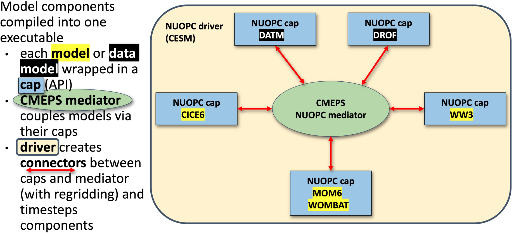
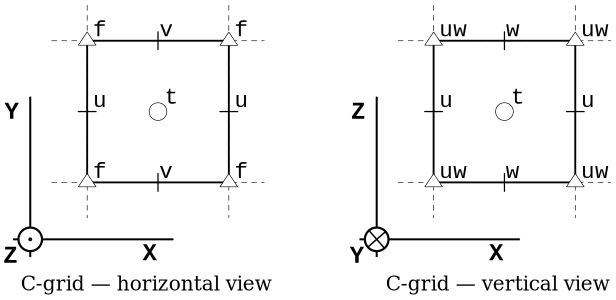
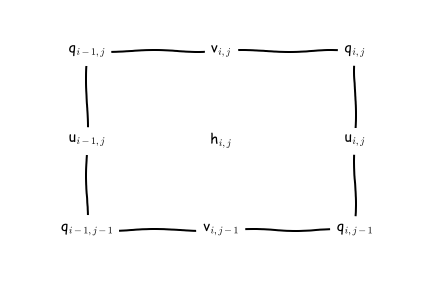
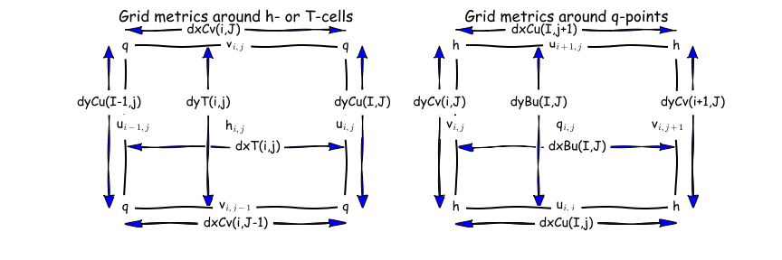

# Season 1

## General info on decoding MOM6 sessions
- The early sessions of these “Decoding MOM6” segments will talk through the tools that might be useful to navigate the MOM6 code
- The later sessions will dive deeper into the code itself

## How to use github's search functionality to find code: MOM6 as an example.

Presenter: @dougiesquire

Searching [the MOM6 code repository in the ACCESS-NRI GitHub org](https://github.com/access-nri/mom6).
Contains all of the MOM6 Fortran code used in ACCESS-OM3

### Quick summary of GitHub search functionality

Pros:

 - Easy and convenient
 - Allows you to see how parts of the model work

Cons:

 - Can only search on the default branch of the repo.
 - GitHub doesn't actually index everything.


### More detailed notes

- Why use the GitHub search bar?
    - See how a specific piece of code is written - how is it implemented in MOM6? Need to search through the code
- Dougie’s screen: Looking at [MOM6 fork on ACCESS-NRI GitHub org](https://github.com/ACCESS-NRI/MOM6)
    - Can click on search at top or click `/` to start a search
    - Eg [search `global`](https://github.com/search?q=repo%3AACCESS-NRI%2FMOM6%20global&type=code)
        - Will return all files in this repo with “Global” (not case sensitive by default)
        - Get the summary of the files, and can click to expand more lines of code
        - Can click on the line itself and it will take you to that line in the file
    - Can search on multiple terms
        - Eg `Global Mean` - searches all files with global or mean
        - Eg `“Global Mean”` - search for specific phrase
        - Eg `“Global mean ocean salinity”` - can search directly for this diagnostic
            - Finds where it’s registered, and can backtrack to find the code
    - Can search on patterns (regex) rather than words
        - Eg search `Global` but only at specific path: `Global path:src/core`
    - Fast, powerful, easy to use
    - Can share searches with people (can’t do this if you are, eg, using “grep” on Gadi terminal)
- Gotchas
    - Can only search on default branch
    - GitHub doesn’t index everything, and opaque which code is indexed
        - Eg doesn’t index vendor code, but not clear what that means
        - If you search something and it seems weird that nothing is found, then this might be the main issue

#### Questions from the audience
- _Q: Can it organize the search in order of the subroutines called?_
    - MOM6 docs does include schematics on subroutines that are called from specific file
        - But may not be generated anymore, so may be out of date
- _Q: Can searches be case sensitive?_
    - Yes, you can use regex: `/(?-i)Global/`
    - By default they aren’t case sensitive
- _Q: What is regex?_
    - Language for pattern matching
    - Stands for regular expression
    - Lots of resources online
        - Just be sure to use the correct version of regex, as there are different types
    - Can click “Search syntax tips” - link at bottom of search popup in GitHub - provides quick help for lots of common regex uses
- _Q: OM3 configurations are all on a branch - does that mean we’ve eliminated the ability to search through OM3 configurations?_
    - Yes, we can’t search OM3 configurations at the moment using this tool, because there is almost nothing on the default branch. This is definitely a limitation.
    - Some parameter documentation has been moved to main branch specifically to be able to search on them
    - There are other ways to search through other branches, but no examples were given
    - Lots of people would like GitHub to add functionality to search on a branch other than the default, but not the case currently
 
### More resources
[Understanding GitHub Code Search syntax](https://docs.github.com/en/search-github/github-code-search/understanding-github-code-search-syntax#query-for-an-exact-match)


## Lessons learned from MOM6 code development

Presenter: @jbisits (11/12/2025).
!!! tip
    Take-home message: when starting development, take care with which version of the MOM6 code repository you fork from.

### Background

When @jbisits started work on MOM6, he went to google and found the MOM6 codebase and then made a fork of `mom-ocean/MOM6` (the [central consortium repository](https://github.com/mom-ocean/MOM6)). Actually if one is looking to contribute to the MOM6 codebase _from_ Australia, there is an [access-nri/MOM6](https://github.com/access-nri/mom6) fork. They are different forks with different branches and code bases! 

### How do I find out which version of MOM6 I am currently using?

Go to the OM3 configuration that you are using [example](https://github.com/ACCESS-NRI/access-om3-configs/blob/release-MC_25km_jra_iaf/config.yaml
) and find the `config.yaml` following lines:

Note these lines:
```yaml
modules:
    use:
        - /g/data/vk83/modules
    load:
        - access-om3/2025.08.001
```

Specifically note that this line `access-om3/2025.08.001` highlights the [Spack bundle package](https://github.com/ACCESS-NRI/access-spack-packages/blob/main/packages/access-om3/package.py) and git tag that is being used for MOM6 code. One can then match this tag name `2025.08.001` from the model deployment repository, this link [lists all the tags](https://github.com/ACCESS-NRI/ACCESS-OM3/tags), and here is the tag we are looking for: [`2025.08.001`](https://github.com/ACCESS-NRI/ACCESS-OM3/releases/tag/2025.08.001) in this case.

Further information:

 - [MOM6 fork management for being a development node](https://github.com/ACCESS-NRI/MOM6/wiki);
 - [OM3 build system and deployment](https://access-om3-configs.access-hive.org.au/infrastructure/Building/);
 - [NOAA-GFDL MOM6 development guide](https://github.com/NOAA-GFDL/MOM6-examples/wiki/Developers-guide);
 - [MOM6 development presentation](https://www.marshallward.org/mom6workshop/develop.html) by @marshallward.

## How to find code that corresponds to a particular executable
### ACCESS-NRI executables
Presenter: @jbisits.

Scope: where and how to find which model components and source code are used in an OM3 configuration that are built with Spack (this applies to all ACCESS-NRI models).

#### Through ACCESS-NRI release database (friendly)

The easiest way to find a related version is to use the [release database](https://reporting.access-nri-store.cloud.edu.au/release-provenance/releases
). For example, suppose we are interested in model version `2025.08.001` (listed in a `config.yaml` file in an `access-om3-configs` branch or directory if you have already cloned an experiment).

We can find this model version [here](https://reporting.access-nri-store.cloud.edu.au/release-provenance/releases/32/). Then clicking on any of the github icons for the relevant component takes you to the version of the code that was used in that release.

#### Directly through GitHub (more complicated)

For example looking at `ACCESS-OM3`, we start by looking at the [configuration repository](https://github.com/access-nri/access-om3-configs/): `ACCESS-NRI/access-om3-configs`. Note that the main branch does not contain configurations -- you have to look at the branches.

You may wish to know what are the model components being used in [a particular release](https://github.com/ACCESS-NRI/access-om3-configs/tags)? Looking at the release: `release-MC_25km_jra_iaf-1.0-beta` we can browse the repository at the relevant [tag here](https://github.com/ACCESS-NRI/access-om3-configs/tree/release-MC_25km_jra_iaf-1.0-beta).

Then in the `config.yaml`, see [the model software version](https://github.com/ACCESS-NRI/access-om3-configs/blob/95ac4456b2e08a3dc1e6476e8dc96900005151ce/config.yaml#L18-L23):

```yaml
modules:
    use:
        - /g/data/vk83/modules
    load:
        - access-om3/2025.08.001
```

`access-om3/2025.08.001` refers to [this repository](https://github.com/access-nri/access-om3) with this at the tag: `2025.08.001`. To find the tags one goes to [the repository](https://github.com/ACCESS-NRI/ACCESS-OM3) --> Releases --> Tags. Here is the related `access-om3` release:
https://github.com/ACCESS-NRI/ACCESS-OM3/releases/tag/2025.08.001

Browsing the related `spack.yaml` we can see the versions of the components in the build, [for example](https://github.com/ACCESS-NRI/ACCESS-OM3/blob/7439c61acbe167abd79fc9be4dc333fadb9ac0cb/spack.yaml#L10-L82) for CICE and MOM6 we have:
```yaml
    access-cice:
      require:
        - '@CICE6.6.1-0'
        - io_type=PIO
        - 'fflags="-march=sapphirerapids -mtune=sapphirerapids -unroll"'
        - 'cflags="-march=sapphirerapids -mtune=sapphirerapids -unroll"'
        - 'cxxflags="-march=sapphirerapids -mtune=sapphirerapids -unroll"'
    access-mom6:
      require:
        - '@2025.07.000'
        - 'fflags="-march=sapphirerapids -mtune=sapphirerapids -unroll"'
        - 'cflags="-march=sapphirerapids -mtune=sapphirerapids -unroll"'
        - 'cxxflags="-march=sapphirerapids -mtune=sapphirerapids -unroll"'
```

Like before, we go to the related `ACCESS-NRI` repositories and find the related tags, in this instance they are:
 - [access-CICE](https://github.com/ACCESS-NRI/CICE/releases/tag/CICE6.6.1-0);
 - [access-mom6](https://github.com/ACCESS-NRI/MOM6/releases/tag/2025.07.000).

Note that the above two repositories are forks of the upstream repositories ([CICE](https://github.com/ESCOMP/CICE) and [MOM6](https://github.com/mom-ocean/MOM6))

For more information and other related steps: 
 - https://access-om3-configs.access-hive.org.au/infrastructure/Building/
 - https://docs.access-hive.org.au/getting_started/spack/
 - https://docs.access-hive.org.au/models/build_a_model/build_source_code/
 - https://docs.access-hive.org.au/models/build_a_model/create_a_prerelease/ (not shown in this tutorial but can be very simple)

----

### COSIMA executables (e.g. `mom6-panan`) 
Presenter: @angus-g.

Scope: where and how to find which model components and source code are used in a COSIMA configuration built with ninja.

COSIMA made executables use a different build system and way of tracking provenance. Here's an example using the `mom6-panan`. Going to [the relevant line](https://github.com/COSIMA/mom6-panan/blob/master/config.yaml#L17) in the `config.yaml` we have: `exe: /g/data/ik11/inputs/mom6/bin/symmetric_FMS2-e7d09b7`

If one then goes on Gadi to the related folder, one finds:
`/g/data/ik11/inputs/mom6/bin/manifest.yaml`

Looking inside the manifest file we see a series of executables with information related to the major components (MOM6, SIS2, FMS) with the git hash used. The compiler flags are also included but not the more minor components. Below is an example:
```yaml
exe: "symmetric_FMS2-e7d09b7"
  build-date: 2022-01-20
  sha256: "e7d09b7687fba4cf0693adf3c1a5f653dee312df996b99da384c64c279a53eef"
  git:
    - component: MOM6
      ref: "93968bd8ec1a993c705846ec91c4cf33b86bc4fb"
    - component: SIS2
      ref: "d18605eacdd2c92b8262458fcad107c546dd080f"
    - component: FMS
      ref: "2d373d20af28b9d8e2cc0d0acf2334fcff457e47"
  modules:
    - "intel-mkl/2020.2.254"
    - "python3/3.8.5"
    - "netcdf/4.7.4p"
    - "openmpi/4.1.2"
    - "intel-compiler/2021.4.0"
  keywords: [SIS2, symmetric, FMS2]
  flags:
    fflags: "-fno-alias -auto -safe-cray-ptr -ftz -assume byterecl -i4 -r8 -nowarn -sox -g -O2 -debug minimal -fp-model precise -qoverride-limits -xHost"
    cflags: "-D__IFC -sox -g"
```

With the above information, one could then compile using the `mom6-ninja-nci` workflow written by @angus-g -- [see here](https://github.com/angus-g/mom6-ninja-nci).

More information:
 - https://github.com/angus-g/mom6-ninja-nci
 - https://github.com/COSIMA/access-om2/wiki/Developers-guide (possibly out of date)
 - http://github.com/cosima/access-om3 (deprecated!)

## How to find what diagnostics are available in MOM6
Presenter: @dougiesquire.
If one goes to to a run directory on Gadi, then you can look at `available_diags.000000`. This file tells you all the available diagnostics. For each of the disagnostics it lists, it tells you:

 - which diagnostics are `[used]` or ` [Unused]`;
 - the units;
 - description of the variable;
 - name of the variable;
 - which grid points the diagnostic is output on.

Here's an example:
```
"KHMEKE_v"  [Unused]
    ! modules: {ocean_model,ocean_model_d2}
    ! dimensions: xh, yq
    ! long_name: Meridional diffusivity of MEKE
    ! units: m2 s-1
    ! cell_methods: xh:mean yq:point
```

If you are using an access-om3-configs configuration, we keep up to date versions of that file alongside our configurations, [here](https://github.com/ACCESS-NRI/access-om3-configs/tree/release-MC_25km_jra_iaf/docs). So the `available_diags.000000` file is viewed [here](https://github.com/ACCESS-NRI/access-om3-configs/blob/release-MC_25km_jra_iaf/docs/available_diags.000000) for the `release-MC_25km_jra_iaf` configuration.

### How to add a diagnostic
One can simply add lines to the diag_table file ([example](https://github.com/ACCESS-NRI/access-om3-configs/blob/release-MC_25km_jra_iaf/diagnostic_profiles/diag_table_standard)). This is _not_ the suggested workflow, we suggest editing this yaml file:
https://github.com/ACCESS-NRI/access-om3-configs/blob/dev-MC_25km_jra_iaf%2Bwombatlite/diag_table_source.yaml

This yaml file is used by `make_diag_table.py` (latest version: https://github.com/COSIMA/make_diag_table) to create a diag_table file specifying MOM diagnostics. 

Further information on the MOM diag_table format is here:

 - https://github.com/mom-ocean/MOM5/blob/master/src/shared/diag_manager/diag_table.F90
 - https://mom6.readthedocs.io/en/main/api/generated/pages/Diagnostics.html
 - https://www.youtube.com/watch?v=D_J8eg3G80o


### How to find how and where a diagnostic is calculated
Suppose one wants to know how a field is calculated. Taking our example above (and making sure we are looking at the correct mom6 code base for our configuration) we can search the mom6 code base for the `long_name`, namely `Meridional diffusivity of MEKE`, i.e. [here](https://github.com/ACCESS-NRI/MOM6/blob/c664721ebd58c033964b502e7fcdcccd05f02947/src/parameterizations/lateral/MOM_MEKE.F90#L1706).

So the relevant block is
```fortran
    CS%id_KhMEKE_v = register_diag_field('ocean_model', 'KHMEKE_v', diag%axesCv1, Time, &
     'Meridional diffusivity of MEKE', 'm2 s-1', conversion=US%L_to_m**2*US%s_to_T)
```

Helps us find [the actual array that is being output](https://github.com/ACCESS-NRI/MOM6/blob/c664721ebd58c033964b502e7fcdcccd05f02947/src/parameterizations/lateral/MOM_MEKE.F90#L954-L955):
```fortran
  if (CS%id_KhMEKE_v>0) call post_data(CS%id_KhMEKE_v, Kh_v, CS%diag)
```
namely `Kh_v`.

Note that changing CICE outputs involves modifying the relevant namelist: `ice_in` ([here is an example](https://github.com/ACCESS-NRI/access-om3-configs/blob/649e9f4877c1d7ab8caaa8607be8ded96c823648/ice_in#L112)).

## Overview of MOM6 configuration (input files etc)
Presenters: @aekiss @claireyung

Configuration and input files when running MOM6 "standalone" (FMS coupler). Actually, running MOM6 in an idealised way only requires 3 input files. Here is an example taken from Claire's `IS-PG-MOM6` repository:

 - `MOM_input` -- parameter settings (name defined in 'MOM_input').
 - `diag_table` -- diagnostics.
 - `input.nml` -- run settings (calendar, MOM_input names etc).

As this is an idealised test case, much of the configuration (forcing, geometry etc) are defined in `common/MOM_input`. MOM_input file typically contain only the non-default values that are needed. A full list of parameters  be found in the corresponding `MOM_parameter_doc.all` file ([example](https://github.com/claireyung/IS-PG-MOM6/blob/main/icemount-layer-LSPR/MOM_parameter_doc.all)) which is generated by the model at run-time. In Claire's case, she builds "perturbations" of the base case ("common") by modifying these files; in `icemount-layer-LSPR` ([here](https://github.com/claireyung/IS-PG-MOM6/tree/main/icemount-layer-LSPR)) you can see the symlinks to the `MOM_input`, `diag_table`, `input.nml` files discussed above. Except that now there is a MOM_override file ([here](https://github.com/claireyung/IS-PG-MOM6/blob/main/icemount-layer-LSPR/MOM_override)) which overrides any settings in `MOM_input`. 

MOM6 also has an in-built sea-ice model SIS2. An example configuratin is [here](https://github.com/cosima/mom6-panan/tree/master). You can see that there are more configuration files (additional to `MOM_input`, `diag_table`, `input.nml`): 

 - `field_table`;
 - `SIS_input` SIS2 input files;
 - `data_table` forcing files if using FMS coupler

ACCESS-NRI ACCESS-OM3 uses a different coupler (NUOPC) compared to the above two examples. It also uses a different "standalone" sea-ice model CICE. So whilst the MOM elements discussed above remain the same. Additional files are required for NUOPC to couple the components. 


source: https://access-om3-configs.access-hive.org.au/infrastructure/Architecture/

There's a description of the files found in a configuration here: https://access-om3-configs.access-hive.org.au/configurations/Overview/

OM3 configurations are stored here:
https://github.com/acCESS-nri/access-om3-configs

Configurations that have a `{dev|release}-` prefix are the ones to focus on. Briefly, the configurations branches are named with the following
`{dev|release}-{MODEL_COMPONENTS}_{nominal_resolution}km_{forcing_data}_{forcing_method}[+{modifier}]`

Further details [here](https://access-om3-configs.access-hive.org.au/#access-om3-configs-overview).

Users are welcome to fork the access-nri configuration repository and share what changes/additions they make to configurations. ACCESS-NRI is also interested in helping support users share configurations ([process outlined here](https://access-om3-configs.access-hive.org.au/contributing/Add-Supported-Config/)). We are also keeping a list of key experiments used for [development here](https://access-om3-configs.access-hive.org.au/Experiments/).

Handy resources:

 - ACCESS-NRI's OM3 configurations [live here](https://github.com/acCESS-nri/access-om3-configs);
 - ACCESS-NRI [ACCESS-OM3 configuration files explanation](https://access-om3-configs.access-hive.org.au/configurations/Overview/); 
 - [MOM6 runtime parameters format (input.nml, MOM_input)](https://mom6.readthedocs.io/en/main/api/generated/pages/Runtime_Parameter_System.html);
 - [diag_table](https://mom6.readthedocs.io/en/main/api/generated/pages/Diagnostics.html) ;
 - [Another explanation of config files from MOM6 regional](https://regional-mom6.readthedocs.io/en/latest/mom6-file-structure-primer.html);
 - [AOS MOM6 tutorial 2022: Running and controlling MOM6](https://www.youtube.com/watch?v=94m3CMTwJ1E) (e.g. ~15 minutes)

## Overview of MOM6 code structure 
Presenter: Paul Spence (@PaulSpence)
Date: 26/03/2026.

Suggested resources in which this presentation was heavily based:

 - [Central MOM6 code](https://github.com/mom-ocean/MOM6);
 - [ACCESS-NRI MOM6 fork](https://github.com/acCESS-nri/mom6);
 - [Marshall Ward's talk on the structure of the MOM6 code base](https://www.marshallward.org/mom6workshop/internals.html#/mom6-directory-tree);
 - [Overview: MOM6 internals](https://www.youtube.com/watch?v=E8WKrESscc4).

Thanks to @marshallward for some great content!

Looking at the `mom6` [directory](https://github.com/aCCESS-NRI/mom6), we have:
 
 - `src/` -- model code and dynamical core solvers;
 - `config_src/` -- configurable components;
 - `pkg/` -- code directory but written by other people (eg. TEOS10 equation of state) linked into `src/`;
 - `doc/` -- documentation;
 - `ac/` -- autoconf build (build the model without mkf).

See 1 minute 20 in this [Overview: MOM6 internals](https://www.youtube.com/watch?v=E8WKrESscc4) for more details.

`Config_src` is particurly important. It has functions that call other model components (e.g NUOPC coupler):

 - `config_src/drivers`;
 - `solo_driver/` ocean-only (example [here](https://github.com/ACCESS-NRI/MOM6/tree/2026.01/config_src/drivers/solo_driver));
 - [NUOPC](https://github.com/ACCESS-NRI/MOM6/tree/2026.01/config_src/drivers/nuopc_cap) used in OM3 is an example of this.
 - other drivers (e.g. `ice_solo_driver` and `FMS_cap`)

Other configs are:

 - `config_src/memory` (e.g. [symmetric](https://github.com/ACCESS-NRI/MOM6/tree/2026.01/config_src/memory/dynamic_symmetric), [non-symmetric](https://github.com/ACCESS-NRI/MOM6/tree/2026.01/config_src/memory/dynamic_nonsymmetric), static.)
 - `config/src_infra` FMS1, FMS2
 - `config_src/external` BGC, data assimilation, python interface, etc.

Note: `config_src/external` just contains a set of dummy interfaces for external codebases that could be used with MOM6. For example there is no actual BGC code in as that lives in a different repository ([here](https://github.com/ACCESS-NRI/GFDL-generic-tracers)).

The `src` folder has model code and has directories:

 - `core/` -- main solvers such as initialisation and time-stepping 
 - `parameterizations` -- viscosity, mixing and diabatic
 - `tracer` -- tracer dynamics 
 - `ALE` -- vertical remapping
 - `diagnostics` -- diagnostic management
 - `user` -- preset focing and topography

Also see `framework/`, `equation_of_state/` etc

We then watched a little of this video ([Overview: MOM6 internals](https://www.youtube.com/watch?v=E8WKrESscc4)) focusing on modules, starting at 10 minutes.

Module guidelines:

 - "1 file per module rule".
 - explicit about dependencies (improve readability).
 - explicit about which functions are exposed publicly.
 - has object-like programming structures.
 - we don't put variables in modules. This is to ensure that we don't have global variables.
 - this rightward facing arrow `!>` shows what is being documents. (You'll notice there are also `!<`.).
 - Public parts of the interface are the ones that you can call elsewhere (as opposed to private ones that you can't). [Here an example](https://github.com/mom-ocean/MOM6/blob/08529ba87ea4ee6403446afc0c8b14f744f79c58/src/parameterizations/vertical/MOM_geothermal.F90#L25) of public subroutines.
 
 Here's some examples:

 - [MOM_diagnostics](https://github.com/mom-ocean/MOM6/blob/main/src/diagnostics/MOM_diagnostics.F90);
 - [MOM_diagnose_MLD](https://github.com/mom-ocean/MOM6/blob/main/src/diagnostics/MOM_diagnose_MLD.F90);
 - A simple example is the geothermal module ([here](https://github.com/mom-ocean/MOM6/blob/08529ba87ea4ee6403446afc0c8b14f744f79c58/src/parameterizations/vertical/MOM_geothermal.F90)).

## Specifying model outputs via `diag_table` or `make_diag_table`
Presenter: @chrisb13 and @aekiss
Date: 02/04/2026

### Understanding the MOM6 diag_table.
Presenter: @chrisb13 (Chris Bull -- channeling Alistair Adcroft)

Resources:

 - [Tutorial: Running and controlling MOM6](https://www.youtube.com/watch?v=94m3CMTwJ1E&t=1860s) (31 to 37 minutes);
 - [MOM6 diagnostics on readthedocs](https://mom6.readthedocs.io/en/dev-gfdl/api/generated/pages/Diagnostics.html);
 - [ACCESS hive docs configuration MOM6 diagnostics](https://docs.access-hive.org.au/models/run_a_model/run_access-om3/#configuring-mom6-diagnostics);
 - [Dougie on adding diagnostics](https://decoding-access-om3.readthedocs.io/decoding_mom6/#how-to-add-a-diagnostic).

4 parts to the diag table:

 - Label (title section) -- required;
 - Date (title section) -- required -- reference date (year month day hour minute second) for realistic models is typically `1900 1 1 0 0 0` whereas `1 1 1 0 0 0` is often used in idealised setups;
 - File section -- this section defines an arbitrary number of files that will be created. Each file is limited to a single rate of either sampling or time-averaging;
 - Field section -- an arbitrary number of lines, one per diagnostic field.

In the **file** section, we have:

> "file_name",  output_freq,  "output_freq_units",  file_format,  "time_axis_units",  "time_axis_name"

plus optional extras (see [MOM6 docs](https://mom6.readthedocs.io/en/dev-gfdl/api/generated/pages/Diagnostics.html#file-section)).

Here's an example from Claire Yung `MOM6-examples-z/diag_table` ([link](https://github.com/claireyung/IS-PG-MOM6/blob/main/MOM6-examples-z/diag_table)):

> "GOLD Experiment"
> 1 1 1 0 0 0

Claire [also has](https://github.com/claireyung/IS-PG-MOM6/blob/3ba9863f52e075a3f588c34406d03f2b22c85fe8/MOM6-examples-z/diag_table#L7):

> "prog",     6,"hours",1,"days","Time"

Here's how to interpret this:

 - "file_name": "prog" (excludes the `.nc` extension)
 - output_freq: 6
 - "output_freq_units": "hours"
 - file_format: 1 (Always set to 1, meaning netcdf.)
 - "time_axis_units": "days" (units to use for the time-axis in the file. Valid values are “years”, “months”, “days”, “hours”, “minutes” or “seconds”)
 - "time_axis_name": "Time" (The name of the time-axis, usually “Time”)

In the **field** section, we have:

> "module_name",  "field_name",  "output_name",  "file_name",  "time_sampling",  "reduction_method",  "regional_section",  packing

 - module_name: Name of the component model. 
 - field_name: The name of the variable as registered in the model.
 - output_name: The name of the variable as it will appear in the file.
 - file_name: One of the files defined above in the section File section (a target).
 - time_sampling: Always set to “all”.
 - reduction_method: “none” means sample or snapshot. “average” or “mean” performs a time-average. “min” or “max” diagnose the minimum or maximum over each time period. [Other options](https://github.com/mom-ocean/MOM5/blob/6bdbdd4892543bbade921fa3224b2530d93c6f40/src/shared/diag_manager/diag_table.F90#L169-L182) are also available.
 - regional_section: “lon_min lon_max lat_min lat_max vert_min vert_max” limits the diagnostic to a region (“none” means global output).
 - packing: Data representation in the file. 1 means double precision (64 bit real), 2 means single precision (32 bit real), 4 means packed 16-bit integers, 8 means packed 1-byte.

https://github.com/claireyung/IS-PG-MOM6/blob/3ba9863f52e075a3f588c34406d03f2b22c85fe8/MOM6-examples-z/diag_table#L22-L33

Picking up on Claire's example from earlier, [we have several fields](https://github.com/claireyung/IS-PG-MOM6/blob/3ba9863f52e075a3f588c34406d03f2b22c85fe8/MOM6-examples-z/diag_table#L22-L33) that will end up in the `prog.nc` file ([defined here](https://github.com/claireyung/IS-PG-MOM6/blob/3ba9863f52e075a3f588c34406d03f2b22c85fe8/MOM6-examples-z/diag_table#L7)), namely:

> "ocean_model","u","u","prog","all",.false.,"none",1
 
> "ocean_model","v","v","prog","all",.false.,"none",1
 
> "ocean_model","h","h","prog","all",.false.,"none",1
 
> "ocean_model","temp","temp","prog","all",.false.,"none",2

> "ocean_model","salt","salt","prog","all",.false.,"none",2

So taking the first one as an example:

 - module_name: Name of the component model. 
 - field_name: we will output the variable `u`.
 - output_name: when we output `u`, we'll call it `u`.
 - file_name: target file is "prog".
 - time_sampling: here it is “all” but this could be "mean" (note that you cannot mix and match within a file, nor can you have different frequencies).
 - reduction_method: `.false.` means no time reduction.
 - regional_section: “none” means no limited region.
 - packing: 2 means “real*4” (single precision)

More examples [here](https://mom6.readthedocs.io/en/dev-gfdl/api/generated/pages/Diagnostics.html#example).

Also, from earlier sessions recall that the list of available diagnostics is dependent on the particular configuration of the model. For this reason the model writes a record of the available diagnostic fields at run-time into a file “available_diags", [here's an example](https://github.com/ACCESS-NRI/access-om3-configs/blob/release-MC_25km_jra_iaf/docs/available_diags.000000) from ACCESS-OM3.

### Using the COSIMA created `make_diag_table` workflow.
Presenter: @aekiss (Andrew Kiss)

[`make_diag_table`](https://github.com/COSIMA/make_diag_table) is a script that generates a `diag_table` file from a YAML file `diag_table_source.yaml`.
It can be run with
```
python /g/data/vk83/apps/make_diag_table/make_diag_table.py
```
which reads `diag_table_source.yaml` and writes `diag_table`, overwriting it if it already exists.
`diag_table_source.yaml` covers every feature of `diag_table`, so when using `make_diag_table` the normal practice is to only edit `diag_table_source.yaml`.

Why use `make_diag_table`? In ACCESS-OM2 and ACCESS-OM3 we often want to save one file per variable, using an informative and standardised filename convention, e.g.
```
ocean-2d-surface_salt-1-daily-mean-ym_1958_01.nc
ocean-2d-surface_salt-1-monthly-mean-ym_1958_01.nc
ocean-2d-surface_temp-1-daily-mean-ym_1958_01.nc
ocean-2d-surface_temp-1-monthly-mean-ym_1958_01.nc
ocean-2d-surface_temp-1-monthly-min-ym_1958_01.nc
ocean-2d-swflx-1-monthly-mean-ym_1958_01.nc
ocean-2d-tau_x-1-monthly-mean-ym_1958_01.nc
ocean-2d-tau_y-1-monthly-mean-ym_1958_01.nc
ocean-2d-temp_int_rhodz-1-monthly-mean-ym_1958_01.nc
ocean-2d-temp_xflux_adv_int_z-1-monthly-mean-ym_1958_01.nc
ocean-2d-temp_yflux_adv_int_z-1-monthly-mean-ym_1958_01.nc
ocean-2d-tx_trans_int_z-1-monthly-mean-ym_1958_01.nc
ocean-2d-wfiform-1-monthly-mean-ym_1958_01.nc
ocean-2d-wfimelt-1-monthly-mean-ym_1958_01.nc
ocean-3d-age_global-1-monthly-mean-ym_1958_01.nc
ocean-3d-buoyfreq2_wt-1-monthly-mean-ym_1958_01.nc
ocean-3d-diff_cbt_t-1-monthly-mean-ym_1958_01.nc
ocean-3d-dzt-1-monthly-mean-ym_1958_01.nc
ocean-3d-pot_rho_0-1-monthly-mean-ym_1958_01.nc
ocean-3d-pot_rho_2-1-monthly-mean-ym_1958_01.nc
ocean-3d-pot_temp-1-monthly-mean-ym_1958_01.nc
ocean-3d-salt-1-monthly-mean-ym_1958_01.nc
ocean-3d-temp-1-monthly-mean-ym_1958_01.nc
```
This would involve a lot of repetitious and error-prone fiddling around if done by hand within `diag_table`. `make_diag_table` solves this problem by allowing you to specify a standardised file name convention and automatically generate file names for each variable you save.

Here's [an example `diag_table_source.yaml`](https://github.com/COSIMA/make_diag_table/blob/master/diag_table_source.yaml). It is thoroughly commented and should be fairly intelligible.

It is in two sections:

- `global_defaults` which sets the defaults used for every file and field unless overridden in `defaults` in the `diag_table` section
  - the `file_name` list the components which are concatenated to form a standardised filename; their values are defined below
- `diag_table` which defines the diagnostics to appear in the generated `diag_table`
  - These are grouped together in categories, which are variables that have a common set of parameters (such as `reduction_method` or `output_freq`) defined in `defaults` (which override `global_defaults`)
    - within each category, `fields` is a dictionary containing all the variables in that category.

**So to add an output field to an existing category, all you need to do is add its name to the `fields` dictionary and run**
```
python /g/data/vk83/apps/make_diag_table/make_diag_table.py
```
This will update `diag_table` to have new file and field entries, with a standardised file name.

## OM3 runtime output files 
Presenter: @chrisb13 (Chris Bull).

Date: 09/04/2026

!!! abstract

    Today we're focusing on understanding model output when OM3 runs succesfully. We'll be looking at key OM3 output files and ending on how to interpret diagnostics on the MOM6 C-grid. Next week Helen will discover what to do when things go wrong. 

We'll focus on a recent dev `MC_25km_jra_iaf-1.0-beta-5165c0f8` [OM3 experiment](https://github.com/ACCESS-Community-Hub/access-om3-experiments/tree/MC_25km_jra_iaf-1.0-beta-5165c0f8) (`/g/data/ol01/outputs/access-om3-25km/MC_25km_jra_iaf-1.0-beta-5165c0f8/`).

!!! note

    Providence of this run includes:

     - [Model build](https://github.com/ACCESS-NRI/ACCESS-OM3/releases/tag/2025.08.001);
     - [Base configuration](https://github.com/ACCESS-NRI/access-om3-configs/tree/f1307b65ee6b06ad9e92a560ae64bc0b4c91e6ee);
     - [Experiment](https://github.com/ACCESS-Community-Hub/access-om3-experiments/tree/MC_25km_jra_iaf-1.0-beta-5165c0f8) (includes the Payu run log -- has a commit for each time the model cycled / had run time changes).

    Further details about these simulations is [available here](https://access-om3-configs.access-hive.org.au/Experiments/).

Looking at the OM3 simulation folder `/home/156/aek156/payu/MC_25km_jra_iaf` we have:
```bash
[gadi-login-06: MC_25km_jra_iaf-1.0-beta-5165c0f8]$ ls  /home/156/aek156/payu/MC_25km_jra_iaf
025km_jra_iaf_c.e156953262  025km_jra_iaf.o156963110    025km_jra_iaf_s.o157005692  input.nml                 postscript.sh.o156573831  postscript.sh.o156808786
025km_jra_iaf_c.e156963108  025km_jra_iaf.o156976044    025km_jra_iaf_s.o157015747  LICENSE                   postscript.sh.o156580484  postscript.sh.o156819850
025km_jra_iaf_c.e156976043  025km_jra_iaf.o156985131    025km_jra_iaf_s.o157180052  manifests                 postscript.sh.o156591178  postscript.sh.o156837563
025km_jra_iaf_c.e156985130  025km_jra_iaf.o156993836    025km_jra_iaf_s.o157180396  metadata.yaml             postscript.sh.o156606425  postscript.sh.o156849829
025km_jra_iaf_c.e156993833  025km_jra_iaf.o157001496    025km_jra_iaf_s.o157180528  MOM_input                 postscript.sh.o156623297  postscript.sh.o156854528
025km_jra_iaf_c.e157001495  025km_jra_iaf.o157011761    025km_jra_iaf_s.o157185544  MOM_override              postscript.sh.o156629387  postscript.sh.o156859814
025km_jra_iaf_c.e157011759  025km_jra_iaf_s.e156956754  025km_jra_iaf_s.o157186682  nuopc.runconfig           postscript.sh.o156679792  postscript.sh.o156872003
025km_jra_iaf_c.o156953262  025km_jra_iaf_s.e156966829  025km_jra_iaf_s.o157186970  nuopc.runseq              postscript.sh.o156683733  postscript.sh.o156886215
025km_jra_iaf_c.o156963108  025km_jra_iaf_s.e156979618  access-om3.err              postscript.sh.o156435401  postscript.sh.o156688095  postscript.sh.o156915954
025km_jra_iaf_c.o156976043  025km_jra_iaf_s.e156988551  access-om3.out              postscript.sh.o156456265  postscript.sh.o156696134  postscript.sh.o156931182
025km_jra_iaf_c.o156985130  025km_jra_iaf_s.e156998369  archive                     postscript.sh.o156463585  postscript.sh.o156703797  postscript.sh.o156956753
025km_jra_iaf_c.o156993833  025km_jra_iaf_s.e157005692  CITATION.cff                postscript.sh.o156464418  postscript.sh.o156707261  postscript.sh.o156966827
025km_jra_iaf_c.o157001495  025km_jra_iaf_s.e157015747  config.yaml                 postscript.sh.o156464466  postscript.sh.o156712962  postscript.sh.o156979617
025km_jra_iaf_c.o157011759  025km_jra_iaf_s.e157180052  datm_in                     postscript.sh.o156464644  postscript.sh.o156717541  postscript.sh.o156988549
025km_jra_iaf.e156942635    025km_jra_iaf_s.e157180396  datm.streams.xml            postscript.sh.o156473862  postscript.sh.o156722375  postscript.sh.o156998368
025km_jra_iaf.e156953263    025km_jra_iaf_s.e157180528  diagnostic_profiles         postscript.sh.o156482340  postscript.sh.o156726486  postscript.sh.o157005691
025km_jra_iaf.e156963110    025km_jra_iaf_s.e157185544  diag_table                  postscript.sh.o156487555  postscript.sh.o156728454  postscript.sh.o157015746
025km_jra_iaf.e156976044    025km_jra_iaf_s.e157186682  docs                        postscript.sh.o156490910  postscript.sh.o156729873  postscript_synced.sh
025km_jra_iaf.e156985131    025km_jra_iaf_s.e157186970  drof_in                     postscript.sh.o156493354  postscript.sh.o156734274  postscript_synced.sh.o157623147
025km_jra_iaf.e156993836    025km_jra_iaf_s.o156956754  drof.streams.xml            postscript.sh.o156496972  postscript.sh.o156742602  postscript_synced.sh.o157623806
025km_jra_iaf.e157001496    025km_jra_iaf_s.o156966829  drv_in                      postscript.sh.o156511423  postscript.sh.o156748735  postscript_synced.sh.o157626155
025km_jra_iaf.e157011761    025km_jra_iaf_s.o156979618  env.yaml                    postscript.sh.o156530694  postscript.sh.o156752864  README.md
025km_jra_iaf.o156942635    025km_jra_iaf_s.o156988551  fd.yaml                     postscript.sh.o156547767  postscript.sh.o156755583  testing
025km_jra_iaf.o156953263    025km_jra_iaf_s.o156998369  ice_in                      postscript.sh.o156564391  postscript.sh.o156782543  work
```

Key files (incomplete, edited for length):

 - `config.yaml` file that defines the experiment options;
 - `025km_jra_iaf.o*` standard output for each model cycle;
 - `025km_jra_iaf.e*` standard output errors;
 - `postscript.sh.o*` standard output for postprocessing script;
 - `access-om3.out` om3 specific errors;
 - `access-om3.err` om3 specific output;
 - `manifests` payu keeping track of `exe.yaml`, `input.yaml`, `restart.yaml`;
 - `docs` (`available_diags.000000`, `MOM_parameter_doc.all`, `MOM_parameter_doc.debugging`, `MOM_parameter_doc.layout`, `MOM_parameter_doc.short`);
 - `diag_table` (symlink `diag_table` ->`diagnostic_profiles/diag_table_standard`);
 - `archive` where all the output goes once each experiment cycle is complete (symlink `archive` -> `/scratch/x77/aek156/access-om3/archive/MC_25km_jra_iaf-1.0-beta-5165c0f8`);
 - `work` temporary working space for the model (where to look when it crashes -- symlink `work` -> `/scratch/x77/aek156/access-om3/work/MC_25km_jra_iaf-1.0-beta-5165c0f8`);
 - model configuration files: `input.nml`, `metadata.yaml`, `MOM_input`, `MOM_override`, `nuopc.runconfig`, `nuopc.runseq`, `datm_in`, `datm.streams.xml`, `drof_in`, `drof.streams.xml`, `drv_in`, `env.yaml`, `fd.yaml`, `ice_in`.

Looking at the `archive` output (`/g/data/ol01/outputs/access-om3-25km/MC_25km_jra_iaf-1.0-beta-5165c0f8/`) we have:

```sh
[gadi-login-04: MC_25km_jra_iaf-1.0-beta-5165c0f8]$ ls
datastore.csv                                     git-runlog     output009  output020  output031  output042  output053   restart006  restart017  restart028  restart039  restart050
datastore_invalid_assets_2025-12-11-14:49:23.csv  metadata.yaml  output010  output021  output032  output043  output054   restart007  restart018  restart029  restart040  restart051
datastore_invalid_assets_2025-12-12-10:15:36.csv  output000      output011  output022  output033  output044  output055   restart008  restart019  restart030  restart041  restart052
datastore_invalid_assets_2025-12-15-14:14:40.csv  output001      output012  output023  output034  output045  output056   restart009  restart020  restart031  restart042  restart053
datastore_invalid_assets_2025-12-16-05:19:19.csv  output002      output013  output024  output035  output046  pbs_logs    restart010  restart021  restart032  restart043  restart054
datastore_invalid_assets_2025-12-17-13:33:13.csv  output003      output014  output025  output036  output047  restart000  restart011  restart022  restart033  restart044  restart055
datastore_invalid_assets_2025-12-18-11:17:27.csv  output004      output015  output026  output037  output048  restart001  restart012  restart023  restart034  restart045  restart056
datastore_invalid_assets_2025-12-19-08:47:53.csv  output005      output016  output027  output038  output049  restart002  restart013  restart024  restart035  restart046
datastore_invalid_assets_2026-01-08-14:43:25.csv  output006      output017  output028  output039  output050  restart003  restart014  restart025  restart036  restart047
datastore.json                                    output007      output018  output029  output040  output051  restart004  restart015  restart026  restart037  restart048
error_logs                                        output008      output019  output030  output041  output052  restart005  restart016  restart027  restart038  restart049
```

Note:

 - This is where the output is "archived" to;
 - each `output0*` is a cycle of output (yearly);
 - each `restart0*` contains restart files;
 - file `datastore.json` is an ESMdatastore.

Looking at `output030`, we have (trimmed for readability):

```bash
[gadi-login-06: output030]$ ls -1
access-om3.cice.1day.mean.1988-01.nc
access-om3.cice.1day.mean.1988-02.nc
access-om3.cice.1day.mean.1988-03.nc
access-om3.cice.static.nc
access-om3.err
access-om3.mom6.2d.tob.1day.mean.1988.nc
access-om3.mom6.2d.tos.1day.mean.1988.nc
access-om3.mom6.2d.tos.1mon.max.1988.nc
access-om3.mom6.2d.tos.1mon.min.1988.nc
access-om3.mom6.2d.umo_2d.1mon.mean.1988.nc
access-om3.mom6.2d.vmo_2d.1mon.mean.1988.nc
access-om3.mom6.2d.wfo.1mon.mean.1988.nc
access-om3.mom6.2d.zos.1mon.max.1988.nc
access-om3.mom6.2d.zos.1mon.mean.1988.nc
access-om3.mom6.2d.zos.1mon.min.1988.nc
access-om3.mom6.2d.zossq.1mon.mean.1988.nc
access-om3.mom6.3d.agessc.z.1mon.mean.1988.nc
access-om3.mom6.3d.diftrblo.1mon.mean.1988.nc
access-om3.mom6.3d.diftrelo.1mon.mean.1988.nc
access-om3.mom6.3d.e.1mon.mean.1988.nc
access-om3.mom6.3d.e.rho2.1mon.mean.1988.nc
access-om3.mom6.3d.GM_sfn_y.rho2.1mon.mean.1988.nc
access-om3.mom6.3d.uhGM.rho2.1mon.mean.1988.nc
access-om3.mom6.3d.umo.rho2.1mon.mean.1988.nc
access-om3.mom6.3d.uo.z.1mon.mean.1988.nc
access-om3.mom6.3d.vhGM.rho2.1mon.mean.1988.nc
access-om3.mom6.3d.vmo.rho2.1mon.mean.1988.nc
access-om3.mom6.3d.vo.z.1mon.mean.1988.nc
access-om3.mom6.geometry.nc
access-om3.mom6.scalar.1day.snap.1988.nc
access-om3.mom6.static.nc
access-om3.out
available_diags.000000
config.yaml
datm_in
datm.streams.xml
diag_table
drof_in
drof.streams.xml
drv_in
env.yaml
fd.yaml
ice_in
input.nml
log
logfile.000000.out
manifests
MOM_IC_1.nc
MOM_IC_2.nc
MOM_IC_3.nc
MOM_IC.nc
MOM_input
MOM_override
MOM_parameter_doc.all
MOM_parameter_doc.debugging
MOM_parameter_doc.layout
MOM_parameter_doc.short
nuopc.runconfig
nuopc.runseq
ocean.stats
ocean.stats.nc
Vertical_coordinate.nc
warnfile.000000.out
```

We'll focus on interpreting the diagnostic output. 

Taking `access-om3.mom6.3d.uo.z.1mon.mean.1988.nc` as an example, this file consists of monthly time-mean zonal velocities for 1988. Looking at the structure of the file (edited for clarity):

```bash
[cyb561.gadi-login-06: output030]$ ncdump -c access-om3.mom6.3d.uo.z.1mon.mean.1988.nc | head -n100
netcdf access-om3.mom6.3d.uo.z.1mon.mean.1988 {
dimensions:
        xq = 1441 ;
        yh = 1152 ;
        z_l = 75 ;
        z_i = 76 ;
        time = UNLIMITED ; // (12 currently)
        nv = 2 ;
variables:
        float uo(time, z_l, yh, xq) ;
                uo:_FillValue = 1.e+20f ;
                uo:missing_value = 1.e+20f ;
                uo:units = "m s-1" ;
                uo:long_name = "Sea Water X Velocity" ;
                uo:cell_methods = "z_l:mean yh:mean xq:point time: mean" ;
                uo:time_avg_info = "average_T1,average_T2,average_DT" ;
                uo:standard_name = "sea_water_x_velocity" ;
                uo:interp_method = "none" ;
        double xq(xq) ;
                xq:units = "degrees_east" ;
                xq:long_name = "q point nominal longitude" ;
                xq:axis = "X" ;
        double yh(yh) ;
                yh:units = "degrees_north" ;
                yh:long_name = "h point nominal latitude" ;
                yh:axis = "Y" ;
        double z_l(z_l) ;
                z_l:units = "meters" ;
                z_l:long_name = "Depth at cell center" ;
                z_l:axis = "Z" ;
                z_l:positive = "down" ;
                z_l:edges = "z_i" ;
        double time(time) ;
                time:units = "days since 1900-01-01 00:00:00" ;
                time:long_name = "time" ;
                time:axis = "T" ;
                time:calendar_type = "GREGORIAN" ;
                time:calendar = "gregorian" ;
                time:bounds = "time_bnds" ;
```

We need to understand how MOM6's grid is defined.

Here are two different ways to visualise the C-grid that is used by MOM6. 

- The first way shows both the horizontal and vertical staggering. Note that the tracers, velocities and vorticity points are horizontally and vertically staggered:



*Image from the [pycomodo project](https://web.archive.org/web/20160417032300/http://pycomodo.forge.imag.fr/norm.html).*

- The second grid visualisation, focuses on the horizontal, and uses the the notation that is used in the MOM6 documentation:



*Image from the [MOM6 RTD](https://mom6.readthedocs.io/en/dev-gfdl/api/generated/pages/Discrete_Grids.html).*

We can find complete information about the MOM6 grid in this file `access-om3.mom6.static.nc`. This is *very* important when you want to do offline model diagnostics accurately (e.g. fluxes across sections, calculate gradients, integrals etc).

The file has a lot of useful information, so we'll look at it in chunks.

```bash
[gadi-login-06: output030]$ ncdump -c access-om3.mom6.static.nc | head -n220
netcdf access-om3.mom6.static {
dimensions:
        xh = 1440 ;
        yh = 1152 ;
        time = UNLIMITED ; // (1 currently)
        xq = 1441 ;
        yq = 1153 ;
variables:
        double xh(xh) ;
                xh:units = "degrees_east" ;
                xh:long_name = "h point nominal longitude" ;
                xh:axis = "X" ;
        double yh(yh) ;
                yh:units = "degrees_north" ;
                yh:long_name = "h point nominal latitude" ;
                yh:axis = "Y" ;
        double xq(xq) ;
                xq:units = "degrees_east" ;
                xq:long_name = "q point nominal longitude" ;
                xq:axis = "X" ;
        double yq(yq) ;
                yq:units = "degrees_north" ;
                yq:long_name = "q point nominal latitude" ;
                yq:axis = "Y" ;
```

Think of the above as "indices" for the Tracer and velocity points. Once, we have these we can then define latitude (`geolat_*`) and longitude (`geolon_*`) anywhere on the C-grid...

```bash
        double geolat_c(yq, xq) ;
                geolat_c:_FillValue = 1.e+20 ;
                geolat_c:missing_value = 1.e+20 ;
                geolat_c:units = "degrees_north" ;
                geolat_c:long_name = "Latitude of corner (Bu) points" ;
                geolat_c:cell_methods = "time: point" ;
                geolat_c:interp_method = "none" ;
        double geolat(yh, xh) ;
                geolat:_FillValue = 1.e+20 ;
                geolat:missing_value = 1.e+20 ;
                geolat:units = "degrees_north" ;
                geolat:long_name = "Latitude of tracer (T) points" ;
                geolat:cell_methods = "time: point" ;
        double geolat_u(yh, xq) ;
                geolat_u:_FillValue = 1.e+20 ;
                geolat_u:missing_value = 1.e+20 ;
                geolat_u:units = "degrees_north" ;
                geolat_u:long_name = "Latitude of zonal velocity (Cu) points" ;
                geolat_u:cell_methods = "time: point" ;
                geolat_u:interp_method = "none" ;
        double geolat_v(yq, xh) ;
                geolat_v:_FillValue = 1.e+20 ;
                geolat_v:missing_value = 1.e+20 ;
                geolat_v:units = "degrees_north" ;
                geolat_v:long_name = "Latitude of meridional velocity (Cv) points" ;
                geolat_v:cell_methods = "time: point" ;
                geolat_v:interp_method = "none" ;
        double geolon_c(yq, xq) ;
                geolon_c:_FillValue = 1.e+20 ;
                geolon_c:missing_value = 1.e+20 ;
                geolon_c:units = "degrees_east" ;
                geolon_c:long_name = "Longitude of corner (Bu) points" ;
                geolon_c:cell_methods = "time: point" ;
                geolon_c:interp_method = "none" ;
        double geolon(yh, xh) ;
                geolon:_FillValue = 1.e+20 ;
                geolon:missing_value = 1.e+20 ;
                geolon:units = "degrees_east" ;
                geolon:long_name = "Longitude of tracer (T) points" ;
                geolon:cell_methods = "time: point" ;
        double geolon_u(yh, xq) ;
                geolon_u:_FillValue = 1.e+20 ;
                geolon_u:missing_value = 1.e+20 ;
                geolon_u:units = "degrees_east" ;
                geolon_u:long_name = "Longitude of zonal velocity (Cu) points" ;
                geolon_u:cell_methods = "time: point" ;
                geolon_u:interp_method = "none" ;
        double geolon_v(yq, xh) ;
                geolon_v:_FillValue = 1.e+20 ;
                geolon_v:missing_value = 1.e+20 ;
                geolon_v:units = "degrees_east" ;
                geolon_v:long_name = "Longitude of meridional velocity (Cv) points" ;
                geolon_v:cell_methods = "time: point" ;
                geolon_v:interp_method = "none" ;
```

The `areacello` variables (e.g. calculating fluxes through a face):

```bash
        double areacello(yh, xh) ;
                areacello:_FillValue = 1.e+20 ;
                areacello:missing_value = 1.e+20 ;
                areacello:units = "m2" ;
                areacello:long_name = "Ocean Grid-Cell Area" ;
                areacello:cell_methods = "area:sum yh:sum xh:sum time: point" ;
                areacello:standard_name = "cell_area" ;
        double areacello_cu(yh, xq) ;
                areacello_cu:_FillValue = 1.e+20 ;
                areacello_cu:missing_value = 1.e+20 ;
                areacello_cu:units = "m2" ;
                areacello_cu:long_name = "Ocean Grid-Cell Area" ;
                areacello_cu:cell_methods = "area:sum yh:sum xq:sum time: point" ;
                areacello_cu:standard_name = "cell_area" ;
        double areacello_cv(yq, xh) ;
                areacello_cv:_FillValue = 1.e+20 ;
                areacello_cv:missing_value = 1.e+20 ;
                areacello_cv:units = "m2" ;
                areacello_cv:long_name = "Ocean Grid-Cell Area" ;
                areacello_cv:cell_methods = "area:sum yq:sum xh:sum time: point" ;
                areacello_cv:standard_name = "cell_area" ;
        double areacello_bu(yq, xq) ;
                areacello_bu:_FillValue = 1.e+20 ;
                areacello_bu:missing_value = 1.e+20 ;
                areacello_bu:units = "m2" ;
                areacello_bu:long_name = "Ocean Grid-Cell Area" ;
                areacello_bu:cell_methods = "area:sum yq:sum xq:sum time: point" ;
                areacello_bu:standard_name = "cell_area" ;
```

The `dx*` and `dy*` variables (e.g. calculating fluxes through a section, calculating gradients, integrals etc):



```bash
        double dxt(yh, xh) ;
                dxt:_FillValue = 1.e+20 ;
                dxt:missing_value = 1.e+20 ;
                dxt:units = "m" ;
                dxt:long_name = "Delta(x) at thickness/tracer points (meter)" ;
                dxt:cell_methods = "time: point" ;
                dxt:interp_method = "none" ;
        double dyt(yh, xh) ;
                dyt:_FillValue = 1.e+20 ;
                dyt:missing_value = 1.e+20 ;
                dyt:units = "m" ;
                dyt:long_name = "Delta(y) at thickness/tracer points (meter)" ;
                dyt:cell_methods = "time: point" ;
                dyt:interp_method = "none" ;
        double dxCu(yh, xq) ;
                dxCu:_FillValue = 1.e+20 ;
                dxCu:missing_value = 1.e+20 ;
                dxCu:units = "m" ;
                dxCu:long_name = "Delta(x) at u points (meter)" ;
                dxCu:cell_methods = "time: point" ;
                dxCu:interp_method = "none" ;
        double dyCu(yh, xq) ;
                dyCu:_FillValue = 1.e+20 ;
                dyCu:missing_value = 1.e+20 ;
                dyCu:units = "m" ;
                dyCu:long_name = "Delta(y) at u points (meter)" ;
                dyCu:cell_methods = "time: point" ;
                dyCu:interp_method = "none" ;
        double dxCv(yq, xh) ;
                dxCv:_FillValue = 1.e+20 ;
                dxCv:missing_value = 1.e+20 ;
                dxCv:units = "m" ;
                dxCv:long_name = "Delta(x) at v points (meter)" ;
                dxCv:cell_methods = "time: point" ;
                dxCv:interp_method = "none" ;
        double dyCv(yq, xh) ;
                dyCv:_FillValue = 1.e+20 ;
                dyCv:missing_value = 1.e+20 ;
                dyCv:units = "m" ;
                dyCv:long_name = "Delta(y) at v points (meter)" ;
                dyCv:cell_methods = "time: point" ;
                dyCv:interp_method = "none" ;
        double dyCuo(yh, xq) ;
                dyCuo:_FillValue = 1.e+20 ;
                dyCuo:missing_value = 1.e+20 ;
                dyCuo:units = "m" ;
                dyCuo:long_name = "Open meridional grid spacing at u points (meter)" ;
                dyCuo:cell_methods = "time: point" ;
                dyCuo:interp_method = "none" ;
        double dxCvo(yq, xh) ;
                dxCvo:_FillValue = 1.e+20 ;
                dxCvo:missing_value = 1.e+20 ;
                dxCvo:units = "m" ;
                dxCvo:long_name = "Open zonal grid spacing at v points (meter)" ;
                dxCvo:cell_methods = "time: point" ;
                dxCvo:interp_method = "none" ;
        double deptho(yh, xh) ;
                deptho:_FillValue = 1.e+20 ;
                deptho:missing_value = 1.e+20 ;
                deptho:units = "m" ;
                deptho:long_name = "Sea Floor Depth" ;
                deptho:cell_methods = "area:mean yh:mean xh:mean time: point" ;
                deptho:cell_measures = "area: areacello" ;
                deptho:standard_name = "sea_floor_depth_below_geoid" ;
```

Further information:

 - [Discrete Horizontal and Vertical Grids on MOM6 docs](https://mom6.readthedocs.io/en/dev-gfdl/api/generated/pages/Discrete_Grids.html);
 - [Lecture: MOM6 spatial discretizations](https://www.youtube.com/watch?v=Rl_GxAamxjQ);
 - [Tutorial: Analyzing MOM6](https://www.youtube.com/watch?v=SUMjB5jX_dE).


## Interpreting OM3 maxCFL, truncations, warnings, errors.
Presenter: @helenmacdonald 
Date: 16/04/2026

### Part 1 How do I know I have an error?

When your simulation is running, your control directory will have links to an archive and work directory along with a `access-om3.out` and `access-om3.err` file:
```
archive -> /scratch/project/user/access-om3/archive/my-buggy-run
work -> /scratch/project/user/access-om3/work/my-buggy-run
access-om3.out
access-om3.err
```
If your simulation has finished (you can check using `qstat`), payu will remove the work directory (after copying files into the archive directory) and move access-om3.out and access-om3.err into the archive directory. If your simulation has finished and you can still see some or all of these files/links in the control directory, or the expected output is missing from the archive directory it is likely that an error has occurred.

There are a few places to check for error messages, starting with these output files
```
access-om3.out
access-om3.err
1deg_jra55do_ia.e158765798
1deg_jra55do_ia.o158765798
```
Note that the last 2 of these files will have different names. They are usually some of the last files to be created and are of the form: `jobname.ejobid` and `jobname.ojobid`.
The error messagees are usually near the bottom of the files but can be a bit cryptic so also scroll up to see if there are some warnings about, e.g., a missing file.

It can also be helpful to look at log files in your work directory:
```
work/logfile.*.out
work/log/*
work/warnfile.000000.out
```
There are lots of files of the form `work/logfile.*.out`. Don’t look at them all, just pick one.
We can’t go through every error message that could arise but you should first try to classify your error:
 
- is it repeatable? (does it happen again if you do payu sweep; payu run?) 
- if not, it's likely a transient error, eg due to a brief hardware failure on Gadi. You can even [set up payu to automatically sweep and re-run](https://github.com/ACCESS-NRI/access-om2-configs/blob/release-01deg_jra55_iaf/config.yaml#L110-L112) if a particular error occurs.
- is it associated with a particular model component, or payu?
- does it happen in the initialisation, or after several timesteps?

A few more tips for debugging:

1. Look at whatever the last change was, often this is what caused the error.
2. Try putting the error message into google, or an AI agent
3. Search the [hive forum](https://forum.access-hive.org.au)
4. Check [Gadi status](https://opus.nci.org.au/spaces/Help/pages/399802963/System+Maintenance+and+Notices) just in case the issue is external
5. Ask a friend or post in the hive forum
6. [Search through the code-base](https://decoding-access-om3.readthedocs.io/decoding_mom6/#how-to-use-githubs-search-functionality-to-find-code-mom6-as-an-example) for the error message or for key words
7.	Go back to a last working copy and slowly implement your changes, checking for errors along the way 

If all of these fail, there is the option to [use a debugger](https://docs.access-hive.org.au/models/build_a_model/build_source_code/#setting-up-the-debugger)

Note: If you struggled to find an answer, other people will as well so please consider posting the issue and solution to the [hive forum](https://forum.access-hive.org.au)

### Part 2 Truncation errors
See [here](https://access-om3-configs.access-hive.org.au/Tips-and-tricks/) for more detiled notes on understanding truncation errors.
A common error is when the model goes numerically unstable, creating large velocities. MOM6 deals with these by truncating them (artificially setting them back to a realistic number). When MOM6 does this too many times it will end the simulation early with this error message:
```
Ocean velocity has been truncated too many times
```

The following parameters in MOM_input control this process.

```
U_TRUNC_FILE = "U_velocity_truncations" ! default = ""
                                ! The absolute path to a file into which the accelerations leading to zonal
                                ! velocity truncations are written. Undefine this for efficiency if this
                                ! diagnostic is not needed.
V_TRUNC_FILE = "V_velocity_truncations" ! default = ""
                                ! The absolute path to a file into which the accelerations leading to meridional
                                ! velocity truncations are written. Undefine this for efficiency if this
                                ! diagnostic is not needed.

MAXVEL = 6.0                    !   [m s-1] default = 3.0E+08
                                ! The maximum velocity allowed before the velocity components are truncated.
!CFL_TRUNCATE_RAMP_TIME = 7200.0 !   [s] default = 0.0
                                ! The time over which the CFL truncation value is ramped up at the beginning of
                                ! the run.
MAXTRUNC = 100000               !   [truncations save_interval-1] default = 0
                                ! The run will be stopped, and the day set to a very large value if the velocity
                                ! is truncated more than MAXTRUNC times between energy saves.  Set MAXTRUNC to 0
                                ! to stop if there is any truncation of velocities.
CFL_BASED_TRUNCATIONS = True    !   [Boolean] default = True
                                ! If true, base truncations on the CFL number, and not an absolute speed.
CFL_TRUNCATE = 0.5              !   [nondim] default = 0.5
                                ! The value of the CFL number that will cause velocity components to be
                                ! truncated; instability can occur past 0.5.
CFL_REPORT = 0.5                !   [nondim] default = 0.5
                                ! The value of the CFL number that causes accelerations to be reported; the
                                ! default is CFL_TRUNCATE.
CFL_TRUNCATE_RAMP_TIME = 7200.0 !   [s] default = 0.0
                                ! The time over which the CFL truncation value is ramped up at the beginning of
                                ! the run.
CFL_TRUNCATE_START = 0.0        !   [nondim] default = 0.0

```
Note that increasing `MAXTRUNC` usually doesn’t make the problem go away. In particular, when an issue comes up, it affects other variables such as sea surface elevation which can crash the simulation before you reach `MAXTRUNC`. As such it is worth looking for truncation errors if you are getting these sorts of errors:

```
WARNING from PE  1170: Extreme surface sfc_state detected
WARNING from PE   879: btstep: eta has dropped below bathyT
```

If your velocity is being truncated (regardless of if you reach `MAXTRUNC`) then you should also have one or both of these files (or similar):
```
work/V_velocity_truncations
work/U_velocity_truncations
```

These truncation files contain information on where and when the truncations occur and there is detailed information on how to interpret the files [here](https://access-om3-configs.access-hive.org.au/Tips-and-tricks/#2-interpret-truncation-log-files).

There is a notebook to help investigate the location and timing of the truncation errors [here](https://github.com/ACCESS-NRI/access-eval-recipes/blob/main/ocean/Examine_truncation_data.ipynb).


Common ways to fix the issue are to:

1. decrease the timestep and
2. modify the bathymetry to remove “lumps” and “bumps” in the coastline and bathymetry that might be contributing to the instability. 

For 1, You can decrease the timestep in `MOM_input` by reducing parameters `DT` and `DT_THERM`. Changing timestep in ACCESS-OM3 is more involved due to the coupling - see [here](https://access-om3-configs.access-hive.org.au/configurations/Overview/#timesteps). Make sure your coupling timestep (set in 'nuopc.runseq') is divisable by `DT` and `DT_THERM`.

For 2, bathymetry modification is not recommend for anyone using released configs with unaltered topography, as it's quite involved and has many gotchas, including the need to recreate other files (e.g. the mesh files).  There are some tools to help with bathymetry modification [here](https://github.com/COSIMA/bathymetry-tools). ACCESS-OM3 users are advised to start with a clone of [`make_om3_topo`](https://github.com/ACCESS-NRI/make_om3_topo) and check out the commit that created the `topog.nc` their configuration uses.

There is not a good universal rule to identify the “lumps and bumps”. Sometimes it is obvious but sometimes it isn’t and it can be helpful to ask some friends for their opinions.


## How to contribute code back to MOM6 
Presenter: @ jbisits and @ dougiesquire 
Date: 23/04/2026

# Season 2
## Navier Stokes -> stacked shallow water (adiabatic)
## Generalised vertical coordinates
## Vertical Lagrangian remapping
## Pressure forces
## Coriolis term
## Pressure solver - barotropic / baroclinic split
## Timestepping / Advection schemes
## Vertical velocity diagnostics
## MEKE
## EPBL
## KPP
## Submesoscale parameterisation
## Ice shelf code
## Ocean fresh-water forcing / water balance
## How to create a new MOM6 diagnostic
## Horizontal viscosity
## Advection schemes
## Bottom drag (Callum? Luwei?)
## Opacity for shortwave penetration
## For low res: GM / Redi eddy params
## Explicit tides, self attraction and loading
## Regional boundary conditions
## Bulk formulae
## Fortran 101 - control structure, where parameters are defined, some keywords e.g. private, intent, submodule, use module etc
## How to work out how a diagnostic was calculated (general syntax + keywords to search for)
## Different initialisation options - thickness + tracers, topography (all these preset options)
## Coord config vs use_regridding (layer vs ale mode) - how to change your vertical coordinate or target coordinate and what it means
## Regridding of diagnostics and vanished layer output - how to change in diag_table, what it means for output
## Equations of state and different types of salinity, temperature in initialisation, model running and output
## What does the sea ice model do for the ocean ?
## MOM5/MOM6 code differences?
## Shear mixing
## Internal tide mixing
## Lee wave mixing
## Bottom boundary mixing
## Background mixing
