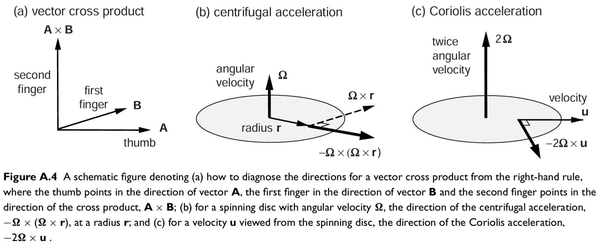
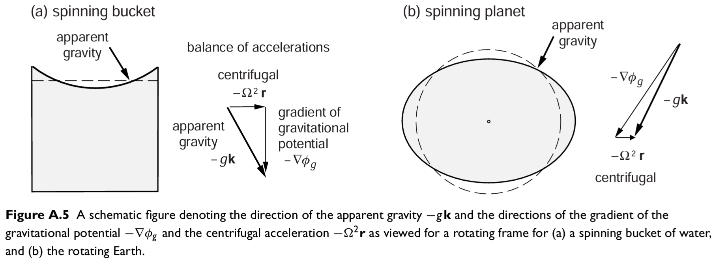
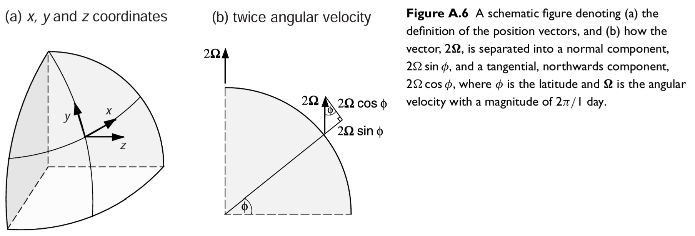

# Coriolis term

Date: 2/7/2026.

Presenters: Chris Bull (@chrisb) and Dave Munday.

**Motivation: why Coriolis is fundamental and subtle**

The Coriolis acceleration is one of the most important terms in large-scale ocean dynamics. It's fundamental for geostrophic balance and so has a ubiquitous influence on global ocean circulation. In everyday use, we treat it as a simple $f\mathbf{k} \times \mathbf{u}$ term in the horizontal momentum equation. But the full story involves...

1. **Rotating-frame transformation** — applying the transport rule twice produces the Coriolis ($2\pmb{\Omega} \times \mathbf{u}$) and centrifugal ($\pmb{\Omega} \times \pmb{\Omega} \times \mathbf{x}$) accelerations. The factor of 2 arises because the cross product contributes once from each of the two bracket expansions.
2. **Centrifugal absorbed into $\mathbf{g}^*$** — valid because $r\Omega^2 / g \lesssim 0.3\%$ everywhere on Earth; the tiny tilt of $\mathbf{g}^*$ from the local vertical is also ignored.
3. **Spherical geometry** — resolving $\pmb{\Omega}$ in local coordinates gives $\pmb{\Omega} = (0, \Omega\cos\phi, \Omega\sin\phi)$, with no eastward component, producing both the traditional Coriolis parameter $f = 2\Omega\sin\phi$ and the non-traditional $\tilde{f} = 2\Omega\cos\phi$.
4. **Traditional approximation** — the non-traditional terms $\tilde{f}w$ (zonal equation) and $\tilde{f}u$ (vertical equation) are dropped: the former because $w \ll |\mathbf{u}|$, the latter because the vertical equation is replaced by hydrostatic balance, which is orders of magnitude larger.

!!! danger 
    The result is: MOM6 accounts for Coriolis by adding $-fv$ to the zonal acceleration and $+fu$ to the meridional acceleration.

These above steps involves assumptions that are worth understanding, especially if you ever encounter situations where they might break down. These notes follow and expand on the Coriolis section of the [AOMSS Lecture Notes](https://decoding-access-om3.readthedocs.io/AOMSS_Lecture_Notes/). The goal is to walk through the derivation carefully enough that each step feels motivated, and to make explicit exactly which approximations we make — and why — before arriving at the simple $\mathbf{f}k \times \mathbf{u}$ that MOM6 actually computes.

For further thoughts, Chris' favorite explanation is A.2.2. in _Williams, R. G., & Follows, M. J. (2011). Ocean dynamics and the carbon cycle: Principles and mechanisms. Cambridge University Press_.

We start with our friend, the Navier-Stokes momentum equation in a _fixed_ reference frame:

$$\frac{D \mathbf{u}}{D t} =  \frac{\partial \mathbf{u}}{\partial t} + \mathbf{u}\cdot \nabla \mathbf{u} = \mathbf{g} - \frac{\nabla p}{\rho} + \nu \nabla^2 \mathbf{u}$$

Our goal is to re-write this in terms of a _rotating_ reference frame. So we need to do a coordinate transformation...

## Derivation: Velocity Transformation Between Fixed and Rotating Frames

The ocean sits on a rotating Earth, so it is natural to write the momentum equations in a frame that co-rotates with the planet. To do this, we need to relate accelerations in the fixed (inertial) frame to those in the rotating frame. But first, definitions...

<figure markdown="span">
  {: style="height:450px;width:450px"}
  <figcaption>We have a spherical Earth rotating at \(\pmb{\Omega}\), at position  \( \mathbf{x}\), the rotation of point \( \mathbf{x}\) is \( \pmb{\Omega} \times \mathbf{x}\).
</figcaption>
</figure>

!!!note 
    Let $\mathbf{x} = (x, y, z)$ be a position and  $\mathbf{u}$ a velocity. Let the velocity in the fixed frame to be $\mathbf{u}_f = \frac{D _f \mathbf{x}}{D t}.$ And the velocity in a reference frame rotating at angular velocity $\pmb{\Omega}$ to be $\mathbf{u}_r = \frac{D _r \mathbf{x}}{D t}.$ 

To translate between the two (transport theorem):

$\frac{D _f \mathbf{x}}{D t} = \frac{D _r \mathbf{x}}{D t} + \pmb{\Omega} \times \mathbf{x}.$

!!!note 
     This says: "how fast $\mathbf{x}$ changes for a fixed-frame observer" equals "how fast it changes for a rotating-frame observer" plus "the change due to the frame itself spinning." Here $\pmb{\Omega}$ is the (assumed constant) angular velocity of the rotating frame. 
       
       
     In less abstract words.. The extra term $\pmb{\Omega} \times \mathbf{x}$ is the velocity that a parcel stationary in the rotating frame must have *as seen from outside*, because the rotating frame is itself moving. Physically: imagine a ball sitting still on a spinning turntable. From the turntable's perspective, the ball is not moving. From outside, it traces a circle — so it must have a velocity. That circle-tracing velocity is exactly $\pmb{\Omega} \times \mathbf{x}$.
       
       
     This single formula is applied twice below — once to the velocity vector $\mathbf{u}_f$, and once to the position vector $\mathbf{x}$. 

Going back to our LHS of the navier stokes, we start from the definition of acceleration in the fixed frame and arrive
at its expression in terms of rotating-frame quantities:

$$
\begin{aligned}
\underbrace{\frac{D_f \mathbf{u}_f}{Dt}}_{\text{acceleration seen in fixed frame}} &= \frac{D _r \mathbf{u}_f}{D t} + \pmb{\Omega} \times \mathbf{u}_f\\
&= \frac{D _r }{D t}  \frac{D _f \mathbf{x}}{D t}+ \pmb{\Omega} \times  \frac{D _f \mathbf{x}}{D t}\\
&= \frac{D _r }{D t} \left[\frac{D _r \mathbf{x}}{D t} + \pmb{\Omega} \times \mathbf{x} \right]+ \pmb{\Omega} \times \left[\frac{D _r \mathbf{x}}{D t} + \pmb{\Omega} \times \mathbf{x}\right]
\\
&= \underbrace{\frac{D_r \mathbf{u}_r}{Dt}}_{\text{acceleration seen in rotating frame}} + \underbrace{2\,\pmb{\Omega}\times \mathbf{u}_r}_{\text{Coriolis term}} + \underbrace{\pmb{\Omega}\times(\pmb{\Omega}\times \mathbf{x})}_{\text{centrifugal term}} 
\end{aligned}
$$

??? code "Click me to see all the detail of how the above works."
     _Line 1_
     
     $$
     \frac{D_f \mathbf{u}_f}{Dt} = \frac{D_r \mathbf{u}_f}{Dt} + \pmb{\Omega}\times \mathbf{u}_f
     $$
     
     Apply the transport theorem!
     
     _Line 2_
     
     $$
     \frac{D_r \mathbf{u}_f}{Dt} + \pmb{\Omega}\times \mathbf{u}_f = \frac{D_r}{Dt}\frac{D_f \mathbf{x}}{Dt} + \pmb{\Omega}\times \frac{D_f \mathbf{x}}{Dt}
     $$
     
     Here we have used the *definition* of velocity in the fixed frame:
     
     $$
     \mathbf{u}_f \equiv \frac{D_f \mathbf{x}}{Dt}
     $$
     
     (Position differentiated as seen by the fixed observer). Substitute this in for both occurrences of $\mathbf{u}_f$ from Line 1. 
     
     _Line 3_
     
     $$
     \frac{D_r}{Dt}\frac{D_f \mathbf{x}}{Dt} + \pmb{\Omega}\times \frac{D_f \mathbf{x}}{Dt}= \frac{D_r}{Dt}\left[\frac{D_r \mathbf{x}}{Dt} + \pmb{\Omega}\times \mathbf{x}\right] + \pmb{\Omega}\times\left[\frac{D_r \mathbf{x}}{Dt} + \pmb{\Omega}\times \mathbf{x}\right]
     $$
     
     Now apply the transport theorem *again*:
     
     $$
     \frac{D_f \mathbf{x}}{Dt} = \frac{D_r \mathbf{x}}{Dt} + \pmb{\Omega}\times \mathbf{x}
     $$
     
     and substitute this expression for $\dfrac{D_f\mathbf{x}}{Dt}$ into **both**
     places it appeared in Line 2 (inside the $\frac{D_r}{Dt}$ operator, and
     inside the $\pmb{\Omega}\times$ term).
     
     _Line 4 — Expanding Both Brackets_
     
     We'll take the two bracketed terms separately. And tackle this in 3 parts.
     
     1\. First bracket
     
     Apply $\frac{D_r}{Dt}$ term by term:
     
     $$
     \frac{D_r}{Dt}\left[\frac{D_r \mathbf{x}}{Dt} + \pmb{\Omega}\times \mathbf{x}\right] = \frac{D_r}{Dt}\left(\frac{D_r \mathbf{x}}{Dt}\right) + \frac{D_r}{Dt}(\pmb{\Omega}\times \mathbf{x})
     $$
     
     The first piece is just $\dfrac{D_r \mathbf{u}_r}{Dt}$, using the definition
     $\mathbf{u}_r \equiv \dfrac{D_r\mathbf{x}}{Dt}$ (velocity relative to the
     rotating frame).
     
     For the second piece, use the product rule and the fact that $\pmb{\Omega}$
     is constant in time (so $\frac{D_r\pmb{\Omega}}{Dt}=0$):
     
     $$
     \frac{D_r}{Dt}(\pmb{\Omega}\times \mathbf{x}) = \pmb{\Omega}\times \frac{D_r \mathbf{x}}{Dt} = \pmb{\Omega}\times \mathbf{u}_r
     $$
     
     So the first bracket contributes:
     
     $$
     \frac{D_r \mathbf{u}_r}{Dt} + \pmb{\Omega}\times \mathbf{u}_r
     $$
     
     2\. Second bracket
     
     Distribute the outer $\pmb{\Omega}\times$:
     
     $$
     \pmb{\Omega}\times\left[\frac{D_r \mathbf{x}}{Dt} + \pmb{\Omega}\times \mathbf{x}\right] = \pmb{\Omega}\times \mathbf{u}_r + \pmb{\Omega}\times(\pmb{\Omega}\times \mathbf{x})
     $$
     
     using $\mathbf{u}_r = \frac{D_r\mathbf{x}}{Dt}$ again.
     
     3\. Adding Everything Together
     
     $$
     \frac{D_r \mathbf{u}_r}{Dt} + \pmb{\Omega}\times \mathbf{u}_r \;+\; \pmb{\Omega}\times \mathbf{u}_r + \pmb{\Omega}\times(\pmb{\Omega}\times \mathbf{x})
     $$
     
     The two $\pmb{\Omega}\times \mathbf{u}_r$ terms are identical and combine:
     
     $$
     \frac{D_f \mathbf{u}_f}{Dt}= \frac{D_r \mathbf{u}_r}{Dt} + 2\,\pmb{\Omega}\times \mathbf{u}_r + \pmb{\Omega}\times \pmb{\Omega}\times \mathbf{x}
     $$
     
     which is what we're after! The factor of 2 in the Coriolis term is the derivation's key output — it arises exactly because $\pmb{\Omega}\times\mathbf{u}_r$ shows up twice: once from differentiating $\mathbf{u}_r$'s "co-rotation" and once from the frame-rotation of $\mathbf{u}_r$ itself.

Okay, so we have that the true (inertial) acceleration equals the acceleration measured by someone standing in the rotating frame, plus a Coriolis correction (depending on relative velocity) plus a centrifugal correction (depending on position). (Centrifugal acceleration is the apparent outward acceleration experienced by an object moving in a circular path.)

The centrifugal acceleration provides an outward acceleration away from the rotational axis where the coriolis acceleration provides an acceleration deflecting a particle perpendicular to its motion ($\pmb{\Omega}$ is positive means to the right)...
<figure markdown="span">

<figcaption>
Source: Williams, R. G., & Follows, M. J. (2011). 
</figcaption>
</figure>

## Absorbing the centrifugal acceleration into gravity

<figure markdown="span">

<figcaption>
The centrifugal acceleration means that a rotating fluid has to change its mass distrubtion to offset this acceleration, on the right, we see that all this spinning leads to an equator beer belly 
 (the Earth is roughly \( 21 \)km wider at the equator than it is at the poles!). Here, apparent gravity is \( \mathbf{g}^*  \). Source: Williams, R. G., & Follows, M. J. (2011). 
</figcaption>
</figure>

The centrifugal term can be written $\pmb{\Omega} \times \pmb{\Omega} \times \mathbf{x} = -\mathbf{r}\Omega^2$, where $\mathbf{r}$ is the vector pointing perpendicularly outward from the Earth's rotation axis to the parcel's location, and $\Omega = |\pmb{\Omega}|$ is a scalar. We can absorb it into a modified gravitational acceleration:

$$\mathbf{g}^* = \mathbf{g} + \mathbf{r}\Omega^2.$$

??? code "The effect on the direction of $\mathbf{g}^*$ is also worth noting..."
    At the Equator both gravity and the centrifugal vector are aligned with the local vertical plane, so $\mathbf{g}^*$ remains vertical, just slightly reduced in magnitude. At mid-latitudes (say 45°), the centrifugal vector $\mathbf{r}\Omega^2$ points outward from the rotation axis — not the local vertical — so decomposing it into local vertical and horizontal components leaves a tiny residual horizontal piece. The resulting $\mathbf{g}^*$ points at a very slight angle from the true local vertical. In practice we always set $\mathbf{g}^* \approx \mathbf{g}$, pointing exactly along the local vertical, and ignore this tiny tilt — if we did not, a horizontal component of effective gravity would appear in the horizontal momentum equations, making them considerably more complex.

How large is the centrifugal correction? At the Equator it is at it's largest, $r \approx 6 \times 10^6$ m and $\Omega \approx 7 \times 10^{-5}$ rad s$^{-1}$, giving $r\Omega^2 \approx 0.03$ m s$^{-2}$. This is less than 0.3% of $g \approx 9.81$ m s$^{-2}$. Away from the Equator, $r$ (the perpendicular distance to the rotation axis, not to Earth's centre) decreases, so the correction is smaller still. On a hypothetical rapidly-rotating or very large planet this could be significant, but for Earth oceanography the approximation is excellent everywhere.
  

With this, the rotating-frame momentum equation simplifies to

$$\frac{D\mathbf{u}}{Dt} + 2\pmb{\Omega} \times \mathbf{u} = \mathbf{g} - \frac{\nabla p}{\rho} + \nu \nabla^2 \mathbf{u}.$$

## Expanding $\pmb{\Omega}$ in local coordinates

We orient local Cartesian coordinates at a point on the Earth's surface with $\mathbf{i}$ pointing eastward, $\mathbf{j}$ pointing northward, and $\mathbf{k}$ pointing upward (in the direction of $-\mathbf{g}$). The velocity is $\mathbf{u} = (u, v, w)$.

We now resolve the Earth's rotation vector $\pmb{\Omega}$ in these local coordinates. This is a geometric exercise: the Earth rotates around its polar axis, and we need to project that rotation vector onto our local $(\mathbf{i}, \mathbf{j}, \mathbf{k})$ basis. The rotation axis lies in the plane containing the local vertical and the meridian, so there is **no component in the $\mathbf{i}$ (eastward) direction**. The projections onto $\mathbf{j}$ (northward) and $\mathbf{k}$ (upward) depend on latitude $\phi$:

<figure markdown="span">

<figcaption>
Source: Williams, R. G., & Follows, M. J. (2011). 
</figcaption>
</figure>

To see this geometrically: at the **pole**, the local vertical is exactly aligned with the Earth's rotation axis, so $\pmb{\Omega}$ projects entirely onto $\mathbf{k}$ ($\sin 90° = 1$, $\cos 90° = 0$). At the **Equator**, the local vertical is perpendicular to the rotation axis, so $\pmb{\Omega}$ projects entirely onto $\mathbf{j}$ ($\sin 0° = 0$, $\cos 0° = 1$). At intermediate latitudes there are components on both.

Evaluating the cross product $2\pmb{\Omega} \times \mathbf{u}$ as a $3 \times 3$ determinant with $\pmb{\Omega} = (0, \Omega\cos\phi, \Omega\sin\phi)$ and $\mathbf{u} = (u, v, w)$:

$$
\begin{aligned}
2\pmb{\Omega} \times \mathbf{u}
&= 2
\begin{vmatrix}
\mathbf{i} & \mathbf{j} & \mathbf{k} \\
0 & \Omega\cos\phi & \Omega\sin\phi \\
u & v & w
\end{vmatrix} \\[6pt]
&= 2\Big[\mathbf{i}\left(\Omega\cos\phi\, w - \Omega\sin\phi\, v\right) - \mathbf{j}\left(-\Omega\sin\phi\, u\right) + \mathbf{k}\left(-\Omega\cos\phi\, u\right)\Big] \\[6pt]
&=
\begin{bmatrix}
\tilde{f}w - fv \\
fu \\
-\tilde{f}u
\end{bmatrix}
\end{aligned}
$$

where we define the **Coriolis parameter** $f \equiv 2\Omega\sin\phi$ and the **non-traditional Coriolis parameter** $\tilde{f} \equiv 2\Omega\cos\phi$. 

??? code "The sphere assumption and the zero in $\Omega_x$."
    The form $\pmb{\Omega} = (0, \Omega\cos\phi, \Omega\sin\phi)$ — with a zero in the eastward direction — follows specifically from treating the Earth as a **sphere** with local coordinates aligned with the local vertical. Above, we saw see that with no eastward component of rotation, the determinant expansion produces no $\tilde{f}$ contribution in the $\mathbf{j}$ row. 

    On a non-spherical geometry (an ellipsoid, or a Cartesian f-plane with a tilted rotation axis), this zero could become nonzero, potentially introducing a $\tilde{f}v$ term in the meridional momentum equation as well. For the Earth treated as a sphere, this does not arise.

Written out as three component equations:

$$\frac{Du}{Dt} + \tilde{f}w - fv = -\frac{1}{\rho}\frac{\partial p}{\partial x} + \ldots \quad \text{(zonal)}$$

$$\frac{Dv}{Dt} + fu = -\frac{1}{\rho}\frac{\partial p}{\partial y} + \ldots \quad \text{(meridional)}$$

$$\frac{Dw}{Dt} - \tilde{f}u = -g - \frac{1}{\rho}\frac{\partial p}{\partial z} + \ldots \quad \text{(vertical)}$$

Notice that the **meridional momentum equation contains only $fu$** — there is no non-traditional $\tilde{f}v$ term. 

    

The latitude dependence of $f$ and $\tilde{f}$ is complementary:

| Location | $f = 2\Omega\sin\phi$ | $\tilde{f} = 2\Omega\cos\phi$ |
|---|---|---|
| Equator ($\phi = 0°$) | 0 | $2\Omega$ (maximum) |
| $\phi = 45°$ | $\sqrt{2}\,\Omega$ | $\sqrt{2}\,\Omega$ |
| Pole ($\phi = 90°$) | $2\Omega$ (maximum) | 0 |

At the pole, the Coriolis force is entirely in the horizontal plane and the non-traditional terms vanish. At the Equator, $f = 0$ so there is no traditional horizontal Coriolis deflection, but the non-traditional terms reach their maximum.

## The traditional approximation

!!! note "When does the traditional approximation fail?"
    The approximation is excellent for large-scale, hydrostatic flows. It becomes questionable in two situations. First, **near the Equator**: $f \to 0$ as $\phi \to 0$, so the ratio $\tilde{f}w / fv$ need not be small. Some studies of equatorial dynamics explicitly retain the non-traditional terms. Second, in **non-hydrostatic flows** (deep convection, fine-scale submesoscale dynamics): when vertical accelerations are significant, $w$ can become comparable to $u$ and $v$, and $\tilde{f}u$ can appear alongside terms no longer dominated by hydrostatic balance.

We have four Coriolis terms in total, but large-scale hydrostatic ocean models retain only two: $fv$ (in the zonal equation) and $fu$ (in the meridional equation). Dropping the $\tilde{f}$ terms is called the **traditional approximation**, justified by two separate scaling arguments.

**For $\tilde{f}w$ in the zonal equation:** The magnitude scales as $\tilde{f}w \sim 2\Omega\cos\phi \cdot w$. Because the ocean is a thin shell, vertical velocities are many orders of magnitude smaller than horizontal velocities ($w \ll |\mathbf{u}|$, typically by three to four orders of magnitude). So $\tilde{f}w \ll fv$ everywhere except very close to the Equator where $f \to 0$.

**For $\tilde{f}u$ in the vertical equation:** This term could in principle be non-negligible, since $\tilde{f}u \sim 2\Omega\cos\phi \cdot u$ and horizontal velocities are large. However, the vertical momentum equation at large scales is overwhelmingly dominated by **hydrostatic balance** — the pressure gradient and buoyancy terms are of order $\rho g \sim 10^4$ Pa m$^{-1}$, while $\tilde{f}u \sim 10^{-4}$ m s$^{-2}$. The entire prognostic vertical momentum equation is replaced by the diagnostic hydrostatic approximation $\partial p / \partial z = -\rho g$, and with it the $\tilde{f}u$ term disappears.

After the traditional approximation, the Coriolis force reduces to $-fv$ added to the zonal acceleration and $+fu$ to the meridional acceleration.

## Implementation in MOM6

What MOM6 actually computes in `MOM_CoriolisAdv.F90` is the traditional Coriolis acceleration (when in hydrostatic mode):

$$
\begin{aligned}
\mathbf{f} \times \mathbf{u}
&= f\mathbf{k} \times (u\mathbf{i} + v\mathbf{j}) \\[6pt]
&=
\begin{vmatrix}
\mathbf{i} & \mathbf{j} & \mathbf{k} \\
0 & 0 & f \\
u & v & 0
\end{vmatrix} \\[6pt]
&= \mathbf{i}\left(0\cdot 0 - f\, v\right) - \mathbf{j}\left(0\cdot 0 - f\, u\right) + \mathbf{k}\left(0\cdot v - 0\cdot u\right) \\[6pt]
&= -f v\,\mathbf{i} + f u\,\mathbf{j} \\[6pt]
&= f(-v\mathbf{i} + u\mathbf{j})
\end{aligned}
$$

i.e. $-fv$ added to the zonal acceleration and $+fu$ to the meridional acceleration.

A non-trivial numerical complication arises on MOM6's Arakawa C-grid: $u$ velocities live at the eastern/western faces of tracer cells, $v$ velocities at the northern/southern faces, and the vorticity (and hence $f$) at the corners. Computing $fv$ for the zonal momentum equation therefore requires interpolating $v$ to where $u$ lives, and vice versa. The choice of interpolation scheme affects whether the discrete equations conserve energy and potential enstrophy. 

!!! note "Non-traditional Coriolis in non-hydrostatic mode"
    For non-hydrostatic simulations (uncommon in large-scale ocean modelling but used for process studies), the hydrostatic approximation is relaxed and the full vertical momentum equation is solved. 

Some background on Coriolis scheme choices in MOM6:

 - Currently we use `CORIOLIS_SCHEME = "SADOURNY75_ENSTRO"` in `dev-MC_25km_jra_iaf` [link](https://github.com/ACCESS-NRI/access-om3-configs/blob/cbdb59e7eeaa92b2950b0bbe0bddcb02d3b6f16a/MOM_input#L478); 
 - [MOM6 code](https://github.com/ACCESS-NRI/MOM6/blob/2026.05.001/src/core/MOM_CoriolisAdv.F90#L910-L912) for the `CORIOLIS_SCHEME = "SADOURNY75_ENSTRO"` is here: [CAu (zonal Coriolis term)](https://github.com/ACCESS-NRI/MOM6/blob/2026.05.001/src/core/MOM_CoriolisAdv.F90#L716-L720) and [CAv (meridional Coriolis term)](https://github.com/ACCESS-NRI/MOM6/blob/2026.05.001/src/core/MOM_CoriolisAdv.F90#L943-L947);
 - Is this a good idea? [Join the discussion!](https://github.com/ACCESS-NRI/access-om3-configs/issues/697)

