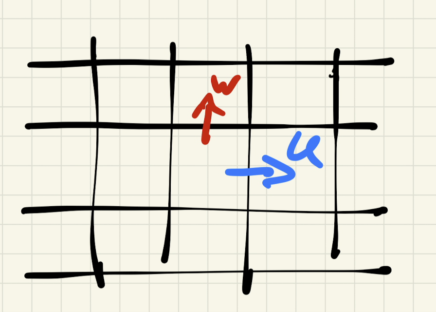
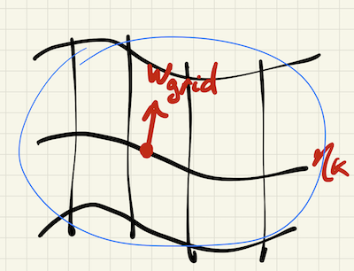

# Generalised vertical coordinates

Date: 11/06/2026.

Presenter: Andy Hogg (@AndyHoggANU). 

In a z-level model, we have vertical velocities, $w$, which passes through coordinate interfaces.

In this case, we can write $w$ from

$$ \frac{\partial w}{\partial z} = - \nabla \cdot \mathbf{u} $$

Conversely, in the stratified shallow water equations the vertical velocity is entirely associated with the vertical motion of the interface itself. We can call this $w_{\mathrm{grid}}$.

Note that $w_{\mathrm{grid}}$ has a contribution from both the local rate of change of the interface and an advective component:

$$ w = w_{\mathrm{grid}} = \frac{\partial \eta_k}{\partial t} + \mathbf{u} \cdot \nabla \eta_k $$

In a nutshell, **generalised vertical coordinates** aims to enable both a cross-interface velocity and the movement of the interface itself.
We would take a scalar field $s(x,y,z,t)$, where $s$ is monotonic in $z$ (actually, its derivative cannot be zero).
Then, to first order, we can calculate the diasurface flux across a surface of constant $s$ to be

$$ w^{(\dot{s})} \approx w - w_{\mathrm{grid}} $$

That is, the diasurface velocity, $w^{(\dot{s})}$, and the velocity of the interface, $w_{\mathrm{grid}}$, combine to make up the actual vertical velocity.

**However,** this is a caveat here, and that is the ``$\approx$'' in the equation above. In fact, the situation is made more complex by geometric effects (basically, the coordinate interface not being flat). For a full treatment of this derivation, I refer you to [Appendix D of the Griffies et al. (2020)](https://doi.org/10.1029/2019MS001954) paper on ALE. There, they show that we can write

$$ w^{(\dot{s})} \, dA = \mathbf{\hat{n}} \cdot (\mathbf{v} - \mathbf{v_{\mathrm{grid}}}) \, dS, $$

where $dS$ is the area of the surface over the grid cell, $dA$ is the projection of that area onto a flat plane, $\mathbf{\hat{n}}$ is the unit normal and $\mathbf{v}$ is the 3D velocity field.

I won't reproduce the full derivation here, but to summarise, a little trigonometry allows the above equation to be written as

$$ w^{(\dot{s})}  = \frac{dz}{ds} \frac{Ds}{Dt} $$

$$ w^{(\dot{s})}  = \frac{dz}{ds} (\frac{\partial s}{\partial t} + \mathbf{v} \cdot \nabla s) $$

...

$$ w^{(\dot{s})}  = w - (\frac{\partial z}{\partial t} + \mathbf{u} \cdot \nabla_s z) $$

You may note that this final equation is similar in form to the approximate equation above, except that there is an additional advection term at the end.

**In summary,** generalised vertical coordinates are mathematically complicated, but the principle is relatively simple: both vertical Lagrangian motion of the grid and dia-surface flux through the coordinate interface is permitted. Importantly, GVCs are a nice framework to help understand the logic of vertical Lagrangian remapping, which Angus will talk about next week ...

