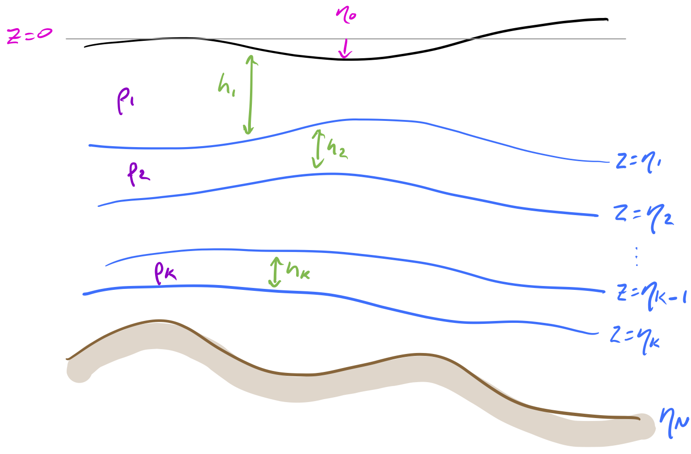

# From Navier Stokes to adiabatic stacked shallow water equations

Date: 28/05/2026.

Presenter: Andrew Kiss (@aekiss). 

**Note:** reload this page if the equations aren't displayed correctly.

I'm following [Vallis' textbook "Atmospheric and Oceanic Fluid Dynamics"](https://www.vallisbook.org/) which you can consult for further details and explanation.
Also see [these notes](https://decoding-access-om3.readthedocs.io/AOMSS_Lecture_Notes/), which cover similar material.

## Navier-Stokes equations
The full shebang
- fully 3D
- can represent nearly any fluid motion
- excessively general for large-scale oceanographic modelling

The _momentum equation_ 

$$
\underbrace{\frac{D_i\mathbf{v}}{D_it}}_\text{Lagrangian acceleration in inertial frame} = \underbrace{\frac{-\nabla p}{\rho}}_\text{pressure gradient} + \underbrace{\nu\nabla^2\mathbf{v}}_\text{molecular viscosity} + \underbrace{\mathbf{g}}_\text{gravity} + \underbrace{\dots}_\text{any other forces}
$$

is Newton's 2nd law $\mathbf{F} = m\mathbf{a}$ for the acceleration $\mathbf{a}$ of an infinitesimal fluid parcel of mass $m$ subject to a net force $\mathbf{F}$, rearranged as $\mathbf{a} = \mathbf{F}_V/\rho$, where $\mathbf{F}_V$ is the force divided by the parcel volume and $\rho$ is the parcel's density. $\mathbf{a}$ is the parcel's Lagrangian acceleration, so $\mathbf{a} = \frac{D_i\mathbf{v}}{D_it}$, where $\mathbf{v} = (u, v, w)$ is the fluid velocity and $\frac{D_i}{D_it}$ is the material derivative relative to an _inertial_ (i.e. non-rotating, non-accelerating) coordinate frame. Here $p$ is pressure, $\rho$ is density and $\nu$ is the kinematic molecular viscosity.

This 3d momentum equation is equivalent to 3 scalar equations, but has 5 unknowns ($u, v, w, p, \rho$), so to close this system we need 2 more equations. These are an _equation of state_ relating the density to pressure (and temperature $T$ and salinity $S$, in the oceanographic context, e.g. TEOS-10; in this case additional evolution equations for $T$ and $S$ are also required), and an equation for the _conservation of mass_ (also known as the _continuity equation_)

$$
\frac{\partial\rho}{\partial t}+\nabla\cdot(\rho\mathbf{v}) = 0.
$$

Seawater density varies very little over the range of $p$, $T$ and $S$ in the ocean, and motions are very much slower than the speed of sound (i.e. the Mach number is very small), so to a good approximation the conservation of mass can be written

$$
\nabla\cdot\mathbf{v} = 0.
$$

This assumption of incompressibility eliminates sound waves.

## Navier-Stokes equations in a rotating frame

In oceanography it's more convenient to a use coordinates that rotate with the Earth. To account for this rotation we must include the Coriolis and centrifugal forces:

$$
\underbrace{\frac{D_i\mathbf{v}}{D_it}}_\text{Lagrangian acceleration in inertial frame} = \underbrace{\frac{D\mathbf{v}}{Dt}}_\text{Lagrangian acceleration in rotating frame} + \underbrace{2\mathbf{\Omega}\times\mathbf{v}}_\text{Coriolis acceleration} + \underbrace{\mathbf{\Omega}\times\mathbf{\Omega}\times\mathbf{r}}_\text{centrifugal acceleration}
$$

where $\mathbf{\Omega}$ is Earth's rotation vector and $\mathbf{r}$ is the position vector relative to Earth's centre, and now $\mathbf{v}$ is velocity relative to the rotating Earth. It turns out the centrifugal acceleration is of the same mathematical form as gravity (a conservative vector field), so we can simply redefine $\mathbf{g}$ to include $-\mathbf{\Omega}\times\mathbf{\Omega}\times\mathbf{r}$ and then worry no more about it. This is not the case for the Coriolis acceleration, which we must retain. So we end up with our momentum equation in rotating coordinates

$$
\underbrace{\frac{D\mathbf{v}}{Dt}}_\text{Lagrangian acceleration in rotating frame} + \underbrace{2\mathbf{\Omega}\times\mathbf{v}}_\text{Coriolis acceleration} = \underbrace{\frac{-\nabla p}{\rho}}_\text{pressure gradient} + \underbrace{\nu\nabla^2\mathbf{v}}_\text{molecular viscosity} + \underbrace{\mathbf{g}}_\text{gravity and centrifugal}+ \underbrace{\dots}_\text{any other forces}
$$

where now $\mathbf{g}$ includes both gravity and the centrifugal acceleration.

## Primitive equations

The so-called "primitive equations" simplify the Navier-Stokes momentum equation by neglecting terms that are insignificant for large-scale oceanographic motions. These approximations are

- shallow-fluid approximation
- hydrostatic balance
- Boussinesq approximation
- neglect Coriolis acting on $w$

Although spherical coordinates should be used, for clarity we'll adopt Cartesian coordinates with $x$ eastward, $y$ northward and $z$ upward (in the opposite direction to $\mathbf{g}$) relative to some mid-latitude point on Earth's surface. We define unit vectors $\mathbf{i}$, $\mathbf{j}$, $\mathbf{k}$ in the directions of increasing $x$, $y$, $z$, respectively.
For convenience we use $\mathbf{u} = (u, v)$ to denote the horizontal component of the full three-dimensional velocity vector $\mathbf{v} = (u, v, w)$.
Molecular viscosity is not a primary concern for us here, so we'll lump viscous forces in with "any other forces" ($\ldots$) from here on.

### Shallow fluid
The oceans are much shallower than they are wide (like the thickness of a piece of paper compared to its width), so large-scale motions must be very nearly horizontal, i.e. $w \ll |\mathbf{u}|$.

Amongst other simplifications discussed below, the shallowness of the ocean allows us to simplify the advection term in the material derivative. The material derivative can be expanded out as

$$
\frac{D\mathbf{v}}{Dt} = \frac{\partial\mathbf{v}}{\partial t} + (\mathbf{v}\cdot\nabla)\mathbf{v} = \frac{\partial\mathbf{v}}{\partial t} + u\frac{\partial\mathbf{v}}{\partial x} + v\frac{\partial\mathbf{v}}{\partial y} + w\frac{\partial\mathbf{v}}{\partial z}
$$

so its horizontal part is

$$
\frac{\partial\mathbf{u}}{\partial t} + u\frac{\partial\mathbf{u}}{\partial x} + v\frac{\partial\mathbf{u}}{\partial y} + w\frac{\partial\mathbf{u}}{\partial z}
$$

If $w \ll |\mathbf{u}|$ and $\frac{\partial\mathbf{u}}{\partial z}$ is not very large, this can be approximated

$$
\frac{\partial\mathbf{u}}{\partial t} + u\frac{\partial\mathbf{u}}{\partial x} + v\frac{\partial\mathbf{u}}{\partial y}
$$

which we will write as $\frac{D\mathbf{u}}{Dt}$.

### The hydrostatic approximation

In large-scale oceanic motions the vertical momentum balance is dominated by the vertical pressure gradient and gravity, allowing us to make the hydrostatic approximation

$$
0 = \frac{-1}{\rho}\frac{\partial p}{\partial z} - g
$$

where $g = |\mathbf{g}|$. This diagnostic equation replaces the vertical momentum equation. It is a very good approximation in nearly all oceanographic circumstances in which horizontal scales of motion are much larger than vertical. Some exceptions (non-hydrostatic motions) include deep-water gravity waves, deep convection, and fine submesoscale motions, for which vertical Lagrangian acceleration can also be important.

It is also common practice to treat $g$ as a constant, neglecting the variation with latitude due to its centrifugal component.

### The Boussinesq approximation

Because $\rho$ varies only vary slightly in the ocean, we can approximate it by a constant $\rho_0$ in the horizontal momentum equation. However, the vertical hydrostatic equation must retain the actual $\rho$ in order to retain horizontal gradients in pressure due to variations in density.

### The "traditional approximation" (neglecting small components of Coriolis)

In component form,

$$
2\mathbf{\Omega}\times\mathbf{v} = (2\Omega w\cos\phi - 2\Omega v\sin\phi)\mathbf{i} + 2\Omega u\sin\phi\mathbf{j} - 2\Omega u\cos\phi\mathbf{k}
$$

where $\Omega = |\mathbf{\Omega}|$ and $\phi$ is latitude. Since $w \ll |\mathbf{u}|$ it is traditional to neglect $2\Omega w\cos\phi$ relative to $2\Omega v\sin\phi$, which is a good approximation except very close to the Equator where $\sin\phi\to 0$, or in situations when $w$ becomes comparable to $|\mathbf{u}|$ (e.g. non-hydrostatic flows). Making this approximation and defining $\mathbf{f} = 2\Omega\sin\phi\mathbf{k}$, the horizontal momentum equation can be written

$$
\underbrace{\frac{D\mathbf{u}}{Dt}}_\text{Lagrangian acceleration in rotating frame} + \underbrace{\mathbf{f}\times\mathbf{u}}_\text{Coriolis acceleration} = \underbrace{\frac{-\nabla p}{\rho}}_\text{pressure gradient}+ \underbrace{\dots}_\text{any other forces}
$$

### The primitive equations

With the above approximations we end up the _primitive equations_. These are the horizontal momentum equation

$$
\frac{D\mathbf{u}}{Dt} + \mathbf{f}\times\mathbf{u} = \frac{-\nabla p}{\rho_0} + \dots
$$

the hydrostatic equation

$$
\frac{\partial p}{\partial z} = -\rho g
$$

and conservation of mass

$$
\nabla\cdot\mathbf{u} +\frac{\partial w}{\partial z} = 0.
$$

Note that in these equations $\mathbf{u}$ can vary continuously with $z$.

## Stacked shallow-water equations

A further approximation, which is very useful in theoretical and idealised studies and also in realistic ocean models (e.g. MOM6), is to treat the ocean as consisting of a stack of $N$ constant-density layers which cannot mix. With sufficiently large $N$ we can get arbitrarily close to the true continuous variation of $\rho$ with depth, but it turns out much of the important dynamics of the ocean can be represented with only a few layers (e.g. $N=2$).

### Notation
{: style="height:650px;width:900px"}

We number the layers from the top downwards. Layer $k$ has density $\rho_k$, top interface $\eta_{k-1}$, bottom interface $\eta_{k}$, and thickness $h_k = \eta_{k-1}-\eta_{k}$. The free surface height is therefore $\eta_0$, and the bottom is $\eta_N$. For simplicity we set the Boussinesq reference density to the top layer density, i.e. $\rho_0 = \rho_1$.

### Momentum equation in each layer
In the top layer the hydrostatic equation can be integrated in $z$ to get the pressure

$$
p_1 = \rho_1 g(\eta_0 - z),
$$
where we neglect atmospheric pressure. The horizontal pressure gradient is therefore due only to surface slope, and independent of depth within this layer:

$$\nabla_h p_1 = \rho_1 g \nabla_h \eta_0.$$

Consistent with the depth-independence of $\nabla_h p_1$, we can assume that the horizontal velocity $\mathbf{u}_1$ is also independent of depth within this layer (note, we are neglecting viscous effects here, e.g. the surface Ekman layer). This strengthens our justification for neglecting $w\frac{\partial \mathbf{u}_1}{\partial z}$ in the horizontal advection, and is exact if the flow is geostrophic ($\mathbf{f}\times\mathbf{u}_1 = -\nabla p_1/\rho_0$).

The shallow-water horizontal momentum equation in layer 1 therefore becomes

$$
\frac{D\mathbf{u}_1}{Dt} + \mathbf{f}\times\mathbf{u}_1 = -g\nabla\eta_0 + \dots
$$

where $\mathbf{u}_1 = \mathbf{u}_1(x,y,t)$.

The pressure in layer 2 is the pressure imposed by layer 1 plus that within layer 2: 

$$
\begin{aligned}
p_2 &= \rho_1 g(\eta_0 - \eta_1) + \rho_2 g(\eta_1 - z)\\
    &= \rho_0 g\eta_0 + \rho_0 g'_1\eta_1 - \rho_2 gz,
\end{aligned}
$$

where $g'_1 = g(\rho_2-\rho_1)/\rho_0$ is the _reduced gravity_ associated with the interface $\eta_1$ and we've used $\rho_0 = \rho_1$. The horizontal pressure gradient is again independent of depth within the layer

$$
\nabla_h p_2 = \rho_0 g \nabla_h \eta_0 +  \rho_0 g'_1 \nabla_h \eta_1
$$

and the layer 2 horizontal momentum equation is

$$
\frac{D\mathbf{u}_2}{Dt} + \mathbf{f}\times\mathbf{u}_2 = -g\nabla\eta_0 -g'_1\nabla\eta_1 + \dots
$$

Extending this reasoning, we find that the shallow-water momentum equation for any layer $k$ is

$$
\frac{D\mathbf{u}_k}{Dt} + \mathbf{f}\times\mathbf{u}_k = -\sum_{i=1}^{k}g'_{i-1}\nabla\eta_{i-1} + \dots
$$

where $g'_{i-1} = g(\rho_i-\rho_{i-1})/\rho_0$ are the interfacial reduced gravities, $g'_0 = g$ and $\mathbf{u}_k = \mathbf{u}_k(x,y,t)$.

### Conservation of mass in each layer

Since $\frac{\partial \mathbf{u}_k}{\partial z}=0$, integrating the conservation of mass through the thickness of layer $k$ gives

$$
h_k\nabla\cdot\mathbf{u}_k + \left.w_k\right|_{z=\eta_k}^{z=\eta_{k-1}} = 0.
$$

Since we regard the interfaces as impenetrable (i.e. it is a material surface), at the lower layer interface $\eta_k$, the 3-dimensional velocity $\mathbf{u}_k + \left.w_k\right|_{z=\eta_k}\mathbf{k}$ must be parallel to $\eta_k$ and move vertically with it, so

$$
\left.w\right|_{z=\eta_k} = \frac{\partial \eta_k}{\partial t} + \mathbf{u}_k\cdot\nabla\eta_k,
$$

and similarly for the upper interface $\eta_{k-1}$. Therefore, using $h_k = \eta_{k-1}-\eta_{k}$ we get

$$
\left.w_k\right|_{z=\eta_k}^{z=\eta_{k-1}} = \frac{\partial h_k}{\partial t} + \mathbf{u}_k\cdot\nabla h_k
$$

so the thickness-integrated mass conservation equation becomes
$$
h_k\nabla\cdot\mathbf{u}_k + \frac{\partial h_k}{\partial t} + \mathbf{u}_k\cdot\nabla h_k = 0
$$

which simplifies to

$$
\frac{\partial h_k}{\partial t} + \nabla\cdot(h_k\mathbf{u}_k) = 0.
$$

This just says that the layer becomes thinner where there is horizontal divergence of transport, and it thickens where there is convergence.

Although $w$ varies with $z$ in each layer, we don't need it in either the momentum or mass conservation equation, so these are fully discretised in depth, with all variables varying with $z$ only between layers, not within them.

### Isopycnal coordinates

Note that we are still using $z$ as a vertical coordinate, in that our horizontal derivatives are being taken by infinitesimal differences at constant $z$ within each layer. However, because $\rho$ is a montonic function of $z$ (assuming a stable stratification), another approach is to use $\rho$ instead of $z$ as a "vertical" coordinate in the continuously-stratified primitive equations. This is called using _isopycnal coordinates_. In this case the horizontal derivatives are along isopycnals (surfaces of constant $\rho$), rather than surfaces of constant $z$, but the equations can be made as tidy as the primitive equations we've derived here if the horizontal pressure gradient is replaced by the gradient of Montgomery potential $M=\frac{p+\rho gz}{\rho_0}$ on isopycnal surfaces. The $\rho$ coordinate can then be discretised to arrive at layered shallow-water equations with isopycnal coordinates. See [these notes](https://decoding-access-om3.readthedocs.io/AOMSS_Lecture_Notes/) or [Vallis](https://www.vallisbook.org/) section 3.9 for further details.

