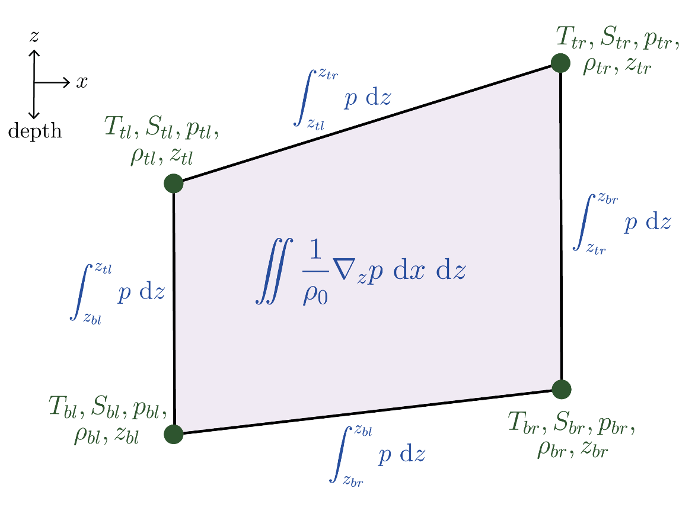
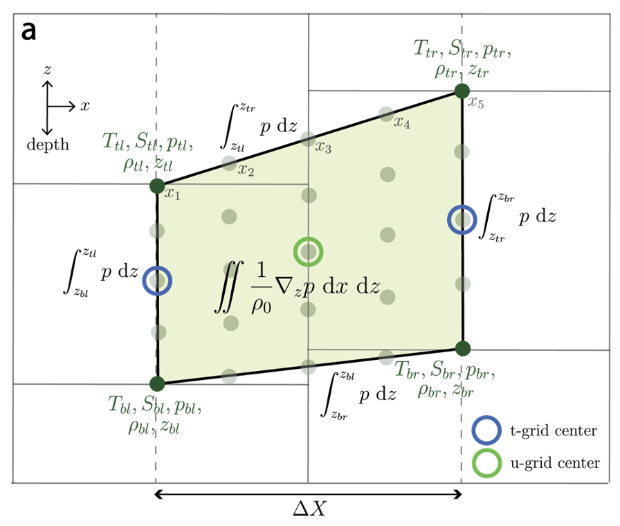

# Pressure forces

Date: 25/06/2026.

Presenter: Claire Yung (@claireyung). 

The net pressure force acting on a domain $\mathcal{R}$ is computed from the surface integral of pressure at the boundaries of domain, $\partial \mathcal{R}$ (written nicely by [Griffies et al 2020](https://doi.org/10.1029/2019MS001954)):

$$\mathbf{F}^{\text{pressure}} = -\oint_{\partial \mathcal{R}} p\,\mathbf{\hat{n}} \,d\mathcal{S} = -\int_\mathcal{R}\nabla p\,dV\qquad (1)$$

We can use the divergence theorem to rewrite this force as a gradient of pressure $\nabla p$, integrated over the domain. The pressure force is a term in the momentum equation and are fundamental to fluid flow, for example the equation below in material derivative form:

$$\rho\frac{D\mathbf{u}}{Dt} = -\nabla p + \rho \mathbf{g} + \text{other terms} \qquad (2)$$

In hydrostatic ocean models like MOM6 we assume the vertical pressure gradient balances the weight due to gravity, and therefore here we will only discuss horizontal pressure forces.

In discrete ocean model world, one could imagine computing the horizontal pressure gradient in the $x$ direction very crudely as 

$$\dfrac{\partial p}{\partial x} = \frac{p(x+dx)-p(x)}{dx} \qquad (3)$$

but this isn't a great approach because

1. this assumes the two points you are taking a derivative between are at exactly the same height $z$. Ocean models usually have sea surface height gradients (barotropic pressure force), on top of slight tilts in the model grid (e.g. $z^*$ coordinates, partial cells, let alone terrain-following or isopycnal coordinates which are definitely not flat)

2. very simple numerical scheme can lead to errors

Therefore, there has been quite a bit of work historically trying to accurately compute horizontal pressure gradients in ocean models. Inaccuracies in the calculation can manifest as spurious velocities in simulations. 
The horizontal pressure gradient in an arbitrary vertical coordinate, defined by isosurfaces $r$, under non-Boussinesq and hydrostatic assumptions is

$$\nabla_z p = \rho \nabla_r(gz) + \nabla_r p \qquad (4)$$

A common reason why pressure gradients cause issues in models is that the numerical scheme is slightly inacurrate. If the two terms on the RHS of (4) are large and opposing, then the small inaccurate residual results in pressure gradient errors.

MOM6 deals with pressure gradient forces in a clever way, described in [Adcroft, Hallberg and Harrison et al. (2008)](https://www.sciencedirect.com/science/article/abs/pii/S1463500308000243). They use eqn. (1) above with the form of the pressure gradient integral that is an line integral of pressure along the edge of finite volume grid cell (see below schematic).  They integrate the pressure analytically (with a given equation of state) along each side of the grid cell in $x-z$ and $y-z$ space, add them up, and find very accurate solutions. 

In MOM6, we use a highly accurate numerical implementation of the analytic Adcroft et al. (2008) method. We create a $5\times5$ sub-grid distribution of temperature and salinity within a grid cell (light green dots below). Density is computed at each sub-grid cell location using the equation of state, and then pressure is computed from an numerical integral of density. The pressure is then numerically integrated along each grid cell edge (actually the two integrals are combined into one step for numerical efficiency). The numerical integration uses Boole's rule: a higher-order version of the triangle rule, where the area under the curve of a function is to first order, proportional to the average of function at two end points. The resultant method is very accurate, however, it requires computing the equation of state within grid cells for EVERY grid cell, which adds some computational cost, particularly for nonlinear equations of state. There are also some choices that must be made when creating your sub-grid distribution, such as the accuracy of the interpolation method: currently we do linear interpolation of T and S in the horizontal, which means the pressure gradient is not perfect with a nonlinear equation of state and tilted cells.

