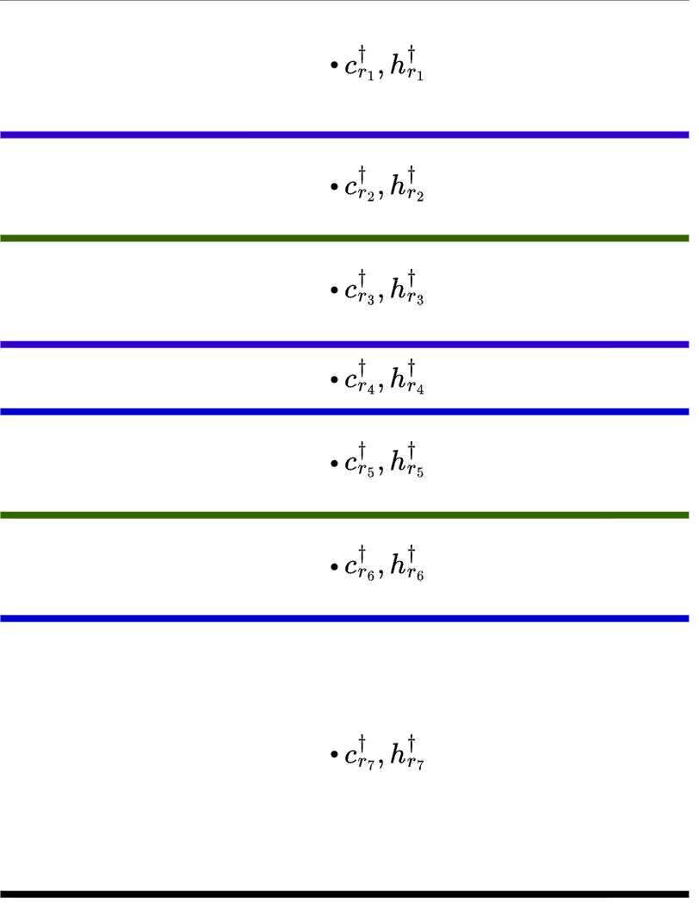
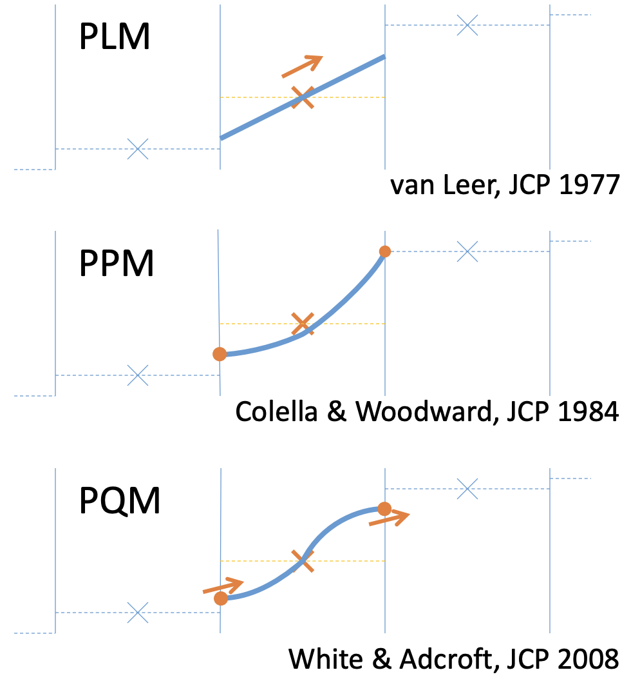

# Vertical Lagrangian Remapping Code

Date: 19/08/2026.

Presenter: Krishiv Kukreja (@KKukreja-code).

This set of notes intends to continue the discussion of the Lagrangian remapping algorithm covered in a [previous page](https://decoding-access-om3.readthedocs.io/mom6/vertical-lagrangian-remapping/).

The basic problem the remapping algorithm aims to solve is being able to compute tracer concentrations on a new target grid, given discrete tracer values on the current source grid. In the context of MOM6, the model has evolved in a Lagrangian frame of reference to give a certain source grid that had moved with the fluid flow. We now wish to view the ocean state on a pre-defined target grid to avoid the problem of vertical surface entanglement that would arise from a continuous Lagrangian evolution.

## intersect_src_tgt_grids Subroutine
We first aim to view the source and target grids relative to each other. To do this, we create a structure called a subgrid, which is a union of the interfaces of both grids. Subcells are defined as the grid cells between two consecutive interfaces of this union, and an image is shown below.

<figure markdown="span">
  
  <figcaption>An example of a subgrid. The blue interfaces are source grid interfaces, while the green ones are target grid interfaces.
</figcaption>
</figure>

This subroutine returns the thickness of each sub-cell within the subgrid. It determines the start and end indices of the subcells within each source or target cell. Finally, it also saves the thickest sub-cell within each source cell, which will be useful for a later conservation algorithm.

We only have a set of thicknesses for the source and target grids, so we need a common point of reference to be able to consider them relative to each other. To do this, the first interfaces of both grids are constrained to coincide at the top. This means the first subcell will always "vanish", i.e. have zero thickness.

The subroutine keeps track of local variables `h0_supply` and `h1_supply`, which store the remaining thickness in the current source and target cell respectively. As we go down the column, an ongoing subcell ends at the end of the source cell or target cell it is within, whichever one comes first. This is why the thickness of the current subcell is set to be `min(h0_supply, h1_supply)`.

## Polynomial Reconstruction
Once we have a subgrid containing the combined relative thickness information of the source and target grids, we need to find tracer values on each of the subcells. To do this, we need to make some assumption of a piecewise continuous model of tracer distribution down the column, as the subgrid is a (non-strictly) finer partition of the source column. We can have piecewise constant (PCM), piecewise linear (PLM), piecewise parabolic (PPM), and piecewise quartic (PQM) reconstructions of tracer distribution, and the error associated with each scheme depends on the degree of the polynomial we use to model the tracer content.

<figure markdown="span">
  
  <figcaption>Polynomial Reconstruction Options for Tracer Distribution (Collated by Adcroft (2016))
</figcaption>
</figure>

A higher-order scheme will more accurately be able to model the unknown underlying distribution, but requires more computational resources due to the need to find more coefficients. It also requires more numerical limiters which prevent the creation of spurious extrema and excessive oscillations in slope between neighbouring cells. However, higher-order schemes reduce numerical mixing: intuitively, a smoother interpolation of tracer values reduces the amount of spurious "averaging" that needs to be done when finding tracer values on a new grid column.

## remap_src_to_sub_grid Subroutine

Given a polynomial reconstruction of tracer values down the source column, we can find tracer concentrations in each subcell. The subroutine keeps track of the start and end positions of subcells within a particular source cell using non-dimensional variables `xa` and `xb` which record relative position down a source cell, and hence `xa`, `xb` $\in [0,1]$. It is important to use relative values, as the algorithm only requires position within a source cell: polynomials are defined piecewise, so the polynomial coefficients used for one cell may not be the same as those for the next one. The tracer concentration of a subcell can then be calculated as the average value of the polynomial reconstruction between `xa` and `xb`.

The total tracer content in the source column also needs to be conserved when it is remapped onto the subgrid. This is done using a clever conservation algorithm that updates the tracer content of the thickest subcell in each source cell to be exactly what it needs to be so that the sum of the tracer contents in all the subcells inside the source cell equals the product of the thickness and the tracer concentration in the source cell. This correction is made to the thickest subcell in each source cell so that the same absolute difference between the tracer content in the source cell and the subcells can be spread over the largest thickness to reduce the change in average concentration that will result.

## remap_sub_to_tgt_grid Subroutine

Given the tracer values in each subcell, we can keep running totals of thickness-weighted tracer content and thickness across all subcells in each target cell. The ratio of these quantities for each target cell yields the average tracer concentration in the cell.

## Important Properties to be Preserved
The conservation algorithm discussed before helps ensure the thickness-weighted tracer content in the source and target columns remains the same. There is an acceptable level of numerical error within which the tracer content can fluctuate. This is regularly updated in the algorithm, as each piece of arithmetic contributes an error quantified approximately by the magnitude of the values involved in the calculation, multiplied by machine precision.

The other property we wish to enforce is boundedness: the maximum and minimum tracer concentrations inside the target column should not be beyond the maximum and minimum values in the source column, to prevent the polynomial reconstruction from introducing spurious extrema. This is enforced when remapping from the source column to the subgrid. The concentration of each subcell is forced to be in between the left and right edge values of the tracer distribution in the source cell it is within.

Notice that achieving both of these objectives can create conflicts. If we change subcell concentration so that it stays within the given bounds, we are losing or creating tracer content, so this is done at the expense of tracer conservation. If we use the thickest-subcell algorithm to guarantee conservation, when we change the tracer concentration in the thickest subcell of each source cell there is no guarantee that it remains within the bounds we wish to enforce. However, making this correction to the thickest subcell results in the lowest possible change in tracer concentration, so it gives us the best possible chance of maintaining boundedness as well.

There is a `FATAL_CHECK_REMAPPING` flag in the MOM parameter document, which is set to `False` by default, but can be turned on to see if any of the above errors in conservation or boundedness arise. If they do, the `check_remapped_values` subroutine will raise a fatal exception and cause the model to terminate.