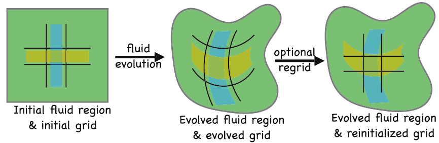
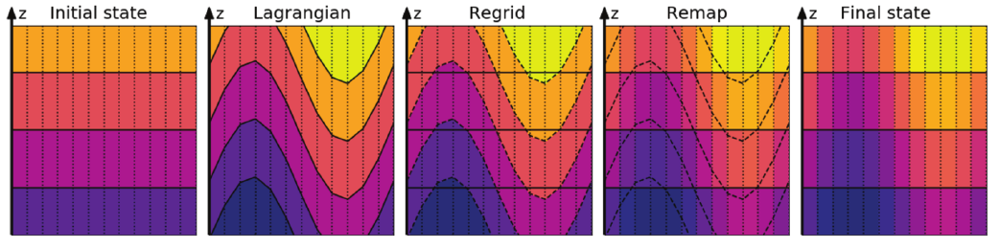

# Vertical Lagrangian remapping

Date: 18/06/2026.

Presenter: Angus Gibson (@angus-g).

With **generalised vertical coordinates (GVC)**, we know that vertical velocities permit
a range of grid evolution from fully Lagrangian (zero dia-surface transport) to fully
Eulerian (zero grid velocity). In MOM6, the dynamics are written in the fully Lagrangian sense:
the GVC $s$ follows fluid elements so that the dia-surface volume flux $w^{(\dot{s})} = 0$.

If the model is using a purely Lagrangian coordinate, how do we have any control
over it? In general, these coordinates drift to a less useful representation of the
water column. For example, volume injection at the surface would inflate the
upper-most layer, losing resolution for the representation of boundary layer
processes. Even more simply, there is indeed irreversible mixing across surfaces
that must be captured somehow.

The method has three steps:

1. the Vertical Lagrangian step: evolve the model with a purely Lagrangian
   generalised coordinate;
2. the Vertical Regrid step: explicitly set the generalised coordinate;
3. the Vertical Remap step: ensure consistency between the ocean state
   and the new coordinate.

The *Vertical Regrid* step is where we have the most freedom and flexibility. At
this stage, we explicitly set the generalised coordinate $s(x,y,z,t)$. The choice
is arbitrary: it could be predetermined (like a fixed geopotential or
terrain-following coordinate); state-dependent (following particular isopycnals by
solving for density levels); or even evolutionary (relaxing the current field
toward some target value). In fact, you could even change the number of
vertical levels!

There is a slight issue after the Vertical Regrid step: the underlying ocean
state is no longer consistent with the GVC. The *Vertical Remap* step fixes
this by interpolating (or extrapolating) the state onto the new grid. In the
continuous limit, this doesn't change the ocean state. However, since we have
limited resolution there is necessarily a spurious change to the state due to
interpolation error. Ideally, this numerical mixing is reduced while integrated
quantities are conserved.

There are two big advantages to using this method:

1. There is no vertical CFL limit! As long as the remapping can handle
   interpolation over more than a single cell, the target grid can be
   arbitrary.
2. Grid evolution can occur on a different timestep to state evolution. You may
   take several Lagrangian timesteps before performing the regrid/remap steps.
   Particularly with several tracers (as with BCG), this may give some
   performance improvements.

A third advantage is that there is a built-in method for remapping the state onto
an arbitrary grid, which is useful for diagnostics. You may have a lower-resolution
diagnostic grid, or want density-space diagnostics, etc.

