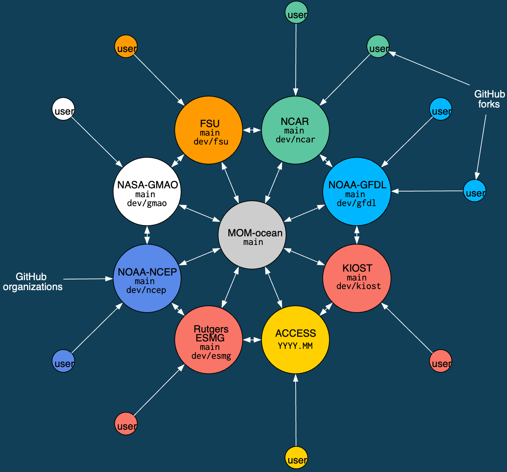

# Contributing to MOM6

## Part 1: How to contribute code back to MOM6

Date: 23/04/2026.

Presenter: Josef Bisits (@jbisits).

### Benefits:

 - allows for online calculation (very precise);
 - could be of enduring value to the community;
 - it will get maintained for you once you've contributed it!

### Background

Joey did this once recently and will walk us through the steps. Today, he'll focus on diagnostics as they are a friendly place to start. A related issue is how to edit the source code and then build the model, this will be the focus of a later session. In general, one needs to 

> find the relevant model code --> do a calculation --> output it

### Important Memory Layout Considerations

Important to be aware that there are two different types of memory `non-symmetric` and `symmetric` in MOM6. This influences where your data lives on the grid:

| Non-symmetric | Symmetric |
|---------------|-----------|
|  |  |

 - the crosses (`x`) are h points
 - faces are the `u` and `v` points

### Unit Systems

Another consideration is that MOM6 has internal dimensions (non-dimensionalised) and typical external units.
These are documented throughout the source cod, for example: 
```fortran
[CU H L2 T-1 --> conc m3 s_1 or conc kg s-1]
```

In the above, `CU` is the concentration of any tracer in internal dimensions which, once transformed, becomes the physical concentration unit; see [for here](https://github.com/ACCESS-NRI/MOM6/blob/c664721ebd58c033964b502e7fcdcccd05f02947/src/tracer/MOM_tracer_types.F90#L11). For example, the internal dimension of temperature is `CU` but the output `conc` will be degrees Celsius. Additionally, in the above `H` is the layer thickness, `L` is the horizontal length and `T` is time which are transformed to conc m3 s-1 when the model output is saved.

One will see these kinds of statements in the headers of subroutines:
```fortran
subroutine calculate_diagnostic_fields(u, v, h, uh, vh, tv, ADp, CDp, p_surf, &
                                       dt, diag_pre_sync, G, GV, US, CS)
  type(ocean_grid_type),   intent(inout) :: G    !< The ocean's grid structure.
  type(verticalGrid_type), intent(in)    :: GV   !< The ocean's vertical grid structure.
  type(unit_scale_type),   intent(in)    :: US   !< A dimensional unit scaling type
  real, dimension(SZIB_(G),SZJ_(G),SZK_(GV)), &
                           intent(in)    :: u    !< The zonal velocity [L T-1 ~> m s-1].
```
Will save you some time to think about this earlier rather than later!

### Calculation Process

One then does their calculation. See [here](https://github.com/jbisits/MOM6/blob/45d9ea4acf54959149d01e85c4b497b1f20c1428/src/tracer/MOM_tracer_numerical_mixing.F90#L41-L67) for a demonstration of a subroutine that defines dimensions of inputs and outputs and carries out a calculation for an output diagnostic.

Having defined a diagnostic, for the model to output it a `conversion` needs to be specified so that the output data is in the correct units. The `conversion` is specified in when the diagnostic is registered, see the registering of the [zonal mass transport](https://github.com/jbisits/MOM6/blob/45d9ea4acf54959149d01e85c4b497b1f20c1428/src/diagnostics/MOM_diagnostics.F90#L2217-L2220) which converts the internal units into `kgs^-1` for output.

@jbisits has been working on a contribution on his own fork:

 - https://github.com/jbisits/MOM6/tree/jib/numerical-mixing

Once one is happy with a code contribution. It is then possible, via the [ACCESS-NRI MOM6 fork](https://github.com/aCCESS-NRI/mom6), to go through a process by which it gets accepted into the ["upstream" `mom-ocean` codebase](https://github.com/mom-ocean/mom6). We will cover this process in more detail in a future presentation. 

### Further Resources

Further background is available:

 - Marshall Ward (@marshallward) on:
    - [contributing to MOM6](https://www.marshallward.org/mom6workshop/contrib.html#/summary)
    - [the MOM6 development cycle](https://www.marshallward.org/woco2023/#/title-slide)
    - [Testing: verification and validation](https://www.marshallward.org/mom6vv/#/title-slide)
    - [Dimensional and rotational testing of MOM6](https://www.marshallward.org/fortrancon2021/#/title-slide)
 - [Contributing to MOM6 video](https://www.youtube.com/watch?v=JsjEBxt9A6I).
 - [ACCESS-NRI on MOM6 node PR testing](https://access-om3-configs.access-hive.org.au/latest/infrastructure/MOM6-node-PR-testing/).
 - [ACCESS-NRI MOM6 branch management](https://github.com/accESS-nRI/mom6/wiki) (relevant for making contributions).

## Part 2: How to contribute code back to MOM6

Date: 30/04/2026.

Presenter: Dougie Squire (@dougiesquire).

### MOM6 Consortium Overview


_Schematic of MOM6 consortium with it's 8 development nodes._

#### The MOM6 Consortium

- ACCESS-NRI is a member of the MOM6 consortium.
- Contributions start at the outside and work their way in. All code contributions (preferably) go through development nodes.
- All members review/test contributions to the "official" codebase (`mom-ocean/MOM6:main`).
- ACCESS-OM3 is built from the ACCESS-NRI fork.

For example, Joey Bisits is working in his own fork of ACCESS-NRI's MOM6 fork, a PR will then merge Joey's code into our organisation's fork -- as part of the PR, ACCESS-NRI will do some testing. Collating several of these kinds of contributions together, we will eventually put a PR together to `mom-ocean/MOM6:main`. This will then be tested by all the development nodes and they all separately need to approve it before it will be merged into `mom-ocean/MOM6:main`. Further details of the tests ACCESS-NRI does is [available here](https://access-om3-configs.access-hive.org.au/latest/infrastructure/MOM6-node-PR-testing/).

### Fork Status and Implications

At times, the ACCESS-NRI fork is out of step with `mom-ocean/MOM6:main`, this occurs across all the development nodes. For example, currently on our fork, on the `2026.01` branch, it is "14 commits ahead of and 18 commits behind mom-ocean/MOM6:main".

What does this mean for me (a community person)?

 - Pull requests should be made to `ACCESS-NRI/MOM6`
 - In practice, we prefer Pull Requests are made from branches in `ACCESS-NRI/MOM6` (it makes testing easier as our infrastructure is set up there), rather than people's own personal fork.
 - We want to help the community contribute code. Open an issue in `ACCESS-NRI/MOM6` if you are thinking about contributing something and we can chat it over and give people write access to the repository.
 - It may take some time for your code to reach `mom-ocean/MOM6`.
 - We offer technical support for people's work.

### Avoiding Duplicate Work

Audience question: how does one know that the thing they're working on not being worked on elsewhere?

 - We can ask at the bi-weekly MOM6 developer meetings
 - Look at `mom-ocean` PRs and development occurring at other development nodes (e.g. [gfdl](https://github.com/NOAA-GFDL/MOM6))
 - Open an issue on the [`ACCESS-NRI/MOM6` fork to discuss](https://github.com/acCESS-nri/mom6) -- it's okay to do this earlier whilst you are still working out a plan.

### Additional Resources

Further information is available:

 - Marshall Ward (@marshallward) on:
    - [contributing to MOM6](https://www.marshallward.org/mom6workshop/contrib.html#/summary)
 - [Contributing to MOM6 video](https://www.youtube.com/watch?v=JsjEBxt9A6I).
 - [ACCESS-NRI MOM6 branch management](https://github.com/accESS-nRI/mom6/wiki) (relevant for making contributions).
