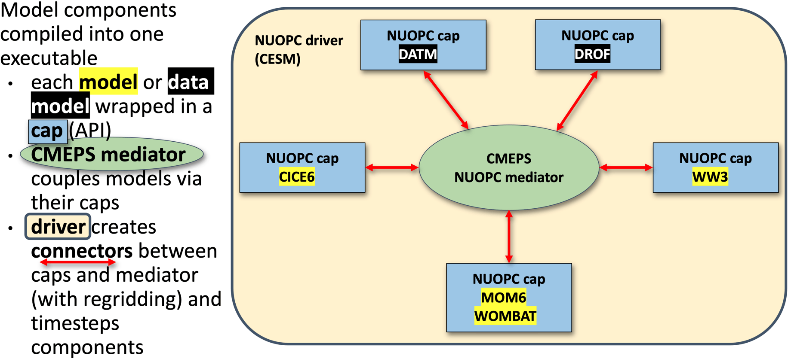

# Overview of MOM6 configuration (input files etc)

Presenters: @aekiss @claireyung

Configuration and input files when running MOM6 "standalone" (FMS coupler). Actually, running MOM6 in an idealised way only requires 3 input files. Here is an example taken from Claire's `IS-PG-MOM6` repository:

 - `MOM_input` -- parameter settings (name defined in 'MOM_input').
 - `diag_table` -- diagnostics.
 - `input.nml` -- run settings (calendar, MOM_input names etc).

As this is an idealised test case, much of the configuration (forcing, geometry etc) are defined in `common/MOM_input`. MOM_input file typically contain only the non-default values that are needed. A full list of parameters  be found in the corresponding `MOM_parameter_doc.all` file ([example](https://github.com/claireyung/IS-PG-MOM6/blob/main/icemount-layer-LSPR/MOM_parameter_doc.all)) which is generated by the model at run-time. In Claire's case, she builds "perturbations" of the base case ("common") by modifying these files; in `icemount-layer-LSPR` ([here](https://github.com/claireyung/IS-PG-MOM6/tree/main/icemount-layer-LSPR)) you can see the symlinks to the `MOM_input`, `diag_table`, `input.nml` files discussed above. Except that now there is a MOM_override file ([here](https://github.com/claireyung/IS-PG-MOM6/blob/main/icemount-layer-LSPR/MOM_override)) which overrides any settings in `MOM_input`. 

MOM6 also has an in-built sea-ice model SIS2. An example configuratin is [here](https://github.com/cosima/mom6-panan/tree/master). You can see that there are more configuration files (additional to `MOM_input`, `diag_table`, `input.nml`): 

 - `field_table`;
 - `SIS_input` SIS2 input files;
 - `data_table` forcing files if using FMS coupler

ACCESS-NRI ACCESS-OM3 uses a different coupler (NUOPC) compared to the above two examples. It also uses a different "standalone" sea-ice model CICE. So whilst the MOM elements discussed above remain the same. Additional files are required for NUOPC to couple the components. 

source: https://access-om3-configs.access-hive.org.au/latest/infrastructure/Architecture/

There's a description of the files found in a configuration here: https://access-om3-configs.access-hive.org.au/latest/configurations/Overview/

OM3 configurations are stored here:
https://github.com/acCESS-nri/access-om3-configs

Configurations that have a `{dev|release}-` prefix are the ones to focus on. Briefly, the configurations branches are named with the following
`{dev|release}-{MODEL_COMPONENTS}_{nominal_resolution}km_{forcing_data}_{forcing_method}[+{modifier}]`

Further details [here](https://access-om3-configs.access-hive.org.au/latest/#access-om3-configs-overview).

Users are welcome to fork the access-nri configuration repository and share what changes/additions they make to configurations. ACCESS-NRI is also interested in helping support users share configurations ([process outlined here](https://access-om3-configs.access-hive.org.au/latest/contributing/Add-Supported-Config/)). We are also keeping a list of key experiments used for [development here](https://access-om3-configs.access-hive.org.au/latest/Experiments/).

Handy resources:

 - ACCESS-NRI's OM3 configurations [live here](https://github.com/acCESS-nri/access-om3-configs);
 - ACCESS-NRI [ACCESS-OM3 configuration files explanation](https://access-om3-configs.access-hive.org.au/latest/configurations/Overview/); 
 - [MOM6 runtime parameters format (input.nml, MOM_input)](https://mom6.readthedocs.io/en/main/api/generated/pages/Runtime_Parameter_System.html);
 - [diag_table](https://mom6.readthedocs.io/en/main/api/generated/pages/Diagnostics.html) ;
 - [Another explanation of config files from MOM6 regional](https://regional-mom6.readthedocs.io/en/latest/mom6-file-structure-primer.html);
 - [AOS MOM6 tutorial 2022: Running and controlling MOM6](https://www.youtube.com/watch?v=94m3CMTwJ1E) (e.g. ~15 minutes)
