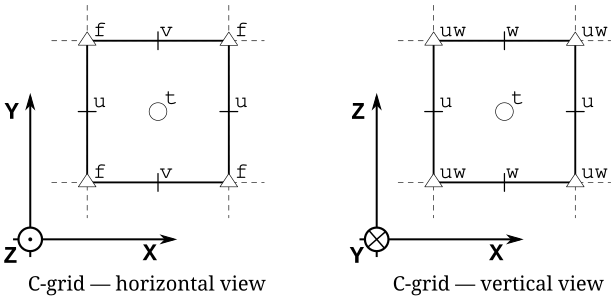
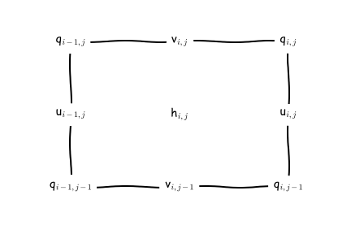
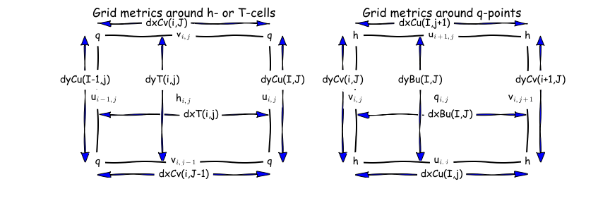

# OM3 Runtime Output Files

Presenter: @chrisb13 (Chris Bull).

Date: 09/04/2026

!!! abstract

    Today we're focusing on understanding model output when OM3 runs succesfully. We'll be looking at key OM3 output files and ending on how to interpret diagnostics on the MOM6 C-grid. Next week Helen will discover what to do when things go wrong. 

We'll focus on a recent dev `MC_25km_jra_iaf-1.0-beta-5165c0f8` [OM3 experiment](https://github.com/ACCESS-Community-Hub/access-om3-experiments/tree/MC_25km_jra_iaf-1.0-beta-5165c0f8) (`/g/data/ol01/outputs/access-om3-25km/MC_25km_jra_iaf-1.0-beta-5165c0f8/`).

!!! note

    Providence of this run includes:

     - [Model build](https://github.com/ACCESS-NRI/ACCESS-OM3/releases/tag/2025.08.001);
     - [Base configuration](https://github.com/ACCESS-NRI/access-om3-configs/tree/f1307b65ee6b06ad9e92a560ae64bc0b4c91e6ee);
     - [Experiment](https://github.com/ACCESS-Community-Hub/access-om3-experiments/tree/MC_25km_jra_iaf-1.0-beta-5165c0f8) (includes the Payu run log -- has a commit for each time the model cycled / had run time changes).

    Further details about these simulations is [available here](https://access-om3-configs.access-hive.org.au/latest/Experiments/).

Looking at the OM3 simulation folder `/home/156/aek156/payu/MC_25km_jra_iaf` we have:
```bash
[gadi-login-06: MC_25km_jra_iaf-1.0-beta-5165c0f8]$ ls  /home/156/aek156/payu/MC_25km_jra_iaf
025km_jra_iaf_c.e156953262  025km_jra_iaf.o156963110    025km_jra_iaf_s.o157005692  input.nml                 postscript.sh.o156573831  postscript.sh.o156808786
025km_jra_iaf_c.e156963108  025km_jra_iaf.o156976044    025km_jra_iaf_s.o157015747  LICENSE                   postscript.sh.o156580484  postscript.sh.o156819850
025km_jra_iaf_c.e156976043  025km_jra_iaf.o156985131    025km_jra_iaf_s.o157180052  manifests                 postscript.sh.o156591178  postscript.sh.o156837563
025km_jra_iaf_c.e156985130  025km_jra_iaf.o156993836    025km_jra_iaf_s.o157180396  metadata.yaml             postscript.sh.o156606425  postscript.sh.o156849829
025km_jra_iaf_c.e156993833  025km_jra_iaf.o157001496    025km_jra_iaf_s.o157180528  MOM_input                 postscript.sh.o156623297  postscript.sh.o156854528
025km_jra_iaf_c.e157001495  025km_jra_iaf.o157011761    025km_jra_iaf_s.o157185544  MOM_override              postscript.sh.o156629387  postscript.sh.o156859814
025km_jra_iaf_c.e157011759  025km_jra_iaf_s.e156956754  025km_jra_iaf_s.o157186682  nuopc.runconfig           postscript.sh.o156679792  postscript.sh.o156872003
025km_jra_iaf_c.o156953262  025km_jra_iaf_s.e156966829  025km_jra_iaf_s.o157186970  nuopc.runseq              postscript.sh.o156683733  postscript.sh.o156886215
025km_jra_iaf_c.o156963108  025km_jra_iaf_s.e156979618  access-om3.err              postscript.sh.o156435401  postscript.sh.o156688095  postscript.sh.o156915954
025km_jra_iaf_c.o156976043  025km_jra_iaf_s.e156988551  access-om3.out              postscript.sh.o156456265  postscript.sh.o156696134  postscript.sh.o156931182
025km_jra_iaf_c.o156985130  025km_jra_iaf_s.e156998369  archive                     postscript.sh.o156463585  postscript.sh.o156703797  postscript.sh.o156956753
025km_jra_iaf_c.o156993833  025km_jra_iaf_s.e157005692  CITATION.cff                postscript.sh.o156464418  postscript.sh.o156707261  postscript.sh.o156966827
025km_jra_iaf_c.o157001495  025km_jra_iaf_s.e157015747  config.yaml                 postscript.sh.o156464466  postscript.sh.o156712962  postscript.sh.o156979617
025km_jra_iaf_c.o157011759  025km_jra_iaf_s.e157180052  datm_in                     postscript.sh.o156464644  postscript.sh.o156717541  postscript.sh.o156988549
025km_jra_iaf.e156942635    025km_jra_iaf_s.e157180396  datm.streams.xml            postscript.sh.o156473862  postscript.sh.o156722375  postscript.sh.o156998368
025km_jra_iaf.e156953263    025km_jra_iaf_s.e157180528  diagnostic_profiles         postscript.sh.o156482340  postscript.sh.o156726486  postscript.sh.o157005691
025km_jra_iaf.e156963110    025km_jra_iaf_s.e157185544  diag_table                  postscript.sh.o156487555  postscript.sh.o156728454  postscript.sh.o157015746
025km_jra_iaf.e156976044    025km_jra_iaf_s.e157186682  docs                        postscript.sh.o156490910  postscript.sh.o156729873  postscript_synced.sh
025km_jra_iaf.e156985131    025km_jra_iaf_s.e157186970  drof_in                     postscript.sh.o156493354  postscript.sh.o156734274  postscript_synced.sh.o157623147
025km_jra_iaf.e156993836    025km_jra_iaf_s.o156956754  drof.streams.xml            postscript.sh.o156496972  postscript.sh.o156742602  postscript_synced.sh.o157623806
025km_jra_iaf.e157001496    025km_jra_iaf_s.o156966829  drv_in                      postscript.sh.o156511423  postscript.sh.o156748735  postscript_synced.sh.o157626155
025km_jra_iaf.e157011761    025km_jra_iaf_s.o156979618  env.yaml                    postscript.sh.o156530694  postscript.sh.o156752864  README.md
025km_jra_iaf.o156942635    025km_jra_iaf_s.o156988551  fd.yaml                     postscript.sh.o156547767  postscript.sh.o156755583  testing
025km_jra_iaf.o156953263    025km_jra_iaf_s.o156998369  ice_in                      postscript.sh.o156564391  postscript.sh.o156782543  work
```

Key files (incomplete, edited for length):

 - `config.yaml` file that defines the experiment options;
 - `025km_jra_iaf.o*` standard output for each model cycle;
 - `025km_jra_iaf.e*` standard output errors;
 - `postscript.sh.o*` standard output for postprocessing script;
 - `access-om3.out` om3 specific errors;
 - `access-om3.err` om3 specific output;
 - `manifests` payu keeping track of `exe.yaml`, `input.yaml`, `restart.yaml`;
 - `docs` (`available_diags.000000`, `MOM_parameter_doc.all`, `MOM_parameter_doc.debugging`, `MOM_parameter_doc.layout`, `MOM_parameter_doc.short`);
 - `diag_table` (symlink `diag_table` ->`diagnostic_profiles/diag_table_standard`);
 - `archive` where all the output goes once each experiment cycle is complete (symlink `archive` -> `/scratch/x77/aek156/access-om3/archive/MC_25km_jra_iaf-1.0-beta-5165c0f8`);
 - `work` temporary working space for the model (where to look when it crashes -- symlink `work` -> `/scratch/x77/aek156/access-om3/work/MC_25km_jra_iaf-1.0-beta-5165c0f8`);
 - model configuration files: `input.nml`, `metadata.yaml`, `MOM_input`, `MOM_override`, `nuopc.runconfig`, `nuopc.runseq`, `datm_in`, `datm.streams.xml`, `drof_in`, `drof.streams.xml`, `drv_in`, `env.yaml`, `fd.yaml`, `ice_in`.

Looking at the `archive` output (`/g/data/ol01/outputs/access-om3-25km/MC_25km_jra_iaf-1.0-beta-5165c0f8/`) we have:

```sh
[gadi-login-04: MC_25km_jra_iaf-1.0-beta-5165c0f8]$ ls
datastore.csv                                     git-runlog     output009  output020  output031  output042  output053   restart006  restart017  restart028  restart039  restart050
datastore_invalid_assets_2025-12-11-14:49:23.csv  metadata.yaml  output010  output021  output032  output043  output054   restart007  restart018  restart029  restart040  restart051
datastore_invalid_assets_2025-12-12-10:15:36.csv  output000      output011  output022  output033  output044  output055   restart008  restart019  restart030  restart041  restart052
datastore_invalid_assets_2025-12-15-14:14:40.csv  output001      output012  output023  output034  output045  output056   restart009  restart020  restart031  restart042  restart053
datastore_invalid_assets_2025-12-16-05:19:19.csv  output002      output013  output024  output035  output046  pbs_logs    restart010  restart021  restart032  restart043  restart054
datastore_invalid_assets_2025-12-17-13:33:13.csv  output003      output014  output025  output036  output047  restart000  restart011  restart022  restart033  restart044  restart055
datastore_invalid_assets_2025-12-18-11:17:27.csv  output004      output015  output026  output037  output048  restart001  restart012  restart023  restart034  restart045  restart056
datastore_invalid_assets_2025-12-19-08:47:53.csv  output005      output016  output027  output038  output049  restart002  restart013  restart024  restart035  restart046
datastore_invalid_assets_2026-01-08-14:43:25.csv  output006      output017  output028  output039  output050  restart003  restart014  restart025  restart036  restart047
datastore.json                                    output007      output018  output029  output040  output051  restart004  restart015  restart026  restart037  restart048
error_logs                                        output008      output019  output030  output041  output052  restart005  restart016  restart027  restart038  restart049
```

Note:

 - This is where the output is "archived" to;
 - each `output0*` is a cycle of output (yearly);
 - each `restart0*` contains restart files;
 - file `datastore.json` is an ESMdatastore.

Looking at `output030`, we have (trimmed for readability):

```bash
[gadi-login-06: output030]$ ls -1
access-om3.cice.1day.mean.1988-01.nc
access-om3.cice.1day.mean.1988-02.nc
access-om3.cice.1day.mean.1988-03.nc
access-om3.cice.static.nc
access-om3.err
access-om3.mom6.2d.tob.1day.mean.1988.nc
access-om3.mom6.2d.tos.1day.mean.1988.nc
access-om3.mom6.2d.tos.1mon.max.1988.nc
access-om3.mom6.2d.tos.1mon.min.1988.nc
access-om3.mom6.2d.umo_2d.1mon.mean.1988.nc
access-om3.mom6.2d.vmo_2d.1mon.mean.1988.nc
access-om3.mom6.2d.wfo.1mon.mean.1988.nc
access-om3.mom6.2d.zos.1mon.max.1988.nc
access-om3.mom6.2d.zos.1mon.mean.1988.nc
access-om3.mom6.2d.zos.1mon.min.1988.nc
access-om3.mom6.2d.zossq.1mon.mean.1988.nc
access-om3.mom6.3d.agessc.z.1mon.mean.1988.nc
access-om3.mom6.3d.diftrblo.1mon.mean.1988.nc
access-om3.mom6.3d.diftrelo.1mon.mean.1988.nc
access-om3.mom6.3d.e.1mon.mean.1988.nc
access-om3.mom6.3d.e.rho2.1mon.mean.1988.nc
access-om3.mom6.3d.GM_sfn_y.rho2.1mon.mean.1988.nc
access-om3.mom6.3d.uhGM.rho2.1mon.mean.1988.nc
access-om3.mom6.3d.umo.rho2.1mon.mean.1988.nc
access-om3.mom6.3d.uo.z.1mon.mean.1988.nc
access-om3.mom6.3d.vhGM.rho2.1mon.mean.1988.nc
access-om3.mom6.3d.vmo.rho2.1mon.mean.1988.nc
access-om3.mom6.3d.vo.z.1mon.mean.1988.nc
access-om3.mom6.geometry.nc
access-om3.mom6.scalar.1day.snap.1988.nc
access-om3.mom6.static.nc
access-om3.out
available_diags.000000
config.yaml
datm_in
datm.streams.xml
diag_table
drof_in
drof.streams.xml
drv_in
env.yaml
fd.yaml
ice_in
input.nml
log
logfile.000000.out
manifests
MOM_IC_1.nc
MOM_IC_2.nc
MOM_IC_3.nc
MOM_IC.nc
MOM_input
MOM_override
MOM_parameter_doc.all
MOM_parameter_doc.debugging
MOM_parameter_doc.layout
MOM_parameter_doc.short
nuopc.runconfig
nuopc.runseq
ocean.stats
ocean.stats.nc
Vertical_coordinate.nc
warnfile.000000.out
```

We'll focus on interpreting the diagnostic output. 

Taking `access-om3.mom6.3d.uo.z.1mon.mean.1988.nc` as an example, this file consists of monthly time-mean zonal velocities for 1988. Looking at the structure of the file (edited for clarity):

```bash
[cyb561.gadi-login-06: output030]$ ncdump -c access-om3.mom6.3d.uo.z.1mon.mean.1988.nc | head -n100
netcdf access-om3.mom6.3d.uo.z.1mon.mean.1988 {
dimensions:
        xq = 1441 ;
        yh = 1152 ;
        z_l = 75 ;
        z_i = 76 ;
        time = UNLIMITED ; // (12 currently)
        nv = 2 ;
variables:
        float uo(time, z_l, yh, xq) ;
                uo:_FillValue = 1.e+20f ;
                uo:missing_value = 1.e+20f ;
                uo:units = "m s-1" ;
                uo:long_name = "Sea Water X Velocity" ;
                uo:cell_methods = "z_l:mean yh:mean xq:point time: mean" ;
                uo:time_avg_info = "average_T1,average_T2,average_DT" ;
                uo:standard_name = "sea_water_x_velocity" ;
                uo:interp_method = "none" ;
        double xq(xq) ;
                xq:units = "degrees_east" ;
                xq:long_name = "q point nominal longitude" ;
                xq:axis = "X" ;
        double yh(yh) ;
                yh:units = "degrees_north" ;
                yh:long_name = "h point nominal latitude" ;
                yh:axis = "Y" ;
        double z_l(z_l) ;
                z_l:units = "meters" ;
                z_l:long_name = "Depth at cell center" ;
                z_l:axis = "Z" ;
                z_l:positive = "down" ;
                z_l:edges = "z_i" ;
        double time(time) ;
                time:units = "days since 1900-01-01 00:00:00" ;
                time:long_name = "time" ;
                time:axis = "T" ;
                time:calendar_type = "GREGORIAN" ;
                time:calendar = "gregorian" ;
                time:bounds = "time_bnds" ;
```

We need to understand how MOM6's grid is defined.

Here are two different ways to visualise the C-grid that is used by MOM6. 

- The first way shows both the horizontal and vertical staggering. Note that the tracers, velocities and vorticity points are horizontally and vertically staggered:



*Image from the [pycomodo project](https://web.archive.org/web/20160417032300/http://pycomodo.forge.imag.fr/norm.html).*

- The second grid visualisation, focuses on the horizontal, and uses the the notation that is used in the MOM6 documentation:



*Image from the [MOM6 RTD](https://mom6.readthedocs.io/en/dev-gfdl/api/generated/pages/Discrete_Grids.html).*

We can find complete information about the MOM6 grid in this file `access-om3.mom6.static.nc`. This is *very* important when you want to do offline model diagnostics accurately (e.g. fluxes across sections, calculate gradients, integrals etc).

The file has a lot of useful information, so we'll look at it in chunks.

```bash
[gadi-login-06: output030]$ ncdump -c access-om3.mom6.static.nc | head -n220
netcdf access-om3.mom6.static {
dimensions:
        xh = 1440 ;
        yh = 1152 ;
        time = UNLIMITED ; // (1 currently)
        xq = 1441 ;
        yq = 1153 ;
variables:
        double xh(xh) ;
                xh:units = "degrees_east" ;
                xh:long_name = "h point nominal longitude" ;
                xh:axis = "X" ;
        double yh(yh) ;
                yh:units = "degrees_north" ;
                yh:long_name = "h point nominal latitude" ;
                yh:axis = "Y" ;
        double xq(xq) ;
                xq:units = "degrees_east" ;
                xq:long_name = "q point nominal longitude" ;
                xq:axis = "X" ;
        double yq(yq) ;
                yq:units = "degrees_north" ;
                yq:long_name = "q point nominal latitude" ;
                yq:axis = "Y" ;
```

Think of the above as "indices" for the Tracer and velocity points. Once, we have these we can then define latitude (`geolat_*`) and longitude (`geolon_*`) anywhere on the C-grid...

```bash
        double geolat_c(yq, xq) ;
                geolat_c:_FillValue = 1.e+20 ;
                geolat_c:missing_value = 1.e+20 ;
                geolat_c:units = "degrees_north" ;
                geolat_c:long_name = "Latitude of corner (Bu) points" ;
                geolat_c:cell_methods = "time: point" ;
                geolat_c:interp_method = "none" ;
        double geolat(yh, xh) ;
                geolat:_FillValue = 1.e+20 ;
                geolat:missing_value = 1.e+20 ;
                geolat:units = "degrees_north" ;
                geolat:long_name = "Latitude of tracer (T) points" ;
                geolat:cell_methods = "time: point" ;
        double geolat_u(yh, xq) ;
                geolat_u:_FillValue = 1.e+20 ;
                geolat_u:missing_value = 1.e+20 ;
                geolat_u:units = "degrees_north" ;
                geolat_u:long_name = "Latitude of zonal velocity (Cu) points" ;
                geolat_u:cell_methods = "time: point" ;
                geolat_u:interp_method = "none" ;
        double geolat_v(yq, xh) ;
                geolat_v:_FillValue = 1.e+20 ;
                geolat_v:missing_value = 1.e+20 ;
                geolat_v:units = "degrees_north" ;
                geolat_v:long_name = "Latitude of meridional velocity (Cv) points" ;
                geolat_v:cell_methods = "time: point" ;
                geolat_v:interp_method = "none" ;
        double geolon_c(yq, xq) ;
                geolon_c:_FillValue = 1.e+20 ;
                geolon_c:missing_value = 1.e+20 ;
                geolon_c:units = "degrees_east" ;
                geolon_c:long_name = "Longitude of corner (Bu) points" ;
                geolon_c:cell_methods = "time: point" ;
                geolon_c:interp_method = "none" ;
        double geolon(yh, xh) ;
                geolon:_FillValue = 1.e+20 ;
                geolon:missing_value = 1.e+20 ;
                geolon:units = "degrees_east" ;
                geolon:long_name = "Longitude of tracer (T) points" ;
                geolon:cell_methods = "time: point" ;
        double geolon_u(yh, xq) ;
                geolon_u:_FillValue = 1.e+20 ;
                geolon_u:missing_value = 1.e+20 ;
                geolon_u:units = "degrees_east" ;
                geolon_u:long_name = "Longitude of zonal velocity (Cu) points" ;
                geolon_u:cell_methods = "time: point" ;
                geolon_u:interp_method = "none" ;
        double geolon_v(yq, xh) ;
                geolon_v:_FillValue = 1.e+20 ;
                geolon_v:missing_value = 1.e+20 ;
                geolon_v:units = "degrees_east" ;
                geolon_v:long_name = "Longitude of meridional velocity (Cv) points" ;
                geolon_v:cell_methods = "time: point" ;
                geolon_v:interp_method = "none" ;
```

The `areacello` variables (e.g. calculating fluxes through a face):

```bash
        double areacello(yh, xh) ;
                areacello:_FillValue = 1.e+20 ;
                areacello:missing_value = 1.e+20 ;
                areacello:units = "m2" ;
                areacello:long_name = "Ocean Grid-Cell Area" ;
                areacello:cell_methods = "area:sum yh:sum xh:sum time: point" ;
                areacello:standard_name = "cell_area" ;
        double areacello_cu(yh, xq) ;
                areacello_cu:_FillValue = 1.e+20 ;
                areacello_cu:missing_value = 1.e+20 ;
                areacello_cu:units = "m2" ;
                areacello_cu:long_name = "Ocean Grid-Cell Area" ;
                areacello_cu:cell_methods = "area:sum yh:sum xq:sum time: point" ;
                areacello_cu:standard_name = "cell_area" ;
        double areacello_cv(yq, xh) ;
                areacello_cv:_FillValue = 1.e+20 ;
                areacello_cv:missing_value = 1.e+20 ;
                areacello_cv:units = "m2" ;
                areacello_cv:long_name = "Ocean Grid-Cell Area" ;
                areacello_cv:cell_methods = "area:sum yq:sum xh:sum time: point" ;
                areacello_cv:standard_name = "cell_area" ;
        double areacello_bu(yq, xq) ;
                areacello_bu:_FillValue = 1.e+20 ;
                areacello_bu:missing_value = 1.e+20 ;
                areacello_bu:units = "m2" ;
                areacello_bu:long_name = "Ocean Grid-Cell Area" ;
                areacello_bu:cell_methods = "area:sum yq:sum xq:sum time: point" ;
                areacello_bu:standard_name = "cell_area" ;
```

The `dx*` and `dy*` variables (e.g. calculating fluxes through a section, calculating gradients, integrals etc):



```bash
        double dxt(yh, xh) ;
                dxt:_FillValue = 1.e+20 ;
                dxt:missing_value = 1.e+20 ;
                dxt:units = "m" ;
                dxt:long_name = "Delta(x) at thickness/tracer points (meter)" ;
                dxt:cell_methods = "time: point" ;
                dxt:interp_method = "none" ;
        double dyt(yh, xh) ;
                dyt:_FillValue = 1.e+20 ;
                dyt:missing_value = 1.e+20 ;
                dyt:units = "m" ;
                dyt:long_name = "Delta(y) at thickness/tracer points (meter)" ;
                dyt:cell_methods = "time: point" ;
                dyt:interp_method = "none" ;
        double dxCu(yh, xq) ;
                dxCu:_FillValue = 1.e+20 ;
                dxCu:missing_value = 1.e+20 ;
                dxCu:units = "m" ;
                dxCu:long_name = "Delta(x) at u points (meter)" ;
                dxCu:cell_methods = "time: point" ;
                dxCu:interp_method = "none" ;
        double dyCu(yh, xq) ;
                dyCu:_FillValue = 1.e+20 ;
                dyCu:missing_value = 1.e+20 ;
                dyCu:units = "m" ;
                dyCu:long_name = "Delta(y) at u points (meter)" ;
                dyCu:cell_methods = "time: point" ;
                dyCu:interp_method = "none" ;
        double dxCv(yq, xh) ;
                dxCv:_FillValue = 1.e+20 ;
                dxCv:missing_value = 1.e+20 ;
                dxCv:units = "m" ;
                dxCv:long_name = "Delta(x) at v points (meter)" ;
                dxCv:cell_methods = "time: point" ;
                dxCv:interp_method = "none" ;
        double dyCv(yq, xh) ;
                dyCv:_FillValue = 1.e+20 ;
                dyCv:missing_value = 1.e+20 ;
                dyCv:units = "m" ;
                dyCv:long_name = "Delta(y) at v points (meter)" ;
                dyCv:cell_methods = "time: point" ;
                dyCv:interp_method = "none" ;
        double dyCuo(yh, xq) ;
                dyCuo:_FillValue = 1.e+20 ;
                dyCuo:missing_value = 1.e+20 ;
                dyCuo:units = "m" ;
                dyCuo:long_name = "Open meridional grid spacing at u points (meter)" ;
                dyCuo:cell_methods = "time: point" ;
                dyCuo:interp_method = "none" ;
        double dxCvo(yq, xh) ;
                dxCvo:_FillValue = 1.e+20 ;
                dxCvo:missing_value = 1.e+20 ;
                dxCvo:units = "m" ;
                dxCvo:long_name = "Open zonal grid spacing at v points (meter)" ;
                dxCvo:cell_methods = "time: point" ;
                dxCvo:interp_method = "none" ;
        double deptho(yh, xh) ;
                deptho:_FillValue = 1.e+20 ;
                deptho:missing_value = 1.e+20 ;
                deptho:units = "m" ;
                deptho:long_name = "Sea Floor Depth" ;
                deptho:cell_methods = "area:mean yh:mean xh:mean time: point" ;
                deptho:cell_measures = "area: areacello" ;
                deptho:standard_name = "sea_floor_depth_below_geoid" ;
```

Further information:

 - [Discrete Horizontal and Vertical Grids on MOM6 docs](https://mom6.readthedocs.io/en/dev-gfdl/api/generated/pages/Discrete_Grids.html);
 - [Lecture: MOM6 spatial discretizations](https://www.youtube.com/watch?v=Rl_GxAamxjQ);
 - [Tutorial: Analyzing MOM6](https://www.youtube.com/watch?v=SUMjB5jX_dE).
