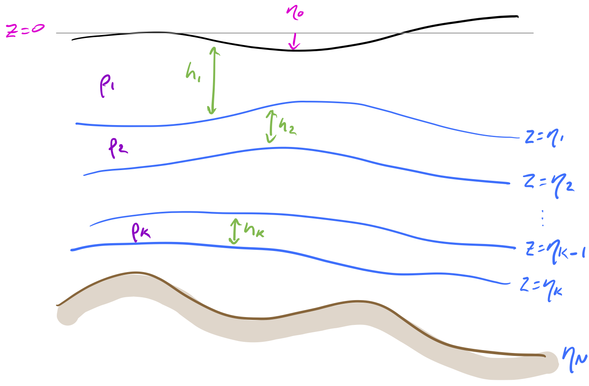
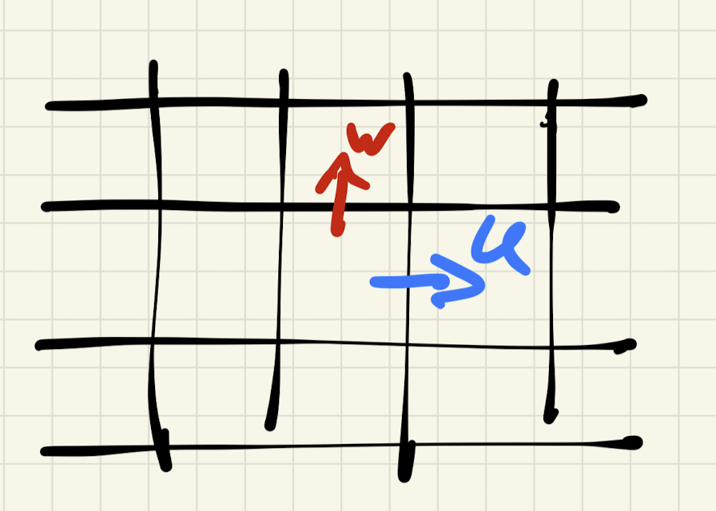
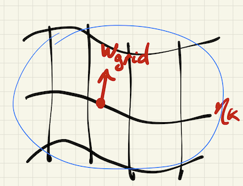
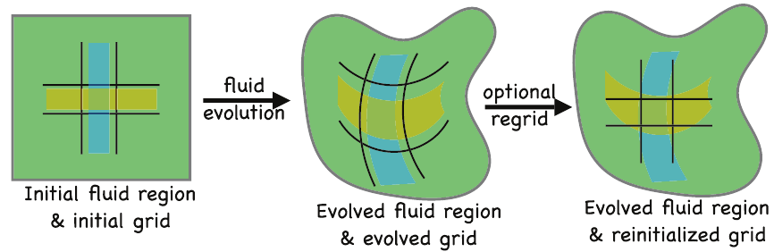
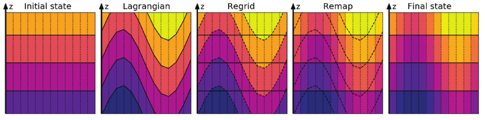
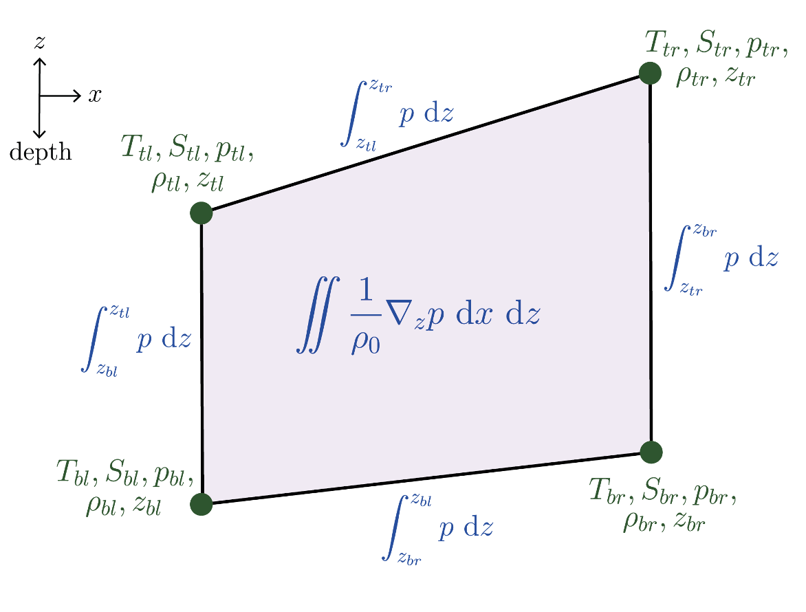
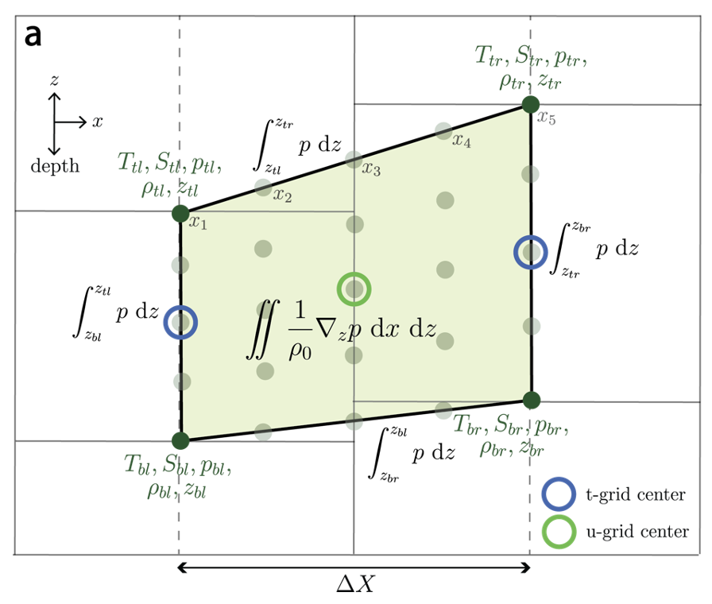
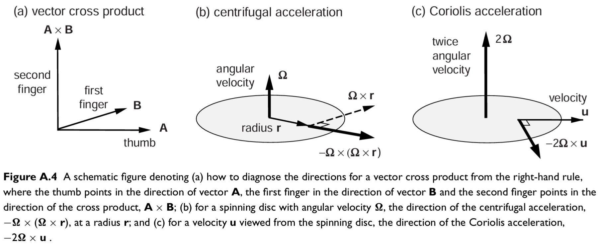
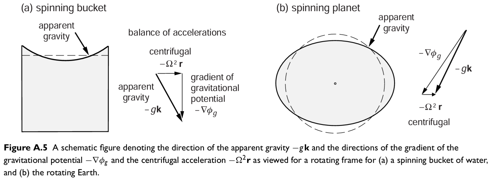
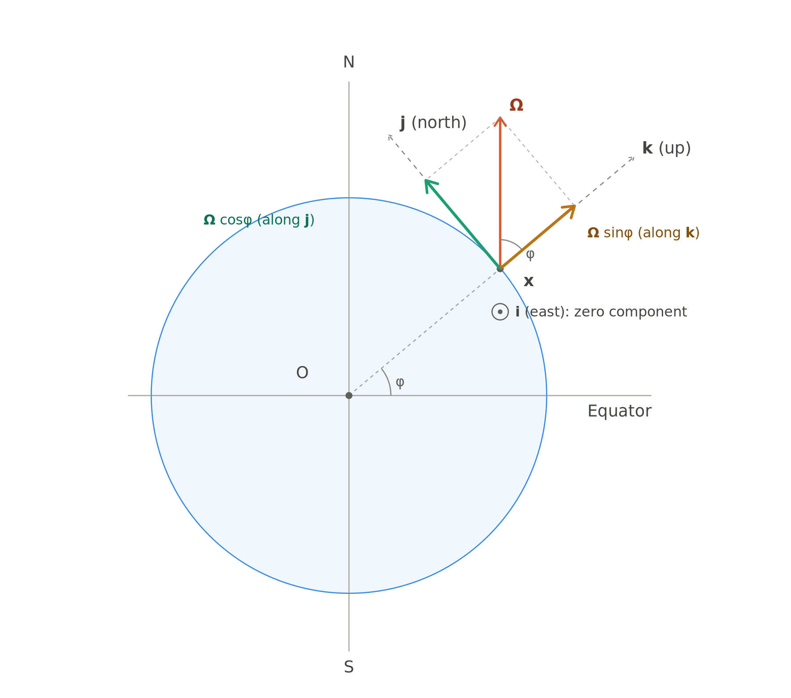

# Season 2

## Navigating MOM6 as a non-oceanographer: a MOM6 mini-app for GPU work.

Date: 7/05/2026.

Presenter: Jorge Gálvez Vallejo (@JorgeG94).

Link to repo: [hackathon_mom6_miniapp](https://github.com/JorgeG94/hackathon_mom6_miniapp)

### Brief Intro

Joining a new project in a field you did not study can be extremely daunting! But fear not, for 
fortune favors the brave. I'd say there are three options here:

- You are an oceanographer that has little knowledge of high performance computing 
- You are a high performance computing person that has no knowledge of oceanography 
- You are a new student and don't know either

The third one naturally has the most to overcome, but they also have the most time. The first one
is simply "we have to learn how to code", the second one is "I have to learn oceanography". However, 
the second one might not need to learn a lot of oceanography since their contributions don't depend 
on them understanding the physics of the ocean dynamics. 

I am a stubborn person that doesn't like to write code I don't understand, so I basically like to 
create more work for myself.  

### Detailed notes (flow of consciousness) 

As an HPC person whose goal is to either optimize code or port it to different architectures the key 
aspect to understand is *what are the bottlenecks?* in the current code. In ocean simulations, to my 
annoyance, there is no _one_ routine that dominates 80% of the time. This makes my work harder, usually
one can quickly say "ah yes, the calculation of this physical thing takes most of the time" so one spends
the most time there. Then naturally you go ask the people that work on the codebase about the bottlenecks and
because everyone is using it for a different thing you will hear different things, this is where the oceanography
knowledge becomes useful! 

What is the best way to understand a gigantic codebase with thousands of lines of code? Simplify it! I.e. the creation of a mini-app. 
This is also the best thing to do for a hackathon, because you can capture algorithmic complexity, main pain points, and you 
end up with a smaller application that is easy to build, easy to verify, and low stakes if you completely break it! 

How does one create a mini-app? First, ask the oceanographers what are the pain points! They'll quickly tell you about the 
"dynamical core", which is where the basic physics are solved, i.e. the fluid mechanics part of the code. The crucial bit 
here is to adopt a "how hard can it be?" mentality, be positive. I was quickly pointed to the file `MOM_dyn_split_RK2.F90`, 
which contains the main RK2 timestepping procedure. Fortran is our friend here, there is not a lot of object orientation 
shenanigans happening, i.e. what you read is what you get (most of the time). The RK2 step can be summarized as:

```fortran 
!! The split RK2 scheme:
!!   1. Predictor phase:
!!      - Compute horizontal viscosity
!!      - Compute Coriolis/momentum advection (CAu, CAv)
!!      - Apply vertical viscosity
!!      - Advance barotropic mode (fast 2D dynamics)
!!      - Update layer thicknesses via continuity
!!   2. Corrector phase:
!!      - Recompute tendencies with updated state
!!      - Apply vertical viscosity
!!      - Final barotropic step
!!      - Final continuity update
!!
```

Don't get too distracted by initialization procedures, those might look ugly but once you pay attention they are simply setting arrays
to something. The above algorithm has done most of the work for us now! We now know what routines we need to look for:

- Horizontal/Vertical viscosities
- Coriolis 
- Barotropic solver 
- Continuity

A key concept here can be extracted from MOM, the first M means "modular". Each physics engine should be a module, i.e. it should be able to 
be run as standalone. Why? Because if I only want to optimize the Coriolis routines, why should I have to run everything else? So when creating a mini-app
always try to have a separation of concerns. 

We go into the magical place that is `MOM6/src/core`, which is where most of the routines we're interested in are. The viscosities are _parametrizations_, i.e. 
approximations to extremely annoying physics. If you're feeling adventurous code up a non-hydrostatic solver that tries to resolve the vertical physics. It is
_ a w f u l_. Here we have:

```
MOM_barotropic.F90
MOM_continuity_PPM.F90
MOM_CoriolisAdv.F90
```

So then we follow the `MOM_dyn_split_RK2.F90` to find the function names that are the most interesting, for simplicity we will do the `call btstep(..)`. Inside
a MOM6 subroutine, we can think of them like:

```fortran 
subroutine btstep(....)
real :: x
integer :: y
logical :: a 

! indices mapping 
is = G%isc ; ie = G%iec ; js = G%jsc ; je = G%jec ; nz = GV%ke 

! bookkeeping (timing, profiling) 

if(OBC) then 

endif 

! halo updates (look for do_group_pass)
call create_group_pass(...)

! begin real work 
...

end subroutine btstep
```
This is not the rule everywhere, especially in helper functions and subroutines. But realizing that _most_ do some bookkeeping, accounting at the start, and then 
they check for configs, such as `OBCs` etc. will make your life less overwhelming. Once in, the magic is just realizing the loops are just loops! 

```fortran 
      do j=js,je ; do I=is-1,ie
        uhbt0(I,j) = uhbt(I,j) - find_uhbt(dt*ubt(I,j), BTCL_u(I,j)) * Idt
      enddo ; enddo
```

As you go into the routine you'll realize that there are patterns. Certain routines loop over certain indices, there's `u`s and `v`s and you start quickly 
noticing how the algorithms are structured. This is the way, you simply just continue doing this _with a lot of patience_. 

The mini-app is a work of hackathon and obsession, trying to compare lots of stuff (serial, openmp, openacc, cuda-fortran) just to get knowledge about the 
advantages and disadvantages of each approach. Testing performance without having to worry too much about breaking MOM6. 


## Fortran 101 - control structure, where parameters are defined, some keywords e.g. private, intent, submodule, use module etc
Presenter: @edoyango (Edward Yang).

Date: 14/05/2026

!!! note

    Today we'll be building a simple Fortran example program that uses some of the concepts that MOM6 is built with. Next week, we'll apply these ideas to some real MOM6 code. Our program today, takes a 3d array (first two indices represent the lateral domain, and the last represents the columns), and performs either a sum or max operation along the column, reducing the result to a 2d array that represents the lateral domain only. If you are comfortable with Python and would like to see today's end goal, the final version of the code is given in Python below.

Contributing to [MOM6](https://github.com/acCESS-nri/mom6) can be extra daunting if you're not used to programming in Fortran. These
notes aim to introduce Fortran to someone who might already be familiar with Python. And thankfully, most of the Fortran features
exercised in MOM6 have a Python equivalent. Here, we won't be looking at MOM6 code directly, because the code itself is quite long
-- even if the language features used aren't too complicated. 


??? code "Python equivalent of the example program to be built"
    ```python
    """
    Python code that emulates the example Fortran program.
    It uses Python functions and classes to represent the equivalent Fortran
    subroutines and derived types.
    """
    
    import numpy as np
    
    class Grid:
        def __init__(self, is_: int, js: int, ie: int, je: int, nz: int):
            self.is_ = is_
            self.js = js
            self.ie = ie
            self.je = je
            self.nz = nz
    
    class ControlStructure:
        def __init__(self, initialized: bool = False, which_op: int = 1):
            self.initialized = initialized
            self.which_op = which_op
    
    def do_something_along_column(cs: ControlStructure, g: Grid, arr1: np.ndarray) -> np.ndarray:
        if not cs.initialized:
            raise RuntimeError("Control structure not initialized!")
    
        if cs.which_op == 1:
            return _sum_along_column(g, arr1)
        if cs.which_op == 2:
            return _max_along_column(g, arr1)
        raise ValueError("Invalid operation provided! must be either 1 or 2")
    
    def _sum_along_column(g: Grid, arr1: np.ndarray) -> np.ndarray:
        arr2 = arr1[:, :, 0].copy()
        for j in range(g.je - g.js + 1):
            for k in range(1, g.nz):
                for i in range(g.ie - g.is_ + 1):
                    arr2[i, j] += arr1[i, j, k]
        return arr2
    
    def _max_along_column(g: Grid, arr1: np.ndarray) -> np.ndarray:
        arr2 = arr1[:, :, 0].copy()
        for j in range(g.je - g.js + 1):
            for k in range(1, g.nz):
                for i in range(g.ie - g.is_ + 1):
                    arr2[i, j] = max(arr2[i, j], arr1[i, j, k])
        return arr2
    
    import numpy as np
    
    from my_module import ControlStructure, Grid, do_something_along_column
    
    if __name__ == "__main__":
        g = Grid(is_=1, js=2, ie=3, je=4, nz=5)
        cs = ControlStructure(initialized=True, which_op=1)
    
        input_array = np.ones((g.ie - g.is_ + 1, g.je - g.js + 1, g.nz))
        output_array = do_something_along_column(cs, g, input_array)
    
        print(np.sum(output_array))
    ```


### Programs and modules

Most of the code in MOM6 is organised into "modules" which usually relate to a certain area of the ocean physics. For example,
`MOM_barotropic.F90` contains the [barotropic solver code](https://github.com/ACCESS-NRI/MOM6/blob/2026.01/src/core/MOM_barotropic.F90),
and `MOM_tracer_advect.F90` contains the [tracer advection code](https://github.com/ACCESS-NRI/MOM6/blob/2026.01/src/tracer/MOM_tracer_advect.F90)
and so on. Modules contains code that can be reused in other modules or "programs". Modules cannot be directly compiled and run, and
so modules' code must be "used" from a program. The skeleton of this arrangement can look like:

```fortran
module my_module ! my_module is the name of the module
  implicit none
end module my_module

program my_program ! my_program is the name of the program
  use my_module
  implicit none
end program my_program
```

The module and program's boundaries in the code are deliniated by `program/module` and `end program/module` couples. The
program/module's name must follow the first `program/module` and matching `end program/module` (including the program/module name is
optional, but it's a requirement to include the name in modules in).

`implicit none` is a "quirk" of Fortran. It says that all variables' type must be declared. Otherwise, the compiler can make an
"educated guess" as to what the type it is, which can result in unexpected behaviour. Hence, it is best practice to always include
`implicit none` in every module and program.

### Subroutines and declaring variables

Programs can have runnable code. But as your codebase gets larger, it's likely that you will:

 1. want to organise the code in some
way to make it easier to understand and maintain (e.g. group code related to certain physics together), and 
 
2. store code that is
reused in multiple places. Subroutines help facilitate this. Subroutines are similar to Python functions except that subroutines
don't return anything, and instead, they modify its arguments instead. Fortran does have functions also, but are used less
frequently in MOM6.

Like programs and modules, subroutines are bounded by `subroutine <name>` and `end subroutine <name>`. The subroutine's arguments
follow the name, followed by the type declaration of the arguments and local variables. Unlike Python, the types of all variables
must be declared and cannot change. In the example below, the variable attributes commonly used in MOM6 are shown (type, dimension,
and intent). Variables can be declared in any order, but a common convention (that MOM6 follows) is to declare the arguments first,
followed by local variables.

The example above is trivial as both the program or module have no code. So let's create our first subroutine (Fortran comments are
prefixed with `!`):

```fortran
module my_module

  implicit none

! says that subroutines/functions are declared after
contains

  ! this is declaring the subroutine's signature
  subroutine sum_along_column(is, ie, js, je, nz, arr1, arr2)

    ! each argument's type must be declared. Here we have:
    ! * type (integer/real)
    !   * real is equivalent to np.float32. However, MOM6 opts to control the precision at compile
    !     time.
    ! * dimension aka shape. No dimension means that variable is scalar. dimension(...) means the
    !   variable is an array.
    !   * dimension(a:b) means that for the given index, only indices a to b are defined.
    !     This a unique feature of Fortran that is utilised heavily in MOM6.
    ! * intent
    !   * `in`: the variable will only be read
    !   * `out`: the variable will be written to
    !   * `inout`: not shown here, but means that the variable may be read and/or written to.
    ! once an argument has been declared, it can also be used to declare others
    integer,                           intent(in)  :: is, ie, js, je, nz
    real, dimension(is:ie, js:je, nz), intent(in)  :: arr1
    real, dimension(is:ie, js:je),     intent(out) :: arr2
    ! all local variables must also be declared
    integer :: i, j, k

    do j=js,je
      ! copies can be done using array slicing
      arr2(:,j) = arr1(:,j,1) ! initialize the sum along columns
      ! MOM6 keeps nested loops on a single line, dilineated by colons.
      do k=2,nz ; do i=is,ie
        arr2(i,j) = arr2(i,j) + arr1(i,j,k) ! do the sum along columns
      enddo ; enddo
    enddo

  end subroutine sum_along_column

end module my_module
```

Note that subroutines are invoked with `call <subroutine>(...)`

### Array copies

Like with Python NumPy, arrays' contents can be copied between each other. If the arrays are of the same shape, they can be copied
with specifying array indices (`a = b`), or you may specify which slices to copy e.g. `a(1:10) = b(1:10)`, or `a(:, 1) = b(:)` etc.
Noting that Fortran accesses array elements/slices using round brackets `()` instead of square brackets `[]` common in other
languages. It is also worth noting that array assignments/copies copies the array's values (different from Python where `a = b`
means something different from `a[:] = b[:]`).

### Loops

Loops are dilineated by `do variable=start,end,step` and `enddo` - which is like `for variable in range(start,end+1,step):` in
Python. The main difference between fortran loop ranges and Python ranges is that the `end` is included in the range.

You may have also noticed that the loop ordering is a bit strange - where the outer loop iterates of the middle index, with the
outer index in the middle, and the inner-most loop iterating over the first. This is quite common in MOM6!

### Derived types

Derived types are similar to Python classes in that they can be instantiated and group related information. Like Python classes,
Fortran derived types has a name and attributes (or members). One of the key derived types in MOM6 is the
[`ocean_grid_type`](https://github.com/ACCESS-NRI/MOM6/blob/2026.01/src/core/MOM_grid.F90) which describe the grid extents
(including the computational and halo extents). It also stores other grid information like lateral dimensions of the columns,
masking etc. We can create a simple version of the grid type and use it in our subroutine:

```fortran
module my_module

  implicit none

  ! grid type to hold grid bounds                     Python analogue:
  type grid_type                                      ! class gridType:
    integer :: is, js   ! starting indices            !     def __init__(self, is, js, ie, je, nz):
    integer :: ie, je   ! ending indices              !         self.is = is ; self.js = js
    integer :: nz       ! number of vertical layers   !         self.ie = ie ; self.je = je
  end type grid_type                                  !         self.nz = nz

contains

  ! we can replace our grid indices with a grid_type
  subroutine sum_along_column(g, arr1, arr2)
    ! We can still use the grid_type's members to define subsequent variables
    ! below, `g` is an instance of the `grid_type`. This `g`'s members are being accessed with `%`,
    ! which in python would be `g.is`. `g`'s members are then used to size the input/output arrays.
    type(grid_type),                             intent(in)  :: g    ! g is an instance of grid_type
    real, dimension(g%is:g%ie, g%js:g%je, g%nz), intent(in)  :: arr1
    real, dimension(g%is:g%ie, g%js:g%je),       intent(out) :: arr2
    integer :: i, j, k

    do j=g%js,g%je
      arr2(:,j) = arr1(:,j,1) ! initialize the sum along columns
      do k=2,g%nz ; do i=g%is,g%ie
        arr2(i,j) = arr2(i,j) + arr1(i,j,k) ! do the sum along columns
      enddo ; enddo
    enddo

  end subroutine sum_along_column

end module my_module
```

Let's also introduce another pattern used in MOM6: the "control structure". Each module will have its own control structure that
mostly stores information to control MOM6's behaviour e.g. which algorithm to use or whether a certain physics is turned on or not.
In our simple example, the control structure will simply control whether to do a sum or max along columns.

```fortran
module my_module

  implicit none

  private ! this says that by default, contents of this module aren't accessible.

  !< grid type to hold grid bounds
  type grid_type
    integer :: is, js   !< starting indices
    integer :: ie, je   !< ending indices
    integer :: nz       !< number of vertical layers
  end type grid_type

  !< control structure
  type control_structure_type
    logical :: initialized = .false. !< whether the control structure is initialized - defaults to .false.
    integer :: which_op = 1          !< which operation to do - default is 1 (sum)
  end type control_structure_type

  ! Explicitly say which things can be used - do_sum/max_along_column cannot be directly used
  public :: grid_type, control_structure_type, do_something_along_column

contains

  !< this subroutine either does a max or sum along columns
  subroutine do_something_along_column(cs, g, arr1, arr2)
    type(control_structure_type),                intent(in)  :: cs   !< control structure
    type(grid_type),                             intent(in)  :: g    !< grid type
    real, dimension(g%is:g%ie, g%js:g%je, g%nz), intent(in)  :: arr1 !< input array
    real, dimension(g%is:g%ie, g%js:g%je),       intent(out) :: arr2 !< output array

    if (.not.CS%initialized) error stop "Control structure not initialized!"

    if (CS%which_op == 1) then
      call sum_along_column(g, arr1, arr2)
    elseif (CS%which_op == 2) then
      call max_along_column(g, arr1, arr2)
    else
      error stop "Invalid operation provided! must be either 1 or 2"
    endif

  end subroutine do_something_along_column

  !< performs a sum reduction along columns
  subroutine sum_along_column(g, arr1, arr2)
    type(grid_type),                             intent(in)  :: g    !< grid type
    real, dimension(g%is:g%ie, g%js:g%je, g%nz), intent(in)  :: arr1 !< input array
    real, dimension(g%is:g%ie, g%js:g%je),       intent(out) :: arr2 !< output array
    integer :: i, j, k ! loop indices

    do j=g%js,g%je
      arr2(:,j) = arr1(:,j,1) ! initialize the sum along columns
      do k=2,g%nz ; do i=g%is,g%ie
        arr2(i,j) = arr2(i,j) + arr1(i,j,k) ! do the sum along columns
      enddo ; enddo
    enddo

  end subroutine sum_along_column

  !< performs a max reduction along columns
  subroutine max_along_column(g, arr1, arr2)
    type(grid_type),                             intent(in)  :: g    !< grid type
    real, dimension(g%is:g%ie, g%js:g%je, g%nz), intent(in)  :: arr1 !< input array
    real, dimension(g%is:g%ie, g%js:g%je),       intent(out) :: arr2 !< output array
    integer :: i, j, k ! loop indices

    do j=g%js,g%je
      arr2(:,j) = arr1(:,j,1) ! initialize the sum along columns
      do k=2,g%nz ; do i=g%is,g%ie
        arr2(i,j) = max(arr2(i,j), arr1(i,j,k)) ! do the max along columns
      enddo ; enddo
    enddo

  end subroutine max_along_column

end module my_module
```

The module is much larger now - the control structure type has been added and two subroutines have also been added.
`max_along_column` is almost identical to `sum_along_column` except that it does a `max` operation instead of `+`.

### If statements

In the module, we've also added a 3-branch if statement. If statements look quite similar to Python's except that the evaluation
must be put it into brackets and is followe by `then`: i.e. `if (statement) then`. Otherwise the semantics are identical.

### Module public and private

To hide details, MOM6 likes to leverage "public" and "private" statements in modules. MOM6 modules will declare everything as
`private` by default (by having an unqualified `private` clause), and then explicitly list the objects that should be accessible
outside of the module with `public :: list, of, objects, and, procedures`. Private things are visible to other things within the
module, but not outside.

### Documenting comments

MOM6 uses [Doxygen comments](https://www.doxygen.nl/manual/docblocks.html) that automatically generate documentation for the code.
These type of comments are sentineled with !< (as opposed to only !). Procedures (functions and subroutines), types and members, and
arguments must be documented.

### Using modules

Let's finish our program and use the module code! The program will be very simple -- uses hardcoded values to initialize everything.

```fortran
program my_program
  ! specify which things we want from the module
  ! Python analogue: from my_module import grid_type, control_structure_type, do_something_along_column
  ! note that because of the privacy in the module, `sum_along_column` is not included in the
  ! `public :: ...` list. This means that importing or calling `sum_along_column` from this
  ! program would fail. Adding `sum_along_column` to the `public :: ...` list would make it
  ! available here.
  ! Note that excluding `only` would lead to everything public being available. However, MOM6
  ! ensures to make imports explicit. This is, in general, good practice as it makes it easier to
  ! identify where something used inside the program/module comes from.
  use my_module, only: grid_type, control_structure_type, do_something_along_column
  implicit none
  ! variable declaration
  type(grid_type) :: g
  type(control_structure_type) :: cs
  ! use allocatable arrays for dynamic array sizes in the program
  real, allocatable :: input_array(:, :, :), output_array(:, :)

  ! derived type instances don't have to be constructed (the construction is implied in the declaration)
  ! but they can be initialized with a default type constructor, or simply setting the members.
  g = grid_type(is=1, js=2, ie=3, je=4, nz=5)
  cs%initialized = .true.
  cs%which_op = 1

  allocate( &
    input_array(g%is:g%ie, g%js:g%je, g%nz), &
    output_array(g%is:g%ie, g%is:g%ie) &
  )

  input_array = 1.0

  call do_something_along_column(cs, g, input_array, output_array)

  ! print the sum of the array to the terminal
  write(*, *) sum(output_array)

end program my_program
```

A program itself looks quite similar the subroutines above, except there aren't any arguments. Near the top we `use` the module and
select which things we want. This convention isn't mandatory, but is closely followed by MOM6.

### Allocatable arrays

Unlike subroutines, programs cannot get array sizes by simply passing them in. So, often arrays are made given the "allocatable"
attribute, which lets the program "allocate" the array based on some user input or similar. Here, we allocate the arrays' based on
hardcoded values, but that could be changed to use CLI arguments or something.

### Compiling and running the example

To compile the program, you can put the above module and program into the same file, say `example.f90`, and compile it with
`gfortran example.f90 -o example.x`. You can then execute it with `./example.x`. You should get `45` with many zeros printed!

MOM6 is a much more complex codebase with many more dependencies and consequently more complex build system.

## Fortran 101 re-visited: MOM6 intrinsics

Date: 21/05/2026.

Presenter: Jorge Gálvez Vallejo (@JorgeG94).

After some careful deliberation I have decided to show a very fun bit of MOM6 that is crucial to all of our simulations! We 
know that MOM6 enforces bitwise reproducbility across runs. To achieve this there are careful safeguards while writing and reviewing
code. Bitwise reproducibility means that two answers at identical to the bits that compose them, i.e. a good example is that: 
`a + (b+c) != (a+b) + c` in terms of bit, they both resolve to `(a+b+c)` but the order of operations is different! 

So MOM6 enforces very tight checks on how the code is written, this is why if you want to refactor a routine in MOM6 
that does intermediate computations you can end up changing answers! For example one that I looked at (this routine is 
in the vertical viscosity):

```fortran
botfn = 1. / (1. + 0.09 * z2 * z2 * z2 * z2 * z2 * z2)
```

I thought, "oh my god, this is ugly", let's make this more readable by doing:

```fortran
botfn = 1. / (1. + 0.09*z2**6) 
```

There are two potential things here. One, this changes the BITS of the answer although they are 
the same number. This is because `z2**6` can be evaluated differently by the compiler! So I thought, well, 
how about:

```fortran
z2_six = z2 * z2 * z2 * z2 * z2 * z2
botfn = 1. / (1. + 0.09*z2_six)
```
You might think, well surely this is correct. Well no, because again the order of the operations has changed, the
compiler can rearrange how things are executed!

You can see now how subtle a small change can break bitwise reproducibility! So, today we are going into a super 
fun bit of the code: `MOM6/src/framework/MOM_intrinsic_functions.F90`! This file contains some routines that 
are not quite trustworthy across compilers. We will focus on the cuberoot! 

The module signature: 

```fortran
module MOM_intrinsic_functions

use iso_fortran_env, only : stdout => output_unit, stderr => error_unit
use iso_fortran_env, only : int64, real64

implicit none ; private

public :: invcosh, cuberoot
public :: intrinsic_functions_unit_tests

!...

end module MOM_intrinsic_functions
```

```fortran
!> Returns the cube root of a real argument at roundoff accuracy, in a form that works properly with
!! rescaling of the argument by integer powers of 8.  If the argument is a NaN, a NaN is returned.
elemental function cuberoot(x) result(root)
  real, intent(in) :: x !< The argument of cuberoot in arbitrary units cubed [A3]
  real :: root !< The real cube root of x in arbitrary units [A]

  real :: asx ! The absolute value of x rescaled by an integer power of 8 to put it into
              ! the range from 0.125 < asx <= 1.0, in ambiguous units cubed [B3]
  real :: root_asx ! The cube root of asx [B]
  real :: ra_3 ! root_asx cubed [B3]
  real :: num ! The numerator of an expression for the evolving estimate of the cube root of asx
              ! in arbitrary units that can grow or shrink with each iteration [B C]
  real :: den ! The denominator of an expression for the evolving estimate of the cube root of asx
              ! in arbitrary units that can grow or shrink with each iteration [C]
  real :: num_prev ! The numerator of an expression for the previous iteration of the evolving estimate
              ! of the cube root of asx in arbitrary units that can grow or shrink with each iteration [B D]
  real :: np_3 ! num_prev cubed  [B3 D3]
  real :: den_prev ! The denominator of an expression for the previous iteration of the evolving estimate of
              ! the cube root of asx in arbitrary units that can grow or shrink with each iteration [D]
  real :: dp_3 ! den_prev cubed  [C3]
  real :: r0  ! Initial value of the iterative solver. [B C]
  real :: r0_3 ! r0 cubed [B3 C3]
  integer :: itt

  integer(kind=int64) :: e_x, s_x

  if ((x >= 0.0) .eqv. (x <= 0.0)) then
    ! Return 0 for an input of 0, or NaN for a NaN input.
    root = x
  else
    call rescale_cbrt(x, asx, e_x, s_x)

    !   Iteratively determine root_asx = asx**1/3 using Halley's method and then Newton's method,
    ! noting that Halley's method onverges monotonically and needs no bounding.  Halley's method is
    ! slightly more complicated that Newton's method, but converges in a third fewer iterations.
    !   Keeping the estimates in a fractional form Root = num / den allows this calculation with
    ! no real divisions during the iterations before doing a single real division at the end,
    ! and it is therefore more computationally efficient.

    ! This first estimate gives the same magnitude of errors for 0.125 and 1.0 after two iterations.
    ! The first iteration is applied explicitly.
    r0 = 0.707106
    r0_3 = r0 * r0 * r0
    num = r0 * (r0_3 + 2.0 * asx)
    den = 2.0 * r0_3 + asx

    do itt=1,2
      ! Halley's method iterates estimates as Root = Root * (Root**3 + 2.*asx) / (2.*Root**3 + asx).
      num_prev = num ; den_prev = den

      ! Pre-compute these as integer powers, to avoid `pow()`-like intrinsics.
      np_3 = num_prev * num_prev * num_prev
      dp_3 = den_prev * den_prev * den_prev

      num = num_prev * (np_3 + 2.0 * asx * dp_3)
      den = den_prev * (2.0 * np_3 + asx * dp_3)
      ! Equivalent to:  root_asx = root_asx * (root_asx**3 + 2.*asx) / (2.*root_asx**3 + asx)
    enddo
    ! At this point the error in root_asx is better than 1 part in 3e14.
    root_asx = num / den

    ! One final iteration with Newton's method polishes up the root and gives a solution
    ! that is within the last bit of the true solution.
    ra_3 = root_asx * root_asx * root_asx
    root_asx = root_asx - (ra_3 - asx) / (3.0 * (root_asx * root_asx))

    root = descale(root_asx, e_x, s_x)
  endif
end function cuberoot
```

From Ed's last session, here we can see a couple of the things he mentioned. We have a `function` 
that is called. Functions return a single value, similar to how they work in Python. Here however, 
we have an extra `attribute` in Fortran, the `elemental` attribute. Elemental makes a routine 
callable/applicable inside an array. So the `cuberoot` routine can be used to obtain the cuberoot
of a scalar, i.e. `real :: my_scalar` or an allocatable array of n dimensions! i.e. we can call
`cuberoot` to operate on `real, allocatable :: my_array(:,:,:,:,:)` with no problems whatsoever! 

Next, we have a `call rescale_cbrt`:

```fortran
!> Rescale `a` to the range [0.125, 1) and compute its cube-root exponent.
pure subroutine rescale_cbrt(a, x, e_r, s_a)
  real, intent(in) :: a
    !< The number to be rescaled for cube-root computation [A3]
   real, intent(out) :: x
    !< The rescaled value of a in the range from 0.125 < asx <= 1.0, in ambiguous units cubed [B3]
  integer(kind=int64), intent(out) :: e_r
    !< Cube root of the exponent of the rescaling of `a`
  integer(kind=int64), intent(out) :: s_a
    !< The sign bit of a

  integer(kind=int64) :: xb
    ! Floating point value of a, bit-packed as an integer
  integer(kind=int64) :: e_a
    ! Unscaled exponent of a
  integer(kind=int64) :: e_x
    ! Exponent of x
  integer(kind=int64) :: e_div, e_mod
    ! Quotient and remainder of e in e = 3*(e/3) + modulo(e,3).

  ! Pack bits of a into xb and extract its exponent and sign.
  xb = transfer(a, 1_int64)
  s_a = ibits(xb, signbit, 1)
  e_a = ibits(xb, expbit, explen) - bias

  ! Compute terms of exponent decomposition e = 3*(e/3) + modulo(e,3).
  ! (Fortran division is round-to-zero, so we must emulate floor division.)
  e_mod = modulo(e_a, 3_int64)
  e_div = (e_a - e_mod)/3

  ! Our scaling decomposes e_a into e = {3*(e/3) + 3} + {modulo(e,3) - 3}.

  ! The first term is a perfect cube, whose cube root is computed below.
  e_r = e_div + 1

  ! The second term ensures that x is shifted to [0.125, 1).
  e_x = e_mod - 3

  ! Insert the new 11-bit exponent into xb and write to x and extend the
  ! bitcount to 12, so that the sign bit is zero and x is always positive.
  call mvbits(e_x + bias, 0, explen + 1, xb, fraclen)
  x = transfer(xb, 1.)
end subroutine rescale_cbrt
```

As we learned last week, a `subroutine` can be invoked via a `call` procedure. 
Subroutines take multiple arguments and can return multiple values at once. You can 
see this in:
```fortran
  integer(kind=int64), intent(out) :: e_r
    !< Cube root of the exponent of the rescaling of `a`
  integer(kind=int64), intent(out) :: s_a
```

`e_r` and `s_a` are both being written to inside the subroutine and being sent back. Also, 
you might notice the `pure` attribtue in the subroutine. A pure function in Fortran is a 
function with no side effects, meaning: it does not write to file/console, it does not alter
any variable outside its function body, and it does not read from or modify any external state
(such as global variables, SAVEd local variables, or I/O streams). Given the same inputs, it
must always produce the same outputs, which allows the compiler to safely call it from
within FORALL constructs, DO CONCURRENT loops, and other pure procedures. This makes it
*threadsafe*. 

Elemental functions are `pure` by design, so any `elemental` function you write is also 
`pure`, you can be verbose and say `pure elemental function cuberoot` but that's a mouthful! 

Why did I show you this? Well, you cannot go and start editing MOM6 code without understanding
the core tenet of MOM6: keep bitwise reproducbility! I hope this small entry helps you and encourages
you to go deep into the codebase! 

## From Navier Stokes to adiabatic stacked shallow water equations

Date: 28/05/2026.

Presenter: Andrew Kiss (@aekiss). 

**Note:** reload this page if the equations aren't displayed correctly.

I'm following [Vallis' textbook "Atmospheric and Oceanic Fluid Dynamics"](https://www.vallisbook.org/) which you can consult for further details and explanation.
Also see [these notes](https://decoding-access-om3.readthedocs.io/AOMSS_Lecture_Notes/), which cover similar material.

### Navier-Stokes equations
The full shebang
- fully 3D
- can represent nearly any fluid motion
- excessively general for large-scale oceanographic modelling

The _momentum equation_ 

$$
\underbrace{\frac{D_i\mathbf{v}}{D_it}}_\text{Lagrangian acceleration in inertial frame} = \underbrace{\frac{-\nabla p}{\rho}}_\text{pressure gradient} + \underbrace{\nu\nabla^2\mathbf{v}}_\text{molecular viscosity} + \underbrace{\mathbf{g}}_\text{gravity} + \underbrace{\dots}_\text{any other forces}
$$

is Newton's 2nd law $\mathbf{F} = m\mathbf{a}$ for the acceleration $\mathbf{a}$ of an infinitesimal fluid parcel of mass $m$ subject to a net force $\mathbf{F}$, rearranged as $\mathbf{a} = \mathbf{F}_V/\rho$, where $\mathbf{F}_V$ is the force divided by the parcel volume and $\rho$ is the parcel's density. $\mathbf{a}$ is the parcel's Lagrangian acceleration, so $\mathbf{a} = \frac{D_i\mathbf{v}}{D_it}$, where $\mathbf{v} = (u, v, w)$ is the fluid velocity and $\frac{D_i}{D_it}$ is the material derivative relative to an _inertial_ (i.e. non-rotating, non-accelerating) coordinate frame. Here $p$ is pressure, $\rho$ is density and $\nu$ is the kinematic molecular viscosity.

This 3d momentum equation is equivalent to 3 scalar equations, but has 5 unknowns ($u, v, w, p, \rho$), so to close this system we need 2 more equations. These are an _equation of state_ relating the density to pressure (and temperature $T$ and salinity $S$, in the oceanographic context, e.g. TEOS-10; in this case additional evolution equations for $T$ and $S$ are also required), and an equation for the _conservation of mass_ (also known as the _continuity equation_)

$$
\frac{\partial\rho}{\partial t}+\nabla\cdot(\rho\mathbf{v}) = 0.
$$

Seawater density varies very little over the range of $p$, $T$ and $S$ in the ocean, and motions are very much slower than the speed of sound (i.e. the Mach number is very small), so to a good approximation the conservation of mass can be written

$$
\nabla\cdot\mathbf{v} = 0.
$$

This assumption of incompressibility eliminates sound waves.

### Navier-Stokes equations in a rotating frame

In oceanography it's more convenient to a use coordinates that rotate with the Earth. To account for this rotation we must include the Coriolis and centrifugal forces:

$$
\underbrace{\frac{D_i\mathbf{v}}{D_it}}_\text{Lagrangian acceleration in inertial frame} = \underbrace{\frac{D\mathbf{v}}{Dt}}_\text{Lagrangian acceleration in rotating frame} + \underbrace{2\mathbf{\Omega}\times\mathbf{v}}_\text{Coriolis acceleration} + \underbrace{\mathbf{\Omega}\times\mathbf{\Omega}\times\mathbf{r}}_\text{centrifugal acceleration}
$$

where $\mathbf{\Omega}$ is Earth's rotation vector and $\mathbf{r}$ is the position vector relative to Earth's centre, and now $\mathbf{v}$ is velocity relative to the rotating Earth. It turns out the centrifugal acceleration is of the same mathematical form as gravity (a conservative vector field), so we can simply redefine $\mathbf{g}$ to include $-\mathbf{\Omega}\times\mathbf{\Omega}\times\mathbf{r}$ and then worry no more about it. This is not the case for the Coriolis acceleration, which we must retain. So we end up with our momentum equation in rotating coordinates

$$
\underbrace{\frac{D\mathbf{v}}{Dt}}_\text{Lagrangian acceleration in rotating frame} + \underbrace{2\mathbf{\Omega}\times\mathbf{v}}_\text{Coriolis acceleration} = \underbrace{\frac{-\nabla p}{\rho}}_\text{pressure gradient} + \underbrace{\nu\nabla^2\mathbf{v}}_\text{molecular viscosity} + \underbrace{\mathbf{g}}_\text{gravity and centrifugal}+ \underbrace{\dots}_\text{any other forces}
$$

where now $\mathbf{g}$ includes both gravity and the centrifugal acceleration.


### Primitive equations

The so-called "primitive equations" simplify the Navier-Stokes momentum equation by neglecting terms that are insignificant for large-scale oceanographic motions. These approximations are

- shallow-fluid approximation
- hydrostatic balance
- Boussinesq approximation
- neglect Coriolis acting on $w$

Although spherical coordinates should be used, for clarity we'll adopt Cartesian coordinates with $x$ eastward, $y$ northward and $z$ upward (in the opposite direction to $\mathbf{g}$) relative to some mid-latitude point on Earth's surface. We define unit vectors $\mathbf{i}$, $\mathbf{j}$, $\mathbf{k}$ in the directions of increasing $x$, $y$, $z$, respectively.
For convenience we use $\mathbf{u} = (u, v)$ to denote the horizontal component of the full three-dimensional velocity vector $\mathbf{v} = (u, v, w)$.
Molecular viscosity is not a primary concern for us here, so we'll lump viscous forces in with "any other forces" ($\ldots$) from here on.

#### Shallow fluid
The oceans are much shallower than they are wide (like the thickness of a piece of paper compared to its width), so large-scale motions must be very nearly horizontal, i.e. $w \ll |\mathbf{u}|$.

Amongst other simplifications discussed below, the shallowness of the ocean allows us to simplify the advection term in the material derivative. The material derivative can be expanded out as

$$
\frac{D\mathbf{v}}{Dt} = \frac{\partial\mathbf{v}}{\partial t} + (\mathbf{v}\cdot\nabla)\mathbf{v} = \frac{\partial\mathbf{v}}{\partial t} + u\frac{\partial\mathbf{v}}{\partial x} + v\frac{\partial\mathbf{v}}{\partial y} + w\frac{\partial\mathbf{v}}{\partial z}
$$

so its horizontal part is

$$
\frac{\partial\mathbf{u}}{\partial t} + u\frac{\partial\mathbf{u}}{\partial x} + v\frac{\partial\mathbf{u}}{\partial y} + w\frac{\partial\mathbf{u}}{\partial z}
$$

If $w \ll |\mathbf{u}|$ and $\frac{\partial\mathbf{u}}{\partial z}$ is not very large, this can be approximated

$$
\frac{\partial\mathbf{u}}{\partial t} + u\frac{\partial\mathbf{u}}{\partial x} + v\frac{\partial\mathbf{u}}{\partial y}
$$

which we will write as $\frac{D\mathbf{u}}{Dt}$.

#### The hydrostatic approximation

In large-scale oceanic motions the vertical momentum balance is dominated by the vertical pressure gradient and gravity, allowing us to make the hydrostatic approximation

$$
0 = \frac{-1}{\rho}\frac{\partial p}{\partial z} - g
$$

where $g = |\mathbf{g}|$. This diagnostic equation replaces the vertical momentum equation. It is a very good approximation in nearly all oceanographic circumstances in which horizontal scales of motion are much larger than vertical. Some exceptions (non-hydrostatic motions) include deep-water gravity waves, deep convection, and fine submesoscale motions, for which vertical Lagrangian acceleration can also be important.

It is also common practice to treat $g$ as a constant, neglecting the variation with latitude due to its centrifugal component.

#### The Boussinesq approximation

Because $\rho$ varies only vary slightly in the ocean, we can approximate it by a constant $\rho_0$ in the horizontal momentum equation. However, the vertical hydrostatic equation must retain the actual $\rho$ in order to retain horizontal gradients in pressure due to variations in density.

#### The "traditional approximation" (neglecting small components of Coriolis)

In component form,

$$
2\mathbf{\Omega}\times\mathbf{v} = (2\Omega w\cos\phi - 2\Omega v\sin\phi)\mathbf{i} + 2\Omega u\sin\phi\mathbf{j} - 2\Omega u\cos\phi\mathbf{k}
$$

where $\Omega = |\mathbf{\Omega}|$ and $\phi$ is latitude. Since $w \ll |\mathbf{u}|$ it is traditional to neglect $2\Omega w\cos\phi$ relative to $2\Omega v\sin\phi$, which is a good approximation except very close to the Equator where $\sin\phi\to 0$, or in situations when $w$ becomes comparable to $|\mathbf{u}|$ (e.g. non-hydrostatic flows). Making this approximation and defining $\mathbf{f} = 2\Omega\sin\phi\mathbf{k}$, the horizontal momentum equation can be written

$$
\underbrace{\frac{D\mathbf{u}}{Dt}}_\text{Lagrangian acceleration in rotating frame} + \underbrace{\mathbf{f}\times\mathbf{u}}_\text{Coriolis acceleration} = \underbrace{\frac{-\nabla p}{\rho}}_\text{pressure gradient}+ \underbrace{\dots}_\text{any other forces}
$$

#### The primitive equations

With the above approximations we end up the _primitive equations_. These are the horizontal momentum equation

$$
\frac{D\mathbf{u}}{Dt} + \mathbf{f}\times\mathbf{u} = \frac{-\nabla p}{\rho_0} + \dots
$$

the hydrostatic equation

$$
\frac{\partial p}{\partial z} = -\rho g
$$

and conservation of mass

$$
\nabla\cdot\mathbf{u} +\frac{\partial w}{\partial z} = 0.
$$

Note that in these equations $\mathbf{u}$ can vary continuously with $z$.

### Stacked shallow-water equations

A further approximation, which is very useful in theoretical and idealised studies and also in realistic ocean models (e.g. MOM6), is to treat the ocean as consisting of a stack of $N$ constant-density layers which cannot mix. With sufficiently large $N$ we can get arbitrarily close to the true continuous variation of $\rho$ with depth, but it turns out much of the important dynamics of the ocean can be represented with only a few layers (e.g. $N=2$).

#### Notation
{: style="height:650px;width:900px"}

We number the layers from the top downwards. Layer $k$ has density $\rho_k$, top interface $\eta_{k-1}$, bottom interface $\eta_{k}$, and thickness $h_k = \eta_{k-1}-\eta_{k}$. The free surface height is therefore $\eta_0$, and the bottom is $\eta_N$. For simplicity we set the Boussinesq reference density to the top layer density, i.e. $\rho_0 = \rho_1$.

#### Momentum equation in each layer
In the top layer the hydrostatic equation can be integrated in $z$ to get the pressure

$$
p_1 = \rho_1 g(\eta_0 - z),
$$
where we neglect atmospheric pressure. The horizontal pressure gradient is therefore due only to surface slope, and independent of depth within this layer:

$$\nabla_h p_1 = \rho_1 g \nabla_h \eta_0.$$

Consistent with the depth-independence of $\nabla_h p_1$, we can assume that the horizontal velocity $\mathbf{u}_1$ is also independent of depth within this layer (note, we are neglecting viscous effects here, e.g. the surface Ekman layer). This strengthens our justification for neglecting $w\frac{\partial \mathbf{u}_1}{\partial z}$ in the horizontal advection, and is exact if the flow is geostrophic ($\mathbf{f}\times\mathbf{u}_1 = -\nabla p_1/\rho_0$).

The shallow-water horizontal momentum equation in layer 1 therefore becomes

$$
\frac{D\mathbf{u}_1}{Dt} + \mathbf{f}\times\mathbf{u}_1 = -g\nabla\eta_0 + \dots
$$

where $\mathbf{u}_1 = \mathbf{u}_1(x,y,t)$.

The pressure in layer 2 is the pressure imposed by layer 1 plus that within layer 2: 

$$
\begin{aligned}
p_2 &= \rho_1 g(\eta_0 - \eta_1) + \rho_2 g(\eta_1 - z)\\
    &= \rho_0 g\eta_0 + \rho_0 g'_1\eta_1 - \rho_2 gz,
\end{aligned}
$$

where $g'_1 = g(\rho_2-\rho_1)/\rho_0$ is the _reduced gravity_ associated with the interface $\eta_1$ and we've used $\rho_0 = \rho_1$. The horizontal pressure gradient is again independent of depth within the layer

$$
\nabla_h p_2 = \rho_0 g \nabla_h \eta_0 +  \rho_0 g'_1 \nabla_h \eta_1
$$

and the layer 2 horizontal momentum equation is

$$
\frac{D\mathbf{u}_2}{Dt} + \mathbf{f}\times\mathbf{u}_2 = -g\nabla\eta_0 -g'_1\nabla\eta_1 + \dots
$$

Extending this reasoning, we find that the shallow-water momentum equation for any layer $k$ is

$$
\frac{D\mathbf{u}_k}{Dt} + \mathbf{f}\times\mathbf{u}_k = -\sum_{i=1}^{k}g'_{i-1}\nabla\eta_{i-1} + \dots
$$

where $g'_{i-1} = g(\rho_i-\rho_{i-1})/\rho_0$ are the interfacial reduced gravities, $g'_0 = g$ and $\mathbf{u}_k = \mathbf{u}_k(x,y,t)$.

#### Conservation of mass in each layer

Since $\frac{\partial \mathbf{u}_k}{\partial z}=0$, integrating the conservation of mass through the thickness of layer $k$ gives

$$
h_k\nabla\cdot\mathbf{u}_k + \left.w_k\right|_{z=\eta_k}^{z=\eta_{k-1}} = 0.
$$

Since we regard the interfaces as impenetrable (i.e. it is a material surface), at the lower layer interface $\eta_k$, the 3-dimensional velocity $\mathbf{u}_k + \left.w_k\right|_{z=\eta_k}\mathbf{k}$ must be parallel to $\eta_k$ and move vertically with it, so

$$
\left.w\right|_{z=\eta_k} = \frac{\partial \eta_k}{\partial t} + \mathbf{u}_k\cdot\nabla\eta_k,
$$

and similarly for the upper interface $\eta_{k-1}$. Therefore, using $h_k = \eta_{k-1}-\eta_{k}$ we get

$$
\left.w_k\right|_{z=\eta_k}^{z=\eta_{k-1}} = \frac{\partial h_k}{\partial t} + \mathbf{u}_k\cdot\nabla h_k
$$

so the thickness-integrated mass conservation equation becomes
$$
h_k\nabla\cdot\mathbf{u}_k + \frac{\partial h_k}{\partial t} + \mathbf{u}_k\cdot\nabla h_k = 0
$$

which simplifies to

$$
\frac{\partial h_k}{\partial t} + \nabla\cdot(h_k\mathbf{u}_k) = 0.
$$

This just says that the layer becomes thinner where there is horizontal divergence of transport, and it thickens where there is convergence.

Although $w$ varies with $z$ in each layer, we don't need it in either the momentum or mass conservation equation, so these are fully discretised in depth, with all variables varying with $z$ only between layers, not within them.

#### Isopycnal coordinates

Note that we are still using $z$ as a vertical coordinate, in that our horizontal derivatives are being taken by infinitesimal differences at constant $z$ within each layer. However, because $\rho$ is a montonic function of $z$ (assuming a stable stratification), another approach is to use $\rho$ instead of $z$ as a "vertical" coordinate in the continuously-stratified primitive equations. This is called using _isopycnal coordinates_. In this case the horizontal derivatives are along isopycnals (surfaces of constant $\rho$), rather than surfaces of constant $z$, but the equations can be made as tidy as the primitive equations we've derived here if the horizontal pressure gradient is replaced by the gradient of Montgomery potential $M=\frac{p+\rho gz}{\rho_0}$ on isopycnal surfaces. The $\rho$ coordinate can then be discretised to arrive at layered shallow-water equations with isopycnal coordinates. See [these notes](https://decoding-access-om3.readthedocs.io/AOMSS_Lecture_Notes/) or [Vallis](https://www.vallisbook.org/) section 3.9 for further details.

## Generalised vertical coordinates

Date: 11/06/2026.

Presenter: Andy Hogg (@AndyHoggANU). 

In a z-level model, we have vertical velocities, $w$, which passes through coordinate interfaces.



In this case, we can write $w$ from

$$ \frac{\partial w}{\partial z} = - \nabla \cdot \mathbf{u} $$

Conversely, in the stratified shallow water equations the vertical velocity is entirely associated with the vertical motion of the interface itself. We can call this $w_{\mathrm{grid}}$.



Note that $w_{\mathrm{grid}}$ has a contribution from both the local rate of change of the interface and an advective component:

$$ w = w_{\mathrm{grid}} = \frac{\partial \eta_k}{\partial t} + \mathbf{u} \cdot \nabla \eta_k $$

In a nutshell, **generalised vertical coordinates** aims to enable both a cross-interface velocity and the movement of the interface itself.
We would take a scalar field $s(x,y,z,t)$, where $s$ is monotonic in $z$ (actually, its derivative cannot be zero).
Then, to first order, we can calculate the diasurface flux across a surface of constant $s$ to be

$$ w^{(\dot{s})} \approx w - w_{\mathrm{grid}} $$

That is, the diasurface velocity, $w^{(\dot{s})}$, and the velocity of the interface, $w_{\mathrm{grid}}$, combine to make up the actual vertical velocity.

**However,** this is a caveat here, and that is the ``$\approx$'' in the equation above. In fact, the situation is made more complex by geometric effects (basically, the coordinate interface not being flat). For a full treatment of this derivation, I refer you to [Appendix D of the Griffies et al. (2020)](https://doi.org/10.1029/2019MS001954) paper on ALE. There, they show that we can write

$$ w^{(\dot{s})} \, dA = \mathbf{\hat{n}} \cdot (\mathbf{v} - \mathbf{v_{\mathrm{grid}}}) \, dS, $$

where $dS$ is the area of the surface over the grid cell, $dA$ is the projection of that area onto a flat plane, $\mathbf{\hat{n}}$ is the unit normal and $\mathbf{v}$ is the 3D velocity field.

I won't reproduce the full derivation here, but to summarise, a little trigonometry allows the above equation to be written as

$$ w^{(\dot{s})}  = \frac{dz}{ds} \frac{Ds}{Dt} $$

$$ w^{(\dot{s})}  = \frac{dz}{ds} (\frac{\partial s}{\partial t} + \mathbf{v} \cdot \nabla s) $$

...

$$ w^{(\dot{s})}  = w - (\frac{\partial z}{\partial t} + \mathbf{u} \cdot \nabla_s z) $$

You may note that this final equation is similar in form to the approximate equation above, except that there is an additional advection term at the end.

**In summary,** generalised vertical coordinates are mathematically complicated, but the principle is relatively simple: both vertical Lagrangian motion of the grid and dia-surface flux through the coordinate interface is permitted. Importantly, GVCs are a nice framework to help understand the logic of vertical Lagrangian remapping, which Angus will talk about next week ...


## Vertical Lagrangian remapping

Date: 18/06/2026.

Presenter: Angus Gibson (@angus-g).

With **generalised vertical coordinates (GVC)**, we know that vertical velocities permit
a range of grid evolution from fully Lagrangian (zero dia-surface transport) to fully
Eulerian (zero grid velocity). In MOM6, the dynamics are written in the fully Lagrangian sense:
the GVC $s$ follows fluid elements so that the dia-surface volume flux $w^{(\dot{s})} = 0$.

If the model is using a purely Lagrangian coordinate, how do we have any control
over it? In general, these coordinates drift to a less useful representation of the
water column. For example, volume injection at the surface would inflate the
upper-most layer, losing resolution for the representation of boundary layer
processes. Even more simply, there is indeed irreversible mixing across surfaces
that must be captured somehow.

The method has three steps:

1. the Vertical Lagrangian step: evolve the model with a purely Lagrangian
   generalised coordinate;
2. the Vertical Regrid step: explicitly set the generalised coordinate;
3. the Vertical Remap step: ensure consistency between the ocean state
   and the new coordinate.



The *Vertical Regrid* step is where we have the most freedom and flexibility. At
this stage, we explicitly set the generalised coordinate $s(x,y,z,t)$. The choice
is arbitrary: it could be predetermined (like a fixed geopotential or
terrain-following coordinate); state-dependent (following particular isopycnals by
solving for density levels); or even evolutionary (relaxing the current field
toward some target value). In fact, you could even change the number of
vertical levels!

There is a slight issue after the Vertical Regrid step: the underlying ocean
state is no longer consistent with the GVC. The *Vertical Remap* step fixes
this by interpolating (or extrapolating) the state onto the new grid. In the
continuous limit, this doesn't change the ocean state. However, since we have
limited resolution there is necessarily a spurious change to the state due to
interpolation error. Ideally, this numerical mixing is reduced while integrated
quantities are conserved.



There are two big advantages to using this method:

1. There is no vertical CFL limit! As long as the remapping can handle
   interpolation over more than a single cell, the target grid can be
   arbitrary.
2. Grid evolution can occur on a different timestep to state evolution. You may
   take several Lagrangian timesteps before performing the regrid/remap steps.
   Particularly with several tracers (as with BCG), this may give some
   performance improvements.

A third advantage is that there is a built-in method for remapping the state onto
an arbitrary grid, which is useful for diagnostics. You may have a lower-resolution
diagnostic grid, or want density-space diagnostics, etc.

## Pressure forces

Date: 25/06/2026.

Presenter: Claire Yung (@claireyung). 

The net pressure force acting on a domain $\mathcal{R}$ is computed from the surface integral of pressure at the boundaries of domain, $\partial \mathcal{R}$ (written nicely by [Griffies et al 2020](https://doi.org/10.1029/2019MS001954)):

$$\mathbf{F}^{\text{pressure}} = -\oint_{\partial \mathcal{R}} p\,\mathbf{\hat{n}} \,d\mathcal{S} = -\int_\mathcal{R}\nabla p\,dV\qquad (1)$$

We can use the divergence theorem to rewrite this force as a gradient of pressure $\nabla p$, integrated over the domain. The pressure force is a term in the momentum equation and are fundamental to fluid flow, for example the equation below in material derivative form:

$$\rho\frac{D\mathbf{u}}{Dt} = -\nabla p + \rho \mathbf{g} + \text{other terms} \qquad (2)$$

In hydrostatic ocean models like MOM6 we assume the vertical pressure gradient balances the weight due to gravity, and therefore here we will only discuss horizontal pressure forces.

In discrete ocean model world, one could imagine computing the horizontal pressure gradient in the $x$ direction very crudely as 

$$\dfrac{\partial p}{\partial x} = \frac{p(x+dx)-p(x)}{dx} \qquad (3)$$

but this isn't a great approach because

1. this assumes the two points you are taking a derivative between are at exactly the same height $z$. Ocean models usually have sea surface height gradients (barotropic pressure force), on top of slight tilts in the model grid (e.g. $z^*$ coordinates, partial cells, let alone terrain-following or isopycnal coordinates which are definitely not flat)

2. very simple numerical scheme can lead to errors

Therefore, there has been quite a bit of work historically trying to accurately compute horizontal pressure gradients in ocean models. Inaccuracies in the calculation can manifest as spurious velocities in simulations. 
The horizontal pressure gradient in an arbitrary vertical coordinate, defined by isosurfaces $r$, under non-Boussinesq and hydrostatic assumptions is

$$\nabla_z p = \rho \nabla_r(gz) + \nabla_r p \qquad (4)$$

A common reason why pressure gradients cause issues in models is that the numerical scheme is slightly inacurrate. If the two terms on the RHS of (4) are large and opposing, then the small inaccurate residual results in pressure gradient errors.

MOM6 deals with pressure gradient forces in a clever way, described in [Adcroft, Hallberg and Harrison et al. (2008)](https://www.sciencedirect.com/science/article/abs/pii/S1463500308000243). They use eqn. (1) above with the form of the pressure gradient integral that is an line integral of pressure along the edge of finite volume grid cell (see below schematic).  They integrate the pressure analytically (with a given equation of state) along each side of the grid cell in $x-z$ and $y-z$ space, add them up, and find very accurate solutions. 



In MOM6, we use a highly accurate numerical implementation of the analytic Adcroft et al. (2008) method. We create a $5\times5$ sub-grid distribution of temperature and salinity within a grid cell (light green dots below). Density is computed at each sub-grid cell location using the equation of state, and then pressure is computed from an numerical integral of density. The pressure is then numerically integrated along each grid cell edge (actually the two integrals are combined into one step for numerical efficiency). The numerical integration uses Boole's rule: a higher-order version of the triangle rule, where the area under the curve of a function is to first order, proportional to the average of function at two end points. The resultant method is very accurate, however, it requires computing the equation of state within grid cells for EVERY grid cell, which adds some computational cost, particularly for nonlinear equations of state. There are also some choices that must be made when creating your sub-grid distribution, such as the accuracy of the interpolation method: currently we do linear interpolation of T and S in the horizontal, which means the pressure gradient is not perfect with a nonlinear equation of state and tilted cells.




## Coriolis term

Date: 2/7/2026.

Presenters: Chris Bull (@chrisb) and Dave Munday.

### Motivation: why Coriolis is fundamental and subtle

!!!abstract
      The Coriolis acceleration is one of the most important terms in large-scale ocean dynamics. It's fundamental for geostrophic balance and so has a ubiquitous influence on global ocean circulation. In everyday use, we treat it as a simple $f\mathbf{k} \times \mathbf{u}$ term in the horizontal momentum equation. But the full story involves a coordinate transformation, the absorption of centrifugal effects into gravity, a careful decomposition of the Earth's rotation vector in local coordinates, and a scaling argument to discard "non-traditional" terms. Each of these steps involves assumptions that are worth understanding, especially if you ever encounter situations where they might break down.

Some assumptions we'll end up making:

 - the earth is spherical;
 - the earth rotates around the poles (not into them);
 - non-traditional Coriolis terms are unimportant;
 - gravity is stronger than centrifugal effects.

These notes follow and expand on the Coriolis section of the [AOMSS Lecture Notes](https://decoding-access-om3.readthedocs.io/AOMSS_Lecture_Notes/). The goal is to walk through the derivation carefully enough that each step feels motivated, and to make explicit exactly which approximations we make — and why — before arriving at the simple $\mathbf{f}k \times \mathbf{u}$ that MOM6 actually computes.

For further thoughts, Chris' favorite explanation is A.2.2. in _Williams, R. G., & Follows, M. J. (2011). Ocean dynamics and the carbon cycle: Principles and mechanisms. Cambridge University Press_.

Some background on Coriolis scheme choices in MOM6:

 - Currently we use `CORIOLIS_SCHEME = "SADOURNY75_ENSTRO"` in `dev-MC_25km_jra_iaf` [link](https://github.com/ACCESS-NRI/access-om3-configs/blob/cbdb59e7eeaa92b2950b0bbe0bddcb02d3b6f16a/MOM_input#L478); 
 - [MOM6 code](https://github.com/ACCESS-NRI/MOM6/blob/2026.05.001/src/core/MOM_CoriolisAdv.F90#L910-L912) for the `CORIOLIS_SCHEME = "SADOURNY75_ENSTRO"` is here: [CAu (zonal Coriolis term)](https://github.com/ACCESS-NRI/MOM6/blob/2026.05.001/src/core/MOM_CoriolisAdv.F90#L716-L720) and [CAv (meridional Coriolis term)](https://github.com/ACCESS-NRI/MOM6/blob/2026.05.001/src/core/MOM_CoriolisAdv.F90#L943-L947);
 - Is this a good idea? [Join the discussion!](https://github.com/ACCESS-NRI/access-om3-configs/issues/697)

!!! danger 
    Take-home: MOM6 accounts for Coriolis by adding $-fv$ to the zonal acceleration and $+fu$ to the meridional acceleration.

### Derivation: Velocity Transformation Between Fixed and Rotating Frames

The ocean sits on a rotating Earth, so it is natural to write the momentum equations in a frame that co-rotates with the planet. To do this, we need to relate accelerations in the fixed (inertial) frame to those in the rotating frame. But first, definitions...

<figure markdown="span">
  {: style="height:450px;width:450px"}
  <figcaption>We have a spherical Earth rotating at <span class="arithmatex">\(\pmb{\Omega}\)</span>, at position  <span class="arithmatex">\( \mathbf{x}\)</span>, the rotation of point <span class="arithmatex">\( \mathbf{x}\)</span> is <span class="arithmatex">\( \pmb{\Omega} \times \mathbf{x}\)</span>.
</figcaption>
</figure>

!!!note 
    Let $\mathbf{x} = (x, y, z)$ be a position and  $\mathbf{u}$ a velocity. Let the velocity in the fixed frame to be $\mathbf{u}_f = \frac{D _f \mathbf{x}}{D t}.$ And the velocity in a reference frame rotating at angular velocity $\pmb{\Omega}$ to be $\mathbf{u}_r = \frac{D _r \mathbf{x}}{D t}.$ 

To translate between the two (transport theorem):

$\frac{D _f \mathbf{x}}{D t} = \frac{D _r \mathbf{x}}{D t} + \pmb{\Omega} \times \mathbf{x}.$

!!!note 
     This says: "how fast $\mathbf{x}$ changes for a fixed-frame observer" equals "how fast it changes for a rotating-frame observer" plus "the change due to the frame itself spinning." Here $\pmb{\Omega}$ is the (assumed constant) angular velocity of the rotating frame. 
      <br>
      <br>
     In less abstract words.. The extra term $\pmb{\Omega} \times \mathbf{x}$ is the velocity that a parcel stationary in the rotating frame must have *as seen from outside*, because the rotating frame is itself moving. Physically: imagine a ball sitting still on a spinning turntable. From the turntable's perspective, the ball is not moving. From outside, it traces a circle — so it must have a velocity. That circle-tracing velocity is exactly $\pmb{\Omega} \times \mathbf{x}$.
      <br>
      <br>
     This single formula is applied twice below — once to the velocity vector $\mathbf{u}_f$, and once to the position vector $\mathbf{x}$. 

We start with our friend, the Navier-Stokes momentum equation in a _fixed_ reference frame:

$$\frac{D \mathbf{u}}{D t} =  \frac{\partial \mathbf{u}}{\partial t} + \mathbf{u}\cdot \nabla \mathbf{u} = \mathbf{g} - \frac{\nabla p}{\rho} + \nu \nabla^2 \mathbf{u}$$

Our goal is to re-write this in terms of a _rotating_ reference frame.

We start from the definition of acceleration in the fixed frame and arrive
at its expression in terms of rotating-frame quantities:


$$
\begin{aligned}
\underbrace{\frac{D_f \mathbf{u}_f}{Dt}}_{\text{acceleration seen in fixed frame}} &= \frac{D _r \mathbf{u}_f}{D t} + \pmb{\Omega} \times \mathbf{u}_f\\
&= \frac{D _r }{D t}  \frac{D _f \mathbf{x}}{D t}+ \pmb{\Omega} \times  \frac{D _f \mathbf{x}}{D t}\\
&= \frac{D _r }{D t} \left[\frac{D _r \mathbf{x}}{D t} + \pmb{\Omega} \times \mathbf{x} \right]+ \pmb{\Omega} \times \left[\frac{D _r \mathbf{x}}{D t} + \pmb{\Omega} \times \mathbf{x}\right]
\\
&= \underbrace{\frac{D_r \mathbf{u}_r}{Dt}}_{\text{acceleration seen in rotating frame}} + \underbrace{2\,\pmb{\Omega}\times \mathbf{u}_r}_{\text{Coriolis term}} + \underbrace{\pmb{\Omega}\times(\pmb{\Omega}\times \mathbf{x})}_{\text{centrifugal term}} 
\end{aligned}
$$

??? code "Click me to see all the detail of how the above works."
     _Line 1_
     
     $$
     \frac{D_f \mathbf{u}_f}{Dt} = \frac{D_r \mathbf{u}_f}{Dt} + \pmb{\Omega}\times \mathbf{u}_f
     $$
     
     Apply the transport theorem!
     
     _Line 2_
     
     $$
     \frac{D_r \mathbf{u}_f}{Dt} + \pmb{\Omega}\times \mathbf{u}_f = \frac{D_r}{Dt}\frac{D_f \mathbf{x}}{Dt} + \pmb{\Omega}\times \frac{D_f \mathbf{x}}{Dt}
     $$
     
     Here we have used the *definition* of velocity in the fixed frame:
     
     $$
     \mathbf{u}_f \equiv \frac{D_f \mathbf{x}}{Dt}
     $$
     
     (Position differentiated as seen by the fixed observer). Substitute this in for both occurrences of $\mathbf{u}_f$ from Line 1. 
     
     _Line 3_
     
     $$
     \frac{D_r}{Dt}\frac{D_f \mathbf{x}}{Dt} + \pmb{\Omega}\times \frac{D_f \mathbf{x}}{Dt}= \frac{D_r}{Dt}\left[\frac{D_r \mathbf{x}}{Dt} + \pmb{\Omega}\times \mathbf{x}\right] + \pmb{\Omega}\times\left[\frac{D_r \mathbf{x}}{Dt} + \pmb{\Omega}\times \mathbf{x}\right]
     $$
     
     Now apply the transport theorem *again*:
     
     $$
     \frac{D_f \mathbf{x}}{Dt} = \frac{D_r \mathbf{x}}{Dt} + \pmb{\Omega}\times \mathbf{x}
     $$
     
     and substitute this expression for $\dfrac{D_f\mathbf{x}}{Dt}$ into **both**
     places it appeared in Line 2 (inside the $\frac{D_r}{Dt}$ operator, and
     inside the $\pmb{\Omega}\times$ term).
     
     _Line 4 — Expanding Both Brackets_
     
     We'll take the two bracketed terms separately. And tackle this in 3 parts.
     
     1\. First bracket
     
     Apply $\frac{D_r}{Dt}$ term by term:
     
     $$
     \frac{D_r}{Dt}\left[\frac{D_r \mathbf{x}}{Dt} + \pmb{\Omega}\times \mathbf{x}\right] = \frac{D_r}{Dt}\left(\frac{D_r \mathbf{x}}{Dt}\right) + \frac{D_r}{Dt}(\pmb{\Omega}\times \mathbf{x})
     $$
     
     The first piece is just $\dfrac{D_r \mathbf{u}_r}{Dt}$, using the definition
     $\mathbf{u}_r \equiv \dfrac{D_r\mathbf{x}}{Dt}$ (velocity relative to the
     rotating frame).
     
     For the second piece, use the product rule and the fact that $\pmb{\Omega}$
     is constant in time (so $\frac{D_r\pmb{\Omega}}{Dt}=0$):
     
     $$
     \frac{D_r}{Dt}(\pmb{\Omega}\times \mathbf{x}) = \pmb{\Omega}\times \frac{D_r \mathbf{x}}{Dt} = \pmb{\Omega}\times \mathbf{u}_r
     $$
     
     So the first bracket contributes:
     
     $$
     \frac{D_r \mathbf{u}_r}{Dt} + \pmb{\Omega}\times \mathbf{u}_r
     $$
     
     2\. Second bracket
     
     Distribute the outer $\pmb{\Omega}\times$:
     
     $$
     \pmb{\Omega}\times\left[\frac{D_r \mathbf{x}}{Dt} + \pmb{\Omega}\times \mathbf{x}\right] = \pmb{\Omega}\times \mathbf{u}_r + \pmb{\Omega}\times(\pmb{\Omega}\times \mathbf{x})
     $$
     
     using $\mathbf{u}_r = \frac{D_r\mathbf{x}}{Dt}$ again.
     
     3\. Adding Everything Together
     
     $$
     \frac{D_r \mathbf{u}_r}{Dt} + \pmb{\Omega}\times \mathbf{u}_r \;+\; \pmb{\Omega}\times \mathbf{u}_r + \pmb{\Omega}\times(\pmb{\Omega}\times \mathbf{x})
     $$
     
     The two $\pmb{\Omega}\times \mathbf{u}_r$ terms are identical and combine:
     
     $$
     \frac{D_f \mathbf{u}_f}{Dt}= \frac{D_r \mathbf{u}_r}{Dt} + 2\,\pmb{\Omega}\times \mathbf{u}_r + \pmb{\Omega}\times \pmb{\Omega}\times \mathbf{x}
     $$
     
     which is what we're after! The factor of 2 in the Coriolis term is the derivation's key output — it arises exactly because $\pmb{\Omega}\times\mathbf{u}_r$ shows up twice: once from differentiating $\mathbf{u}_r$'s "co-rotation" and once from the frame-rotation of $\mathbf{u}_r$ itself.

Okay, so we have that the true (inertial) acceleration equals the acceleration measured by someone standing in the rotating frame, plus a Coriolis correction (depending on relative velocity) plus a centrifugal correction (depending on position). (Centrifugal acceleration is the apparent outward acceleration experienced by an object moving in a circular path.)

The centrifugal acceleration provides an outward acceleration away from the rotational axis where the coriolis acceleration provides an acceleration deflecting a particle perpendicular to its motion ($\pmb{\Omega}$ is positive means to the right)...
<figure markdown="span">

<figcaption>
Source: Williams, R. G., & Follows, M. J. (2011). 
</figcaption>
</figure>

### Absorbing the centrifugal acceleration into gravity

The centrifugal term can be written $\pmb{\Omega} \times \pmb{\Omega} \times \mathbf{x} = -\mathbf{r}\Omega^2$, where $\mathbf{r}$ is the vector pointing perpendicularly outward from the Earth's rotation axis to the parcel's location, and $\Omega = |\pmb{\Omega}|$ is a scalar. Crucially, this is the gradient of a scalar potential — it has the same mathematical character as gravity. We can therefore absorb it into a modified gravitational acceleration:

$$\mathbf{g}^* = \mathbf{g} + \mathbf{r}\Omega^2.$$

The effect on the direction of $\mathbf{g}^*$ is also worth noting. At the Equator both gravity and the centrifugal vector are aligned with the local vertical plane, so $\mathbf{g}^*$ remains vertical, just slightly reduced in magnitude. At mid-latitudes (say 45°), the centrifugal vector $\mathbf{r}\Omega^2$ points outward from the rotation axis — not the local vertical — so decomposing it into local vertical and horizontal components leaves a tiny residual horizontal piece. The resulting $\mathbf{g}^*$ points at a very slight angle from the true local vertical. In practice we always set $\mathbf{g}^* \approx \mathbf{g}$, pointing exactly along the local vertical, and ignore this tiny tilt — if we did not, a horizontal component of effective gravity would appear in the horizontal momentum equations, making them considerably more complex.


<figure markdown="span">

<figcaption>
The centrifugal acceleration means that a rotating fluid has to change its mass distrubtion to offset this acceleration, on the right, we see that all this spinning leads to an equator beer belly 
 (the Earth is roughly <span class="arithmatex">\( 21 \)</span>km wider at the equator than it is at the poles!). Here, apparent gravity is <span class="arithmatex">\( \mathbf{g}^*  \)</span>. Source: Williams, R. G., & Follows, M. J. (2011). 
</figcaption>
</figure>

!!! note "Scalar vs vector $\Omega$"
    How large is the centrifugal correction? At the Equator it is at it's largest, $r \approx 6 \times 10^6$ m and $\Omega \approx 7 \times 10^{-5}$ rad s$^{-1}$, giving $r\Omega^2 \approx 0.03$ m s$^{-2}$. This is less than 0.3% of $g \approx 9.81$ m s$^{-2}$. Away from the Equator, $r$ (the perpendicular distance to the rotation axis, not to Earth's centre) decreases, so the correction is smaller still.

The ratio $r\Omega^2 / g$ is at most $\sim$0.3% on Earth. On a hypothetical rapidly-rotating or very large planet this could be significant, but for Earth oceanography the approximation is excellent everywhere.

With this, the rotating-frame momentum equation simplifies to

$$\frac{D\mathbf{u}}{Dt} + 2\pmb{\Omega} \times \mathbf{u} = \mathbf{g} - \frac{\nabla p}{\rho} + \nu \nabla^2 \mathbf{u}.$$

### Expanding $\pmb{\Omega}$ in local coordinates

We orient local Cartesian coordinates at a point on the Earth's surface with $\mathbf{i}$ pointing eastward, $\mathbf{j}$ pointing northward, and $\mathbf{k}$ pointing upward (in the direction of $-\mathbf{g}$). The velocity is $\mathbf{u} = (u, v, w)$.

We now resolve the Earth's rotation vector $\pmb{\Omega}$ in these local coordinates. This is a geometric exercise: the Earth rotates around its polar axis, and we need to project that rotation vector onto our local $(\mathbf{i}, \mathbf{j}, \mathbf{k})$ basis. The rotation axis lies in the plane containing the local vertical and the meridian, so there is **no component in the $\mathbf{i}$ (eastward) direction**. The projections onto $\mathbf{j}$ (northward) and $\mathbf{k}$ (upward) depend on latitude $\phi$:

<figure markdown="span">

<figcaption>
At a point <span class="arithmatex">\( \mathbf{x} \)</span> on Earth's surface at latitude <span class="arithmatex">\( \phi \)</span>, the local vertical <span class="arithmatex">\( \mathbf{k} \)</span> and local north <span class="arithmatex">\( \mathbf{j} \)</span> form a frame tilted by <span class="arithmatex">\( \phi \)</span> relative to the fixed rotation vector <span class="arithmatex">\( \mathbf{\Omega} \)</span> (parallel to the polar axis). Decomposing <span class="arithmatex">\( \mathbf{\Omega} \)</span> into this tilted frame gives a vertical component <span class="arithmatex">\( \Omega \sin\phi \)</span> and a northward component <span class="arithmatex">\( \Omega \cos\phi \)</span>, while the eastward direction <span class="arithmatex">\( \mathbf{i} \)</span>, perpendicular to the plane of the page, picks up none of <span class="arithmatex">\( \mathbf{\Omega} \)</span>.
</figcaption>
</figure>


To see this geometrically: at the **pole**, the local vertical is exactly aligned with the Earth's rotation axis, so $\pmb{\Omega}$ projects entirely onto $\mathbf{k}$ ($\sin 90° = 1$, $\cos 90° = 0$). At the **Equator**, the local vertical is perpendicular to the rotation axis, so $\pmb{\Omega}$ projects entirely onto $\mathbf{j}$ ($\sin 0° = 0$, $\cos 0° = 1$). At intermediate latitudes there are components on both.

Evaluating the cross product $2\pmb{\Omega} \times \mathbf{u}$ as a $3 \times 3$ determinant with $\pmb{\Omega} = (0, \Omega\cos\phi, \Omega\sin\phi)$ and $\mathbf{u} = (u, v, w)$:

$$
\begin{aligned}
2\pmb{\Omega} \times \mathbf{u}
&= 2
\begin{vmatrix}
\mathbf{i} & \mathbf{j} & \mathbf{k} \\
0 & \Omega\cos\phi & \Omega\sin\phi \\
u & v & w
\end{vmatrix} \\[6pt]
&= 2\Big[\mathbf{i}\left(\Omega\cos\phi\, w - \Omega\sin\phi\, v\right) - \mathbf{j}\left(-\Omega\sin\phi\, u\right) + \mathbf{k}\left(-\Omega\cos\phi\, u\right)\Big] \\[6pt]
&=
\begin{bmatrix}
\tilde{f}w - fv \\
fu \\
-\tilde{f}u
\end{bmatrix}
\end{aligned}
$$

where we define the **Coriolis parameter** $f \equiv 2\Omega\sin\phi$ and the **non-traditional Coriolis parameter** $\tilde{f} \equiv 2\Omega\cos\phi$. 

??? code "The sphere assumption and the zero in $\Omega_x$."
    The form $\pmb{\Omega} = (0, \Omega\cos\phi, \Omega\sin\phi)$ — with a zero in the eastward direction — follows specifically from treating the Earth as a **sphere** with local coordinates aligned with the local vertical. Above, we saw see that with no eastward component of rotation, the determinant expansion produces no $\tilde{f}$ contribution in the $\mathbf{j}$ row. 

    On a non-spherical geometry (an ellipsoid, or a Cartesian f-plane with a tilted rotation axis), this zero could become nonzero, potentially introducing a $\tilde{f}v$ term in the meridional momentum equation as well. For the Earth treated as a sphere, this does not arise.

Written out as three component equations:

$$\frac{Du}{Dt} + \tilde{f}w - fv = -\frac{1}{\rho}\frac{\partial p}{\partial x} + \ldots \quad \text{(zonal)}$$

$$\frac{Dv}{Dt} + fu = -\frac{1}{\rho}\frac{\partial p}{\partial y} + \ldots \quad \text{(meridional)}$$

$$\frac{Dw}{Dt} - \tilde{f}u = -g - \frac{1}{\rho}\frac{\partial p}{\partial z} + \ldots \quad \text{(vertical)}$$

Notice that the **meridional momentum equation contains only $fu$** — there is no non-traditional $\tilde{f}v$ term. 

    

The latitude dependence of $f$ and $\tilde{f}$ is complementary:

| Location | $f = 2\Omega\sin\phi$ | $\tilde{f} = 2\Omega\cos\phi$ |
|---|---|---|
| Equator ($\phi = 0°$) | 0 | $2\Omega$ (maximum) |
| $\phi = 45°$ | $\sqrt{2}\,\Omega$ | $\sqrt{2}\,\Omega$ |
| Pole ($\phi = 90°$) | $2\Omega$ (maximum) | 0 |

At the pole, the Coriolis force is entirely in the horizontal plane and the non-traditional terms vanish. At the Equator, $f = 0$ so there is no traditional horizontal Coriolis deflection, but the non-traditional terms reach their maximum.

### The traditional approximation

We have four Coriolis terms in total, but large-scale hydrostatic ocean models retain only two: $fv$ (in the zonal equation) and $fu$ (in the meridional equation). Dropping the $\tilde{f}$ terms is called the **traditional approximation**, justified by two separate scaling arguments.

**For $\tilde{f}w$ in the zonal equation:** The magnitude scales as $\tilde{f}w \sim 2\Omega\cos\phi \cdot w$. Because the ocean is a thin shell, vertical velocities are many orders of magnitude smaller than horizontal velocities ($w \ll |\mathbf{u}|$, typically by three to four orders of magnitude). So $\tilde{f}w \ll fv$ everywhere except very close to the Equator where $f \to 0$.

**For $\tilde{f}u$ in the vertical equation:** This term could in principle be non-negligible, since $\tilde{f}u \sim 2\Omega\cos\phi \cdot u$ and horizontal velocities are large. However, the vertical momentum equation at large scales is overwhelmingly dominated by **hydrostatic balance** — the pressure gradient and buoyancy terms are of order $\rho g \sim 10^4$ Pa m$^{-1}$, while $\tilde{f}u \sim 10^{-4}$ m s$^{-2}$. The entire prognostic vertical momentum equation is replaced by the diagnostic hydrostatic approximation $\partial p / \partial z = -\rho g$, and with it the $\tilde{f}u$ term disappears.

After the traditional approximation, the Coriolis force reduces entirely to a horizontal rotation:

$$2\pmb{\Omega} \times \mathbf{u} \;\approx\; \mathbf{f} \times \mathbf{u}, \qquad \text{where } \mathbf{f} = f\mathbf{k} = 2\Omega\sin\phi\;\mathbf{k}.$$

Equivalently, we treat the rotation vector as if it pointed purely in the local vertical direction: $\pmb{\Omega} \approx \Omega\sin\phi\;\mathbf{k}$. This is the form that appears in MOM6.

!!! note "When does the traditional approximation fail?"
    The approximation is excellent for large-scale, hydrostatic flows. It becomes questionable in two situations. First, **near the Equator**: $f \to 0$ as $\phi \to 0$, so the ratio $\tilde{f}w / fv$ need not be small. Some studies of equatorial dynamics explicitly retain the non-traditional terms. Second, in **non-hydrostatic flows** (deep convection, near-inertial waves, fine-scale submesoscale dynamics): when vertical accelerations are significant, $w$ can become comparable to $u$ and $v$, and $\tilde{f}u$ can appear alongside terms no longer dominated by hydrostatic balance.


### Implementation in MOM6

After all of the above, what MOM6 actually computes in `MOM_CoriolisAdv.F90` is the traditional Coriolis acceleration (when in hydrostatic mode):

$$
\begin{aligned}
\mathbf{f} \times \mathbf{u}
&= f\mathbf{k} \times (u\mathbf{i} + v\mathbf{j}) \\[6pt]
&=
\begin{vmatrix}
\mathbf{i} & \mathbf{j} & \mathbf{k} \\
0 & 0 & f \\
u & v & 0
\end{vmatrix} \\[6pt]
&= \mathbf{i}\left(0\cdot 0 - f\, v\right) - \mathbf{j}\left(0\cdot 0 - f\, u\right) + \mathbf{k}\left(0\cdot v - 0\cdot u\right) \\[6pt]
&= -f v\,\mathbf{i} + f u\,\mathbf{j} \\[6pt]
&= f(-v\mathbf{i} + u\mathbf{j})
\end{aligned}
$$

i.e. $-fv$ added to the zonal acceleration and $+fu$ to the meridional acceleration.

A non-trivial numerical complication arises on MOM6's Arakawa C-grid: $u$ velocities live at the eastern/western faces of tracer cells, $v$ velocities at the northern/southern faces, and the vorticity (and hence $f$) at the corners. Computing $fv$ for the zonal momentum equation therefore requires interpolating $v$ to where $u$ lives, and vice versa. The choice of interpolation scheme affects whether the discrete equations conserve energy and potential enstrophy. 

!!! note "Non-traditional Coriolis in non-hydrostatic mode"
    For non-hydrostatic simulations (uncommon in large-scale ocean modelling but used for process studies), the hydrostatic approximation is relaxed and the full vertical momentum equation is solved. 

### Summary: the chain of approximations

To arrive at the Coriolis term as implemented in MOM6:

1. **Rotating-frame transformation** — applying the transport rule twice produces the Coriolis ($2\pmb{\Omega} \times \mathbf{u}$) and centrifugal ($\pmb{\Omega} \times \pmb{\Omega} \times \mathbf{x}$) accelerations. The factor of 2 arises because the cross product contributes once from each of the two bracket expansions.
2. **Centrifugal absorbed into $\mathbf{g}^*$** — valid because $r\Omega^2 / g \lesssim 0.3\%$ everywhere on Earth; the tiny tilt of $\mathbf{g}^*$ from the local vertical is also ignored.
3. **Spherical geometry** — resolving $\pmb{\Omega}$ in local coordinates gives $\pmb{\Omega} = (0, \Omega\cos\phi, \Omega\sin\phi)$, with no eastward component, producing both the traditional Coriolis parameter $f = 2\Omega\sin\phi$ and the non-traditional $\tilde{f} = 2\Omega\cos\phi$.
4. **Traditional approximation** — the non-traditional terms $\tilde{f}w$ (zonal equation) and $\tilde{f}u$ (vertical equation) are dropped: the former because $w \ll |\mathbf{u}|$, the latter because the vertical equation is replaced by hydrostatic balance, which is orders of magnitude larger.
5. **Result** — $2\pmb{\Omega} \times \mathbf{u} \to f\mathbf{k} \times \mathbf{u}$, with $f = 2\Omega\sin\phi$. And this is what MOM6 computes! 

## Pressure solver - barotropic / baroclinic split
## Timestepping / Advection schemes
## Vertical velocity diagnostics
## MEKE
## EPBL
## KPP
## Submesoscale parameterisation
## Ice shelf code
## Ocean fresh-water forcing / water balance
## How to create a new MOM6 diagnostic
## Horizontal viscosity
## Advection schemes
## Bottom drag (Callum? Luwei?)
## Opacity for shortwave penetration
## For low res: GM / Redi eddy params
## Explicit tides, self attraction and loading
## Regional boundary conditions
## Bulk formulae
## How to work out how a diagnostic was calculated (general syntax + keywords to search for)
## Different initialisation options - thickness + tracers, topography (all these preset options)
## Coord config vs use_regridding (layer vs ale mode) - how to change your vertical coordinate or target coordinate and what it means
## Regridding of diagnostics and vanished layer output - how to change in diag_table, what it means for output
## Equations of state and different types of salinity, temperature in initialisation, model running and output
## What does the sea ice model do for the ocean ?
## MOM5/MOM6 code differences?
## Shear mixing
## Internal tide mixing
## Lee wave mixing
## Bottom boundary mixing
## Background mixing
